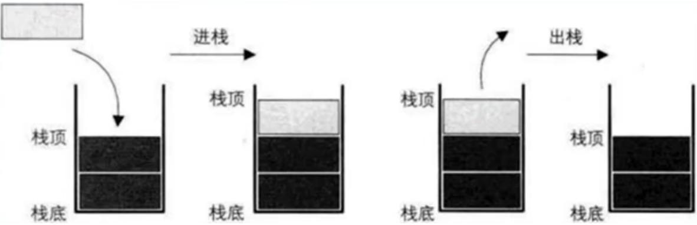
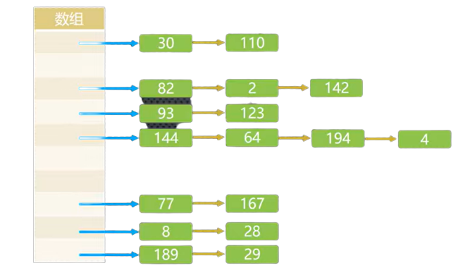
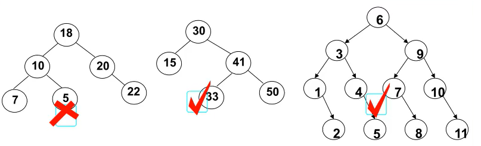
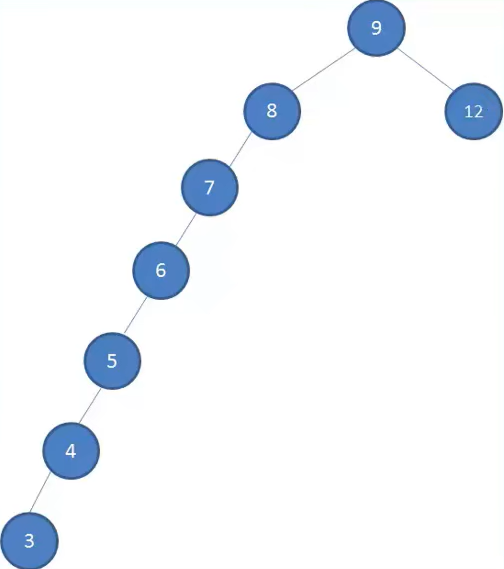
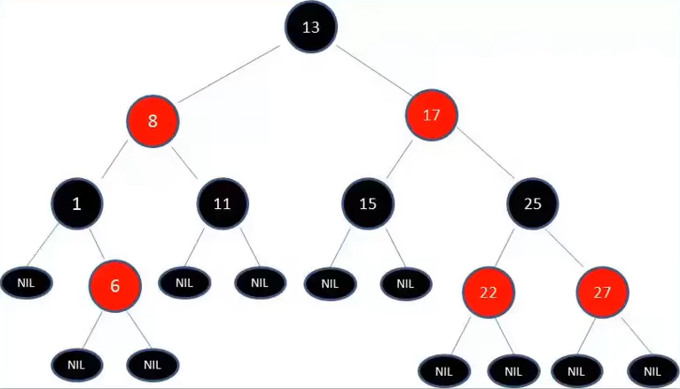
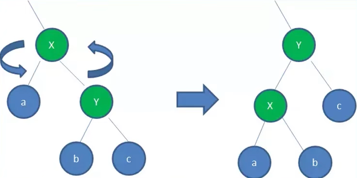
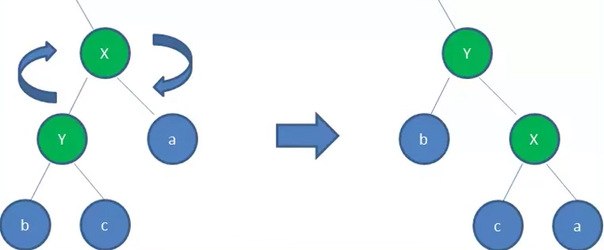

如果我们只是想了解语言的应用层面，那么数据结构和算法显得没有那么重要，但是如果我们希望了解语言的设计层面，那么数据结构和算法就非常的重要。
常见的数据结构：

- 数组（Array）
- 栈（Stack）
- 链表（Linked List）
- 图（Graph）
- 散列表（Hash）
- 队列（Queue）
- 树（Tree）
- 堆（Heap）

## 复杂度

数据结构和算法是为了解决“如何让计算机更快时间、更省空间的完成既定任务”的问题。因此，**执行时间**和**占用空间**就成为了评判数据结构和算法性能的两个维度。这两个维度就称为复杂度。通常使用大 O 表示法表示一个数据结构和算法的复杂度。

推导大 O 表示法的方式:

1、用常量 1 取代运行时间中所有的加法常量

2、在修改后的运行次数函数中,只保留最高阶项

3、如果最高存在且不为 1，则去除与这个项相乘的常数

## 数组

数组作为 JavaScript 中的一种基本数据结构，此处就不多介绍了，这里介绍一下数组中各种操作的时间复杂度：

- 访问：O(1)
- 搜索：O(N)
- 插入：O(N)
- 删除：O(N)

## 栈

我们知道数组是一种线性结构，并且可以在数组的任意位置插入和删除数据。但是有时候,我们为了实现某些功能,必须对这种任意性加以限制，而栈和队列就是比较常见的受限的线性结构。栈是基于数组实现的一种线性结构。

<div style="text-align: center">

</div>

栈( stack )，它是一种受限的线性表，它的受限性在于后进先出(LIFO)

1、其限制是仅允许在表的一端进行插入和删除运算。这一端被称为栈顶，相对地，把另一端称为栈底。

2、LIFO(last in first out)表示就是后进入的元素，第一个弹出栈空间。类似于自动餐托盘,最后放上的托盘,往往先把拿出去使用。

3、向一个栈插入新元素又称作进栈、入栈或压栈，它是把新元素放到栈顶元素的上面，使之成为新的栈顶元素

4、从一个栈删除元素又称作出栈或退栈，它是把栈顶元素删除掉，使其相邻的元素成为新的栈顶元素。

### 栈的基本操作

```js
function Stack() {
  this.items = []
  // 压栈
  Stack.prototype.push = function (el) {
    this.items.push(el)
  }
  // 出栈
  Stack.prototype.pop = function () {
    return this.items.pop()
  }
  // 查看栈顶元素
  Stack.prototype.peek = function () {
    return this.items[this.items.length - 1]
  }
  // 查看栈中是否有元素
  Stack.prototype.isEmpty = function () {
    return this.items.length === 0
  }
  // 查看栈的长度
  Stack.prototype.size = function () {
    return this.items.length
  }
  // 返回字符串
  Stack.prototype.toString = function () {
    return this.items.join(' ')
  }
}
```

### 时间复杂度

访问：O(1)

搜索：O(N)

插入：O(1)

删除：O(1)

## 队列

队列(Queue)，也是一种受限的数据结构。它是一种受限的线性表，其受限性在于先进先出(FIFO First In First Out)，即，只允许在表的前端（ front ）进行删除操作(出队)，而在表的后端（rear）进行插入操作(入队)。

### 队列的基本操作

```js
function Queue() {
  this.items = []
  // 入队
  Queue.prototype.enqueue = function (element) {
    this.items.push(element)
  }
  // 出队
  Queue.prototype.dequeue = function () {
    return this.items.shift()
  }
  // 返回队列中第一个元素
  Queue.prototype.front = function () {
    return this.items[0]
  }
  // 判断队列是否为空
  Queue.prototype.isEmpty = function () {
    return this.items.length === 0
  }
  // 返回队列长度
  Queue.prototype.size = function () {
    return this.items.length
  }
  // 拼接队列
  Queue.prototype.toString = function () {
    return this.items.join(' ')
  }
}
```

### 优先级队列

我们知道,普通的队列插入一个元素，数据会被放在后端，并且需要前面所有的元素都处理完成后才会处理后面的数据。但是优先级队列在插入一个元素的时候会考虑该数据的优先级。插入时先和其他数据优先级进行比较，比较完成后,可以得出这个元素在队列中正确的位置。其他处理方式,和基本队列的处理方式一样。

实现优先级队列主要考虑的问题:

- 每个元素不再只是一个数据，还会包含数据的优先级
- 在添加方式中，根据优先级放入正确的位置。

### 优先队列的实现

优先队列的实质依然是队列，只不过在插入元素的时候会考虑元素的优先级。因此，除了插入方法，其余方法和普通队列并无区别。

```js
function PriorityQueue() {
  function Queue(element, priority) {
    this.element = element
    this.priority = priority
  }
  this.items = []

  PriorityQueue.prototype.enqueue = function (element, priority) {
    var queueElement = new Queue(element, priority)
    if (!this.items.length) {
      this.items.push(queueElement)
    } else {
      var added = false
      for (var i = 0; i < this.items.length; i++) {
        if (queueElement.priority < this.items[i].priority) {
          this.items.splice(i, 0, queueElement)
          added = true
          break
        }
      }
      if (!added) {
        this.items.push(queueElement)
      }
    }
  }
}
```

### 时间复杂度

访问：O(1)

搜索：O(N)

插入：O(1)

删除：O(1)

## 链表

链表和数组一样，可以用于存储一系列的元素，但是链表和数组的实现机制完全不同。数组的创建通常需要申请一段连续的内存空间(一整块的内存)，并且大多数编程语言当中，数组大小是固定的，所以当当前数组不能满足容量需求时,需要扩容。(一般情况下是申请一个更大的数组,比如 2 倍，然后将原数组中的元素复制过去)，而扩容是非常消耗性能的。而且在数组开头或中间位置插入数据的成本很高,需要进行大量元素的位移。

链表也是一种能够存储多个元素的数据结构。链表的每个元素都是由一个存储元素本身的节点和一个指向下一个元素的引用指针组成，因此，链表无需像数组那样需要申请一段连续的内存空间。

### 链表和数组比较

和数组相比，链表有以下优点：

- 内存空间不是必须连续的。这样可以充分利用计算机的内存，实现灵活的内存动态管理。
- 链表不必在创建时就确定大小，并且大小可以无限的延伸下去。
- 链表在插入和删除数据时，时间复杂度可以达到 O(1)，相对数组效率高很多。

相对于数组,链表有一些缺点：

1、链表访问任何一个位置的元素时，都需要从头开始访问(无法跳过第一个元素访问任何一个元素)。

2、无法通过下标直接访问元素，需要从头一个个访问，直到找到对应的元素。

### 链表实现

<details>
<summary style="margin: 20px 0;color: #4e98bb; cursor: pointer">展开查看实现代码</summary>

```js
function LinkList() {
  function Node(data) {
    this.data = data
    this.next = null
  }
  this.head = null
  this.length = 0

  // 追加
  LinkList.prototype.append = function (data) {
    // 创建新节点
    var node = new Node(data)
    if (this.length === 0) {
      // 追加的是第一个节点，直接将head指向新节点
      this.head = node
    } else {
      // 否则，循环找到最后一个节点，并把最后一个节点的next指向新节点
      var current = this.head
      while (current.next) {
        current = current.next
      }
      current.next = node
    }
    // 长度加1
    this.length++
  }

  // 拼接
  LinkList.prototype.toString = function () {
    var res = ''
    var current = this.head
    while (current) {
      res += current.data + ' '
      current = current.next
    }
    return res
  }

  // 插入
  LinkList.prototype.insert = function (position, data) {
    // 边界条件判断
    if (position < 0 || position > this.length) return false
    var node = new Node(data)
    // 如果插入的是第一个位置
    if (position === 0) {
      node.next = this.head
      this.head = node
    } else {
      var index = 0
      var current = this.head
      var previous = null
      // 找到插入位的那个元素以及前一个元素
      while (index++ < position) {
        previous = current
        current = current.next
      }
      // 更换指针
      node.next = current
      previous.next = node
      this.length++
      return true
    }
  }

  // 访问
  LinkList.prototype.get = function (position) {
    if (position < 0 || position >= this.length) return null
    var current = this.head
    var index = 0
    while (index++ < position) {
      current = current.next
    }
    return current.data
  }

  // 返回索引
  LinkList.prototype.indexOf = function (data) {
    var current = this.head
    var index = 0
    while (current) {
      // 如果找到了，直接返回index
      if (current.data === data) {
        return index
      }
      current = current.next
      index++
    }
    // 如果到最后也没有找到，返回-1
    return -1
  }

  // 修改
  LinkList.prototype.update = function (position, data) {
    if (position < 0 || position >= this.length) return false
    var current = this.head
    var index = 0
    while (index++ < position) {
      current = current.next
    }
    current.data = data
    return true
  }

  // 移除某个位置的元素
  LinkList.prototype.removeAt = function (position) {
    var current = this.head
    var previous = null
    if (position < 0 || position >= this.length) {
      return null
    } else if (position === 0) {
      this.head = this.head.next
    } else {
      var index = 0
      while (index++ < position) {
        previous = current
        current = current.next
      }
      previous.next = current.next
    }
    this.length--
    return current
  }

  // 移除某个元素
  LinkList.prototype.remove = function (data) {
    var position = this.indexOf(data)
    return this.removeAt(position)
  }

  // 判断链表是否为空
  LinkList.prototype.isEmpty = function () {
    return this.length === 0
  }

  // 获取链表长度
  LinkList.prototype.size = function () {
    return this.length
  }
}
```

</details>

## 双向链表

前面我们介绍的其实是单向链表，即只能从头遍历到尾，链表相连的过程是单向的。实现的原理是上一个链表中有一个指向下一个的引用。

单向链表有一个比较明显的缺点：我们可以轻松的到达下一个节点，但是回到前一个节点是很难的。双向链表就能很好的解决这个问题，它既可以从头遍历到尾，又可以从尾遍历到头，也就是链表相连的过程是双向的。它的实现原理就是一个节点既有向前连接的引用，也有一个向后连接的引用。

:::tip
双向链表的缺点是相当于单向链表，必然占用内存空间更大一些。
:::

双向链表的特点：

- 可以使用一个 head 和一个 tail 分别指向头部和尾部的节点
- 每个节点都由三部分组成:前一个节点的指针(prev)/保存的元素(item)/后一个节点的指针(next)
- 双向链表的第一个节点的 prev 是 null
- 双向链表的最后的节点的 next 是 null

### 双向链表的实现

<details>
<summary style="margin: 20px 0;color: #4e98bb; cursor: pointer">展开查看实现代码</summary>

```js
function DoublyLinkList() {
  this.head = null
  this.tail = null
  this.length = 0
  function Node(data) {
    this.prev = null
    this.data = data
    this.next = null
  }

  // 追加
  DoublyLinkList.prototype.append = function (data) {
    var node = new Node(data)
    if (this.length === 0) {
      this.head = node
      this.tail = node
    } else {
      node.prev = this.tail
      this.tail.next = node
      this.tail = node
    }
    this.length++
  }

  // 拼接
  DoublyLinkList.prototype.toString = function () {
    var res = ''
    var current = this.head
    while (current) {
      res += current.data + ' '
      current = current.next
    }
    return res
  }

  // 逆向遍历节点并返回
  DoublyLinkList.prototype.forwardString = function () {
    var res = ''
    var current = this.tail
    while (current) {
      res += current.data + ' '
      current = current.prev
    }
    return res
  }

  // 插入
  DoublyLinkList.prototype.insert = function (position, data) {
    if (position < 0 || position > this.length) return false
    var node = new Node(data)
    if (this.length === 0) {
      this.head = node
      this.tail = node
    } else {
      if (position === 0) {
        this.head.prev = node
        node.next = this.head
        this.head = node
      } else if (position === this.length) {
        this.tail.next = node
        node.prev = this.tail
        this.tail = node
      } else {
        var current = null
        if (position <= this.length / 2) {
          var index = 0
          current = this.head
          while (index++ < position) {
            current = current.next
          }
        } else {
          var index = this.length - 1
          current = this.tail
          while (index-- > position) {
            current = current.prev
          }
        }
        current.prev.next = node
        node.prev = current.prev
        current.prev = node
        node.next = current
      }
    }
    this.length++
    return true
  }

  // 访问
  DoublyLinkList.prototype.get = function (position) {
    if (position < 0 || position >= this.length) return null
    var current
    var index
    if (position <= this.length / 2) {
      index = 0
      current = this.head
      while (index++ < position) {
        current = current.next
      }
    } else {
      index = this.length - 1
      current = this.tail
      while (index-- > position) {
        current = current.prev
      }
    }
    return current
  }

  // 返回索引
  DoublyLinkList.prototype.indexOf = function (data) {
    var current = this.head
    var index = 0
    while (current) {
      if (current.data === data) {
        return index
      }
      current = current.next
      index++
    }
    return -1
  }

  // 修改
  DoublyLinkList.prototype.update = function (position, data) {
    if (position < 0 || position >= this.length) return false
    var current
    var index
    if (position <= this.length / 2) {
      current = this.head
      index = 0
      while (index++ < position) {
        current = current.next
      }
    } else {
      current = this.tail
      index = this.length - 1
      while (index-- > position) {
        current = current.prev
      }
    }
    current.data = data
    return true
  }

  // 删除某个位置的元素
  DoublyLinkList.prototype.removeAt = function (position) {
    if (position < 0 || position >= this.length) return null
    var current
    if (this.length === 1) {
      current = this.head
      this.tail = null
      this.head = null
    } else {
      if (position === 0) {
        current = this.head
        this.head.next.prev = null
        this.head = this.head.next
      } else if (position === this.length - 1) {
        current = this.tail
        this.tail.prev.next = null
        this.tail = this.tail.prev
      } else {
        if (position <= this.length / 2) {
          current = this.head
          var index = 0
          while (index++ < position) {
            current = current.next
          }
        } else {
          current = this.tail
          var index = this.length - 1
          while (index-- > position) {
            current = current.prev
          }
        }
        current.prev.next = current.next
        current.next.prev = current.prev
      }
    }
    this.length--
    return current
  }

  //  删除元素
  DoublyLinkList.prototype.remove = function (data) {
    var index = this.indexOf(data)
    return this.removeAt(index)
  }
}
```

</details>

## 集合

集合通常是由一组无序的，不能重复的元素构成。没有顺序意味着不能通过下标值进行访问，不能重复意味着相同的对象在集合中只会存在一份。

### 集合的实现

<details>
<summary style="margin: 20px 0;color: #4e98bb; cursor: pointer">展开查看实现代码</summary>

```js
function Set() {
  // 属性
  this.items = {}

  // 方法

  Set.prototype.add = function (value) {
    // 如果已存在value，则不添加
    if (this.has(value)) {
      return false
    } else {
      this.items[value] = value
      return true
    }
  }

  Set.prototype.has = function (value) {
    return this.items.hasOwnProperty(value)
  }
  Set.prototype.remove = function (value) {
    if (!this.has(value)) {
      return false
    } else {
      return delete this.items[value]
    }
  }
  Set.prototype.size = function () {
    return Object.keys(this.items).length
  }
  Set.prototype.clear = function () {
    this.items = {}
  }
  Set.prototype.values = function () {
    return Object.keys(this.items)
  }
}
```

</details>

### 集合间操作

1、并集：对于给定的两个集合，返回一个包含两个集合中所有元素的新集合。

2、交集：对于给定的两个集合，返回一个包含两个集合中共有元素的新集合。

3、差集：对于给定的两个集合，返回一个包含所有存在于第一个集合且不存在于第二个集合的元素的新集合

4、子集：验证一个给定集合是否是另一集合的子集。

<details>
<summary style="margin: 20px 0;color: #4e98bb; cursor: pointer">展开查看实现代码</summary>

```js
// 并集
Set.prototype.union = function (otherSet) {
  var unionSet = new Set()
  var values = otherSet.values()
  for (var i = 0; i < values.length; i++) {
    unionSet.add(values[i])
  }
  values = this.values()
  for (var i = 0; i < values.length; i++) {
    unionSet.add(values[i])
  }
  return unionSet
}

// 交集
Set.prototype.intersection = function (otherSet) {
  var intersectionSet = new Set()
  var values = this.values()
  for (var i = 0; i < values.length; i++) {
    if (otherSet.has(values[i])) {
      intersectionSet.add(values[i])
    }
  }
  return intersectionSet
}

// 差集
Set.prototype.difference = function (otherSet) {
  var differenceSet = new Set()
  var values = this.values()
  for (let i = 0; i < values.length; i++) {
    if (!otherSet.has(values[i])) {
      differenceSet.add(values[i])
    }
  }
  return differenceSet
}

// 子集
Set.prototype.subSet = function (otherSet) {
  var values = this.values()
  for (var i = 0; i < values.length; i++) {
    if (!otherSet.has(values[i])) return false
  }
  return true
}
```

</details>

## 哈希表

哈希表的结构就是数组，但是它神奇的地方在于对下标值的一种变换，这种变换我们可以称之为哈希函数，通过哈希函数可以获取到 HashCode。

哈希表通常是基于数组进行实现的，但是相对于数组，它又有许多的优势：

- 它可以提供非常快速的插入-删除-查找操作
- 无论多少数据,插入和删除值需要接近常量的时间：即 O(1)的时间级。实际上，只需要几个机器指令即可完成
- 哈希表的速度比树还要快，基本可以瞬间查找到想要的元素。
- 哈希表相对于树来说编码要容易很多。

当然哈希表相对于数组也有自己的一些不足：

- 哈希表中的数据是没有顺序的，所以不能以一种固定的方式(比如从小到大)来遍历其中的元素。
- 通常情况下，哈希表中的 key 是不允许重复的，不能放置相同的 key，用于保存不同的元素.

了解了哈希表后，我们还需要区分下面几个概念：

1、哈希化：将大数字转化成数组范围内下标的过程，我们就称之为哈希化。

2、哈希函数：通常我们会将单词转成大数字，大数字再进行哈希化的代码实现放在一个函数中，这个函数我们称之为哈希函数。即，实现哈希化的函数。

3、哈希表：最终将数据插入到的这个数组，对整个结构的封装，我们就称之为是一个哈希表

### 冲突

前面提到过，哈希表是不允许在存在相同的 key 作为数组下标的，但是经过哈希化后的数据不可避免的会得到相同结果，即，相同的 key。这种情况我们称之为冲突。

解决冲突主要有两种方式：

1、链地址法

2、开放地址法

### 链地址法

链地址法是一种比较常见的解决冲突的方案(也称为拉链法)。

链地址法解决冲突的办法是每个数组单元中存储的不再是单个数据，而是一个链条。这个链条常见的是使用数组或者链表。比如是链表，也就是每个数组单元中存储着一个链表。一旦哈希化出重复的 key，则将数据插入到对应 key 位置存放链表的首端或者末端即可。当查询时，先根据哈希化后的下标值找到对应的位置，再取出链表，线性依次查询数据。

<div style="margin: 10px 0; text-align: center">

</div>

### 开放地址法

开放地址法的主要工作方式是寻找空白的单元格来添加重复的数据。因此，如何探索空白单元格就成为了开放地址法的关键，目前主要有以下几种方式寻找空白单元格：

#### **线性探测：**

- 存放数据(比如存放 32)：

1、经过哈希化得到的 index=2，但是在插入的时候发现该位置已经有了其他数据了，怎么办呢?

2、线性探测就是从 index 位置+1 开始一点点查找合适的位置来放置 32，直到找到一个空的位置，这个时候 32 就会放在该位置.

- 查询数据(查询 32)：

1、首先经过哈希化得到 index=2，比较 2 的位置结果和查询的数值是否相同,相同那么就直接返回。不相同则线性查找, 从 index 位置+1 开始查找和 32 一样的.

2、这里有一个特别需要注意的地方：如果 32 的位置我们之前没有插入,是否将整个哈希表查询一遍来确定 32 存不存在吗?当然不是,查询过程有一个约定,就是查询到空位置,就停止。因为存放的时候就是线性一个个存放的。

- 删除数据(删除 32)：

删除操作一个数据项时，不可以将这个位置下标的内容设置为 null。为什么呢？因为将它设置为 null 可能会影响我们之后查询其他操作，因为查询是遇到空格就停止，所以通常删除一个位置的数据项时，我们可以将它进行特殊处理(比如设置为-1)。当我们之后看到-1 位置的数据项时，就知道查询时要继续查询，但是插入时这个位置可以放置数据。

- 线性探测的缺点：线性探测有一个比较严重的问题,就是聚集。即如果之前的数据是连续插入的，那么新插入的一个数据可能需要探测很长的距离

比如我在没有任何数据的时候,插入的是 22-23-24-25-26，那么意味着下标值：2-3-4-5-6 的位置都有元素。这种一连串填充单元就叫做聚集。**聚集会影响哈希表的性能,无论是插入/查询/删除都会影响。**比如我们插入一个 32,会发现连续的单元都不允许我们放置数据,并且在这个过程中我们需要探索多次。

#### **二次探测**

二次探测主要优化的是探测时的步长。线性探测的步长为 1。二次探测则对步长做了优化，比如从下标值 x 开始：x+1^2，x+2^2，x+3^2。这样就可以一次性探测比较长的距离,比避免那些聚集带来的影响.

缺点：但是二次探测依然存在问题,比如我们连续插入的是 32-112-82-2-192,那么它们依次累加的时候步长的相同的也就是这种情况下会造成步长不一的一种聚集.还是会影响效率.(当然这种可能性相对于连续的数字会小一些)。

#### 再哈希法

再哈希法的做法就是把关键字用另外一个哈希函数,再做一次哈希化，用这次哈希化的结果作为步长.对于指定的关键字,步长在整个探测中是不变的,不过不同的关键字使用不同的步长.

第二次哈希化需要具备以下特点：

- 与第一个哈希函数不同(不要再使用上一次的哈希函数了，不然结果还是原来的位置)
- 不能输出为 0(否则,将没有步长.每次探测都是原地踏步，算法就进入了死循环)
- 一般选用 stepSize = constant - (key % constant)。constant 为常量，且是小于数组长度的质数。

### 哈希表的效率

在谈及哈希表效率时，我们有必要介绍一下哈希表的装填因子。

装填因子表示当前哈希表中已经包含的数据项和整个哈希表长度的比值。装填因子=总数据项/哈希表长度。

开放地址法的装填因子最大是 1。因为它必须寻找到空白的单元才能将元素放入。链地址法的装填因子可以大于 1，因为拉链法可以无限的延伸下去，只要你愿意.(当然后面效率就变低了)。开放地址法查询时间随装填因子的变大呈指数型增长，而链地址法则呈线性增加。因此，总的来说，链地址法的效率比开放地址法要高很多。

:::tip
当装填因子大于 0.75 时，就要对数组进行扩容；而装填因子小于 0.25 时，就需要对数组进行缩容。
:::

如果没有产生冲突，那么哈希表的效率就会更高。如果发生冲突，存取时间就依赖后来的探测长度。而平均探测长度以及平均存取时间，取决于填装因子，随着填装因子变大，探测长度也越来越长。

:::warning
正如前面介绍的那样，链地址法的装填因子(loadFactor)可以大于 1，因此这种哈希表可以无限制的插入数据。但是，随着数据量的增加，每一个下标所存储的链表/数组的长度会越来越长，从而降低查找效率。所以，需要在合适的情况对数组进行扩容，通常 loadFactor 大于 0.75 就需要进行扩容操作。

扩容之后，所有的数据项一定要同时进行修改(重新调用哈希函数来获取到不同的位置）
:::

### 哈希表的实现

**哈希函数**

```js
/**
 * @description 哈希函数
 * 1、将字符串转换成较大的数字(hashCode)
 * 2、哈希化：将较大的数字hashCode压缩到数组范围内
 * @param {string} 字符串
 * @param {number} 数组范围
 */
function hashFunc(str, size) {
  var hashCode = 0
  // 霍纳算法，常用37作为底数计算hashCode
  for (var i = 0; i < str.length; i++) {
    // string.prototype.charCodeAt(index), 将string[i]转化成对应Unicode编码数字
    hashCode = 37 * hashCode + str.charCodeAt(i)
  }
  // 哈希化
  var index = hashCode % size
  return index
}
```

**哈希表**

思路：哈希表的每个 index 对应的是一个数组(bucket)，bucket 中存放的是 key 和 value，我们继续使用一个数组存储它们。最终我们的哈希表的数据格式是这样: [[ [k,v],[k,v],[k,v] ]，[ [k,v],[k,v] ], [ [k,v] ] ]

<details>
<summary style="margin: 20px 0;color: #4e98bb; cursor: pointer">展开查看实现代码</summary>

```js
function HashTable() {
  this.storage = [] //哈希表
  this.count = 0 //已存放元素个数
  this.limit = 7 // 数组总长度，最好为质数，初始值为7，

  // 哈希函数
  HashTable.prototype.hashFunc = function (str, size) {
    var hashCode = 0
    for (var i = 0; i < str.length; i++) {
      hashCode = hashCode + 37 * str.charCodeAt(i)
    }
    var index = hashCode % size
    return index
  }
  // 增加和修改
  HashTable.prototype.put = function (key, value) {
    // 根据key获取对应的index
    var index = this.hashFunc(key, this.limit)
    // 根据index取出对应的bucket
    var bucket = this.storage[index]
    // 判断该bucket是否有值
    if (!bucket) {
      // 如果没有，则新建一个bucket
      bucket = []
      this.storage[index] = bucket
    }
    // 循环bucket中元素，判断元素的第一项是否等于key，如果相等，则是修改
    for (var i = 0; i < bucket.length; i++) {
      if (bucket[i][0] === key) {
        bucket[i][1] = value
        return
      }
    }
    // 如果不等，则是增加
    bucket.push([key, value])
    this.count++
    // 是否扩容
    if (this.count > this.limit * 0.75) {
      var newSize = this.getPrime(this.limit * 2)
      this.resize(newSize)
    }
  }
  // 查找
  HashTable.prototype.get = function (key) {
    var index = this.hashFunc(key, this.limit)
    var bucket = this.storage[index]
    if (!bucket) {
      return null
    } else {
      for (var i = 0; i < bucket.length; i++) {
        if (bucket[i][0] === key) {
          return bucket[i][1]
        }
      }
      return null
    }
  }
  // 删除
  HashTable.prototype.remove = function (key) {
    var index = this.hashFunc(key, this.limit)
    var bucket = this.storage[index]
    if (!bucket) return null
    for (var i = 0; i < bucket.length; i++) {
      var tuple = bucket[i]
      if (tuple[0] === key) {
        bucket.splice(i, 1)
        this.count--
        // 是否缩容
        if (this.limit > 7 && this.count < this.limit * 0.25) {
          var newSize = this.getPrime(Math.floor(this.limit / 2))
          this.resize(newSize)
        }
        return tuple[1]
      }
    }
    return null
  }
  // 扩容/缩容
  HashTable.prototype.resize = function (newLimit) {
    // 保存旧数组中的内容
    var oldStorage = this.storage
    // 重置所有属性
    this.storage = []
    this.count = 0
    this.limit = newLimit
    // 将oldStorage中所有数据重新放置到新的数组中
    for (var i = 0; i < oldStorage.length; i++) {
      var bucket = oldStorage[i]
      if (!bucket) continue
      for (var j = 0; j < bucket.length; j++) {
        var tuple = bucket[j]
        this.put(tuple[0], tuple[1])
      }
    }
  }
  // 判断一个数是否为质数
  HashTable.prototype.isPrime = function (num) {
    // 获取平方根
    var tmp = ParseInt(Math.sqrt(num))
    for (var i = 0; i <= tmp; i++) {
      if (num % i === 0) return false
    }
    return true
  }
  // 获取质数
  HashTable.prototype.getPrime = function (num) {
    while (!this.isPrime(num)) {
      num++
    }
    return num
  }
}
```

</details>

### 哈希表的优缺点

**优点：** 哈希表的插入/删除效率都是非常高的
**缺点：**

1、空间利用率不高,底层使用的是数组,并且某些单元是没有被利用的.

​2、哈希表中的元素是无序的,不能按照固定的顺序来遍历哈希表中的元素.

​3、不能快速的找出哈希表中的最大值或者最小值这些特殊的值.

## 二叉树

### 概念

了解二叉树之前，我们先来熟悉一下树的常见概念：

1、节点的度：某个节点的子节点的数量称为节点的度。

2、树的度：树的所有节点中，最大的度数称为树的度。

3、路径长度：从节点 n1 到 nk 的路径中所包含边的个数，

4、节点层次：根节点的层次是 1，其他任一节点的层数是其父节点层数+1

5、树的深度：树中所有节点中的最大层次

:::tip
如果树中每个节点最多只能有两个子节点，这样的树就成为"二叉树"。几乎上所有的树都可以表示成二叉树的形式。
:::

### 二叉树特性

- 一个二叉树第 i 层的最大节点数为：2^(i-1)
- 深度为 k 的二叉树有最大节点总数为：2^k-1
- 对任何非空二叉树 T，若 n0 表示叶节点的个数，n2 表示深度为 2 的非叶节点个数，那么两者满足关系 n0=n2+1

### 二叉搜索树

二叉搜索树（BST，Binary Search Tree )，也称二叉排序树或二叉查找树，二叉搜索树是一颗二叉树，子节点可以为空，如果不为空，满足以下性质 ∶

- 非空左子树的所有键值小于其根节点的键值。
- 非空右子树的所有键值大于其根节点的键值。
- 左、右子树本身也都是二叉搜索树。

<div style="text-align:center">

</div>

:::warning
二叉搜索树的特点就是相对较小的值总是保存在左节点上，相对较大的值总是保存在右节点上。
:::

### 二叉树的遍历

**先序遍历**

1、访问根节点

2、先序遍历左子树

3、先序遍历右子树

**中序遍历**

1、中序遍历左子树

2、访问根节点

3、中序遍历右子树

**后序遍历**

1、后序遍历左子树

2、后序遍历右子树

3、访问根节点

<details>
<summary style="margin: 20px 0;color: #4e98bb; cursor: pointer">展开查看实现代码</summary>

```js
function BinarySearchTree() {
  function Node(key) {
    this.key = key
    this.left = null
    this.right = null
  }
  // 属性
  this.root = null

  // 方法
  // 插入
  BinarySearchTree.prototype.insert = function (key) {
    // 1、根据 key 创建节点
    const newNode = new Node(key)
    // 2、判断根节点是否有值
    if (this.root === null) {
      this.root = newNode
    } else {
      this.insertNode(this.root, newNode)
    }
  }
  BinarySearchTree.prototype.insertNode = function (node, newNode) {
    if (newNode.key < node.key) {
      if (node.left === null) {
        node.left = newNode
      } else {
        this.insertNode(node.left, newNode)
      }
    } else {
      if (node.right === null) {
        node.right = newNode
      } else {
        this.insertNode(node.right, newNode)
      }
    }
  }

  // 树的遍历
  // 先序遍历
  BinarySearchTree.prototype.preOrderTraversal = function () {
    const nodeList = []
    this.preOrderTraversalNode(this.root, nodeList)
    return nodeList
  }
  BinarySearchTree.prototype.preOrderTraversalNode = function (node, nodeList) {
    if (node !== null) {
      // 处理当前访问节点
      nodeList.push(node.key)
      // 查找左子树中的节点
      this.preOrderTraversalNode(node.left, nodeList)
      // 查找右子树中的节点
      this.preOrderTraversalNode(node.right, nodeList)
    }
  }

  // 中序遍历
  BinarySearchTree.prototype.midOrderTraversal = function () {
    const nodeList = []
    this.midOrderTraversalNode(this.root, nodeList)
    return nodeList
  }
  BinarySearchTree.prototype.midOrderTraversalNode = function (node, nodeList) {
    if (node !== null) {
      // 查找左子树中的节点
      this.midOrderTraversalNode(node.left, nodeList)
      // 处理访问的节点
      nodeList.push(node.key)
      // 查找右子树中的节点
      this.midOrderTraversalNode(node.right, nodeList)
    }
  }

  // 后序遍历
  BinarySearchTree.prototype.postOrderTraversal = function () {
    const nodeList = []
    this.postOrderTraversalNode(this.root, nodeList)
    return nodeList
  }
  BinarySearchTree.prototype.postOrderTraversalNode = function (
    node,
    nodeList
  ) {
    if (node !== null) {
      // 查找左子树中的节点
      this.postOrderTraversalNode(node.left, nodeList)
      // 查找右子树中的节点
      this.postOrderTraversalNode(node.right, nodeList)
      // 处理访问节点
      nodeList.push(node.key)
    }
  }

  // 寻找最大值
  BinarySearchTree.prototype.max = function () {
    // 1、获取根节点
    let node = this.root
    // 2、依次向右查找
    while (node.right !== null) {
      node = node.right
    }
    return node.key
  }

  // 寻找最小值
  BinarySearchTree.prototype.min = function () {
    let node = this.root
    while (node.left !== null) {
      node = node.left
    }
    return node.key
  }

  // 寻找某个值
  BinarySearchTree.prototype.search = function (key) {
    return this.searchNode(this.root, key)
  }

  BinarySearchTree.prototype.searchNode = function (node, key) {
    if (node === null) return false
    if (key < node.key) {
      return this.searchNode(node.left, key)
    } else if (key > node.key) {
      return this.searchNode(node.right, key)
    } else {
      return true
    }
  }

  // 删除节点
  BinarySearchTree.prototype.remove = function (key) {
    // 寻找要删除的节点
    let current = this.root
    let parent = null
    let isLeftChild = true
    while (current.key !== key) {
      parent = current
      if (key < current.key) {
        current = current.left
        isLeftChild = true
      } else {
        current = current.right
        isLeftChild = false
      }
      // 最后都没有找到，直接返回
      if (current === null) return false
    }
    // 根据对应的情况删除节点
    // 1、删除的节点是叶子节点（没有子节点）
    if (current.left === null && current.right === null) {
      if (current === this.root) {
        // 如果删除的节点是根节点
        this.root = null
      } else if (isLeftChild) {
        parent.left = null
      } else {
        parent.right = null
      }
    }
    // 2、删除的节点有一个子节点
    else if (current.right === null) {
      // 如果删除的是根节点
      if (current === this.root) {
        this.root = current.left
      } else if (isLeftChild) {
        parent.left = current.left
      } else {
        parent.right = current.left
      }
    } else if (current.left === null) {
      if (current === this.root) {
        this.root = current.right
      } else if (isLeftChild) {
        parent.left = current.right
      } else {
        parent.right = current.right
      }
    }
    // 3、删除的节点有两个子节点
    else {
      // 3.1、获取后继节点
      let successor = this.getSuccessor(current)
      // 3.2、判断是否为根节点
      if (current === this.root) {
        this.root = successor
      } else if (isLeftChild) {
        parent.left = successor
      } else {
        parent.right = successor
      }
      // 3.3、将删除节点的左子树 = current.left
      successor.left = current.left
    }
  }
  BinarySearchTree.prototype.getSuccessor = function (delNode) {
    let successor = delNode
    let current = delNode.right
    let successorParent = delNode
    while (current !== null) {
      successorParent = successor
      successor = current
      current = current.left
    }
    if (successor !== delNode.right) {
      successorParent.left = successor.right
      successor.right = delNode.right
    }
    return successor
  }
}
```

</details>

比较好的二叉搜索树当中的数据应该时左右分布均匀的，我们称之为平衡树。但是当我们连续插入较小数/较大数时，会造成二叉搜索树的分布不均匀，严重的甚至会将二叉搜索树直接变成链表(比如依次插入 10、9、8、7、6、……)，这种就被称之为非平衡树。

<div style="text-align:center; margin:10px">

</div>
对于一棵平衡二叉树来说，插入/查找等操作的效率是O(logN)，而对于一棵非平衡二叉树，查找效率变成了O(N)。

### 两种常见的平衡树

1、AVL 树：

- AVL 树是最早的一种平衡树。它有些办法保持树的平衡(每个节点多存储了一个额外的数据)因为 AVL 树是平衡的,所以时间复杂度也是 O(logN)。
- 但是,每次插入/删除操作相对于红黑树效率都不高，所以整体效率不如红黑树

2、红黑树：

- 红黑树也通过一些特性来保持树的平衡.
- 因为是平衡树,所以时间复杂度也是在 O(logN).
- 另外插入/删除等操作，红黑树的性能要优于 AVL 树，所以现在平衡树的应用基本都是红黑树.

### 红黑树

**红黑树的特性：**

1.节点是红色或黑色。

⒉.根节点是黑色。

3.每个叶子节点都是黑色的空节点(NIL 节点)。

4.每个红色节点的两个子节点都是黑色。(从每个叶子到根的所有路径上不能有两个连续的红色节点)

5.从任一节点到其每个叶子的所有路径都包含相同数目的黑色节点。

<div style="text-algin:center; margin: 10px">

</div>

前面的约束确保了红黑树的关键特性： **从根到叶子的最长可能路径，不会超过最短可能路径的两倍长。结果就是这个树基本是平衡的。**

为什么可以做到最长路径不超过最短路径的两倍呢：

性质 4 决定了路径不能有两个相连的红色节点。那么最短的可能路径都是黑色节点，最长的可能路径是红色和黑色交替。

性质 5 所有路径都有相同数目的黑色节点。

也就是说假设最短路径是 3 个黑色节点，最长路径就可能是红黑交替，最多 6 个节点。

### 红黑树的变换

插入一个新节点时,有可能树不再平衡,可以通过三种方式的变换,让树保持平衡：

1、变色

为了重新符合红黑树的规则，尝试把红色节点变为黑色，或者把黑色节点变为红色，称为变色。

**首先，一般假定插入的新的节点通常都是红色节点，** 因为在插入节点为红色的时候，有可能存在插入一次而不违反红黑树任何规则的情况，而插入黑色节点，必然会导致有一条路径上多了黑色节点，这是很难调整的。红色节点可能导致出现红红相连的情况,但是这种情况可以通过颜色调换和旋转来调整。

2、左旋

逆时针旋转红黑树的两个节点，使得父节点被自己的右孩子取代，而自己成为新父节点的左孩子。下图，身为右孩子的 Y 取代了 X 的位置，而 X 变成了 Y 的左孩子，此为左旋转。

<div style="text-algin:center; margin: 10px">

</div>

3、右旋

顺时针旋转红黑树的两个节点，使得父节点被自己的左孩子取代，而自己成为自己的右孩子。下图，身为左孩子的 Y 取代了 X 的位置，而 X 变成了 Y 的右孩子，此为右旋转

<div style="text-algin:center; margin: 10px">

</div>

## 排序算法

### 冒泡排序

**思路**

1、对未排序的各元素从头到尾依次比较相邻的两个元素大小关系如果左边的元素较大,则交换位置。

2、向右移动一个位置,比较下面两个元素

3、当走到最右端时，最大的元素一定被放在了最右边

4、按照这个思路,从最左端重新开始,这次比较到倒数第二个位置即可。

5、依次类推,就可以将数据排序完成

**实现**

```js
function bubbleSort(arr) {
  let length = arr.length
  for (let i = length; i >= 0; i--) {
    for (let j = 0; j < i; j++) {
      if (arr[j] > arr[j + 1]) {
        let tmp = arr[j]
        arr[j] = arr[j + 1]
        arr[j + 1] = tmp
      }
    }
  }
  return arr
}
```

:::tip
冒泡排序的比较次数和交换次数为：O(N^2)
:::

## 选择排序

**思路**

1、选定第一个索引位置，然后和后面元素依次比较

2、如果后面的元素小于第一个索引位置,则交换位置，经过一轮的比较后,可以确定第一个位置是最小的，放到第一个位置

3、然后使用同样的方法把剩下的元素逐个比较即可

4、可以看出选择排序，第一轮会选出最小值，第二轮会选出第二小的值，直到最后

```js
function selectionSort(arr) {
  let length = arr.length
  // 从0开始取数据
  for (let i = 0; i < length - 1; i++) {
    let min = i
    // 寻找i后面最小的那个数
    for (let j = i + 1; j < length; j++) {
      if (arr[j] < arr[min]) {
        min = j
      }
    }
    // 交换位置
    if (i !== min) {
      let tmp = arr[i]
      arr[i] = arr[min]
      arr[min] = tmp
    }
  }
  return arr
}
```

:::tip
选择排序的交换次数为 O(N)，比较次数为 O(N^2)
:::

## 插入排序

**思路：**

插入排序思想的核心是局部有序。什么是局部有序呢？比如在一个队列中的人，我们选择其中一个作为标记的队员，这个被标记的队员左边的所有队员已经是局部有序的。这意味着：有一部分人是按顺序排列好的。有一部分还没有顺序.

1、从第一个元素开始，该元素可以认为已经被排序

2、取出下一个元素，在已经排序的元素序列中从后向前扫描如果该元素（已排序)大于新元素，将该元素移到下一位置

3、重复上一个步骤，直到找到已排序的元素小于或者等于新元素的位置将新元素插入到该位置后,重复上面的步骤.

```js
function insertionSort(arr) {
  const length = arr.length
  for (let i = 1; i < length; i++) {
    const tmp = arr[i]
    let j = i
    // 将数据往后挪一个位置，直到找到合适位置插入
    while (arr[j - 1] > tmp && j > 0) {
      arr[j] = arr[j - 1]
      j--
    }
    arr[j] = tmp
  }
  return arr
}
```

:::tip
插入排序的比较次数是冒泡排序和选择排序的 1/2，因此，插入排序是简单排序中最快的方式
:::

## 希尔排序

前面介绍的冒泡排序、选择排序、插入排序都属于简单排序，尽管它们的比较次数和交换次数不尽相同，但其实它们的时间复杂度均为 O(N^2)。

**思路：**

希尔排序是基于插入排序而优化升级的，它是先将数据按 gap 为间隙分成若干组，然后组内进行插入排序，之后不断的减少 gap 的值并重复上面的步骤，直到 gap 为 1。事实上，简单排序中的插入排序就是 gap 为 1 的希尔排序。

```js
function shellSort(arr) {
  const length = arr.length
  // 设定一个gap
  let gap = Math.floor(length / 2)
  // gap不断减小
  while (gap >= 1) {
    // 各个组内比较大小
    for (let i = gap; i < length; i++) {
      let tmp = arr[i]
      let j = i
      while (arr[j - gap] > tmp && j > gap - 1) {
        arr[j] = arr[j - gap]
        j -= gap
      }
      arr[j] = tmp
    }
  }
  gap = Math.floor(gap / 2)
}
```

## 快速排序

大多数情况下，快速排序几乎都是目前所有排序算法中最快的。

**思路：**

快速排序的主要思想是：分而治之。

我们可以先从中选出任意一个数字 n，然后将小于该数字的都放到左边，大于该数字的都放到其右边，那么这个位置就是该数字 n 的正确位置。

如何实现小于的都在左边，大于的都在右边呢？我们可以将 n 放到最右边，然后在第一个位置设一个左指针，在倒数第二个位置设一个右指针，两个指针同时向中间靠拢，当左指针碰到大于 n 的数时停止，而右指针碰到小于 n 的数停止，此时交换左右指针的元素，然后再次移动，当左指针等于或大于右指针时，交换左指针和元素 n 的位置。

然后，我们再递归的从左边分组和右边分组中各自任取一个数字，重复上面的操作，直至整个数据排序完毕。

当然这个任意数字也是有选择规律的，好的选择方法可以提升快速排序的效率，而不好的选择方法甚至可以使得快速排序的效率低于希尔排序。目前比较合理的选择方法是选取第一个位置、中间位置、最后一个位置元素当中的中位数作为分开的枢纽。

```js
/**
 * @description: 找出中位数
 * @param {*} left 左边位置
 * @param {*} right 右边位置
 * @param {*} arr 原数组
 * @return {*}  中位数
 */
function findMid(left, right, arr) {
  // 找出中间位置
  let center = Math.floor((left + right) / 2)
  // 先将三个数排序，减少后期排序次数
  if (arr[left] > arr[center]) {
    swap(left, center, arr)
  }
  if (arr[left] > arr[right]) {
    swap(left, right, arr)
  }
  if (arr[center] > arr[right]) {
    swap(center, right, arr)
  }
  // 将中间位置的元素放到右边倒数第二个位置，因为前一步已经把较大的放到了最右边
  swap(center, right - 1, arr)
  // 返回中位数
  return arr[right - 1]
}

// 交换元素
function swap(m, n, arr) {
  let tmp = arr[m]
  arr[m] = arr[n]
  arr[n] = tmp
}

function quickSort(arr) {
  quick(0, arr.length - 1, arr)
  return arr
}

function quick(left, right, arr) {
  // 结束条件
  if (left >= right) return
  // 获取枢纽，并把枢纽放到倒数第二个位置
  let pivot = findMid(left, right, arr)
  // 定义变量，两个指针，用于记录当前找到的位置
  let i = left
  let j = right - 2
  while (true) {
    while (arr[i] < pivot) {
      i++
    }
    while (arr[j] > pivot) {
      j--
    }
    if (i < j) {
      swap(i, j, arr)
    } else {
      break
    }
  }
  // 将枢纽放到正确的位置
  swap(i, right - 1, arr)
  // 分而治之
  quick(left, i - 1, arr)
  quick(i + 1, right, arr)
}
```

:::tip
快速排序的效率为 O(N \* logN)
:::
