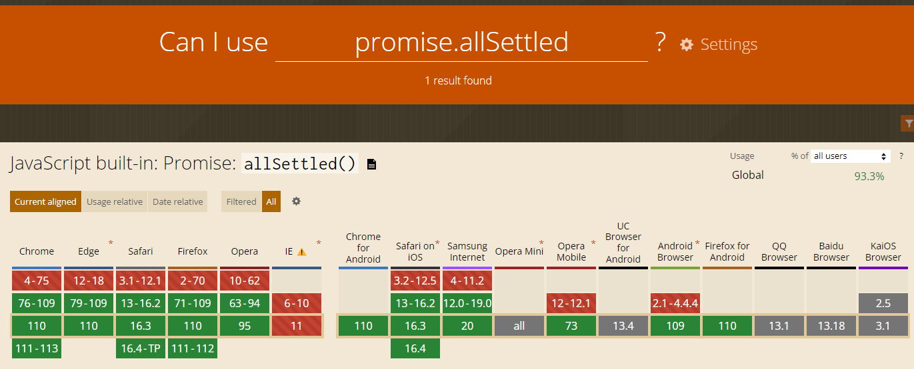
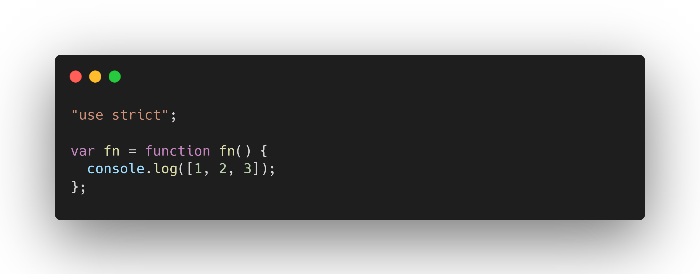
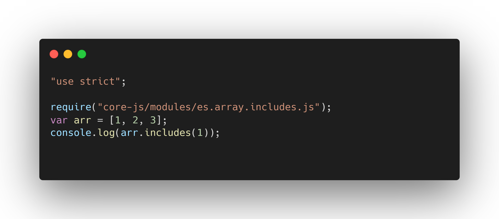
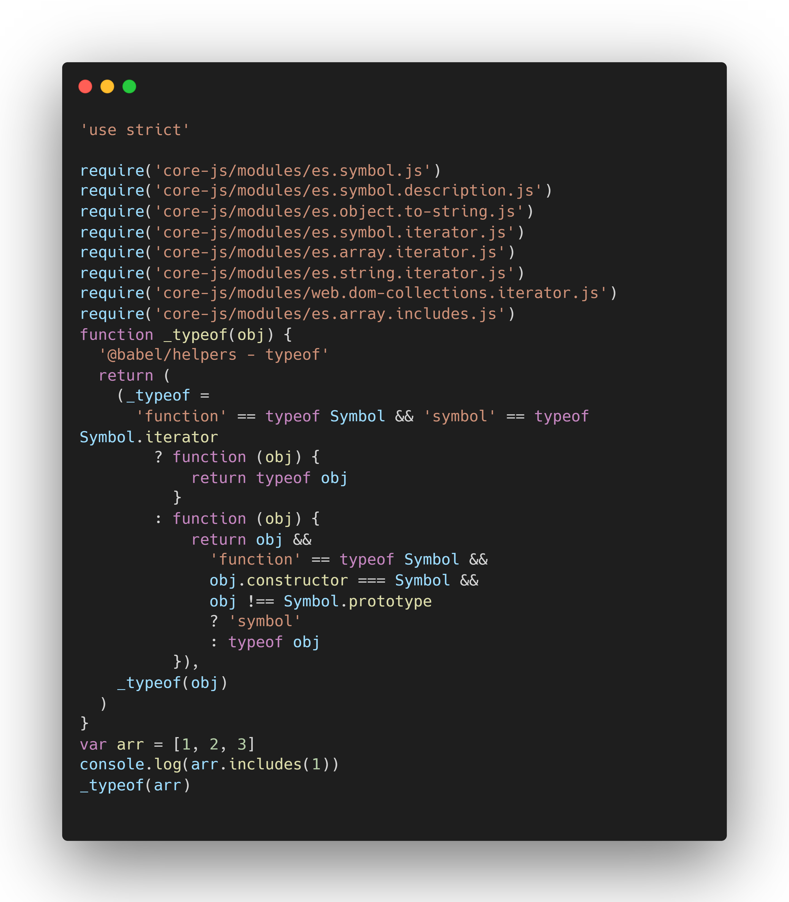
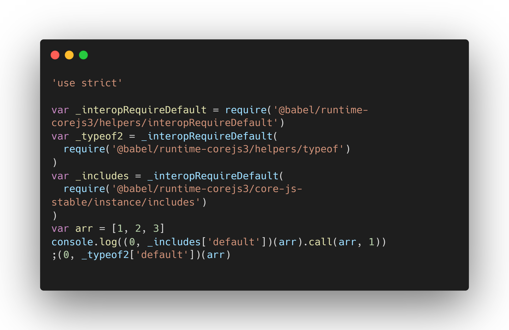

## 简介

随着前端的技术的日益发展，ECMAScript 语法为了满足现代前端需要，几乎每年都会推出一个新的版本，从最开始的 ES3、ES5 到现在的 ES6、ES2020、ES2021、ES2022 等等，每个版本的推出都必不可少的新增一些新的特性。而浏览器对这些新特性的支持速度与其更新速度并不同步，这就造成了许多低版本浏览器对一些新特性并不支持。我们可以在[caniuse](https://caniuse.com/)网站中查找到支持某个新特性的各个版本浏览器。比如在`caniuse`搜索`promise.allSettled`，如下图，可以发现每个浏览器的低版本都不支持该特性：



而 Babel 是一个工具链，主要就是用于将 ES6 中的新特性转换为 ES5 等向后兼容的低版本 JavaScript 特性，以适应对应低版本的浏览器。包括：语法转换、源代码转换、polyfill 等。Babel 的执行过程包括了解析、转换、代码生成，从而将源代码转换成目标代码

:::danger
babel 只会针对
<a href="../webpack/webpack.html">.browserslistrc 文件</a>
中所定义的浏览器进行适配
:::

## 基本使用

```js
npm i @babel/core -D
```

为了在命令行中使用 babel 命令，我们还需要安装一下 babel 的命令行工具

```js
npm i @babel/cli -D
```

完成以上两步安装后，我们就可以使用 babel 对文件进行编译转换了

```js
npx babel 编译文件(夹) --out-dir 输出结果的文件夹 --plugins=插件名, 插件名2
```

但是，我们可能有许多的东西都需要 Babel 来转换，比如箭头函数；const、let 转化成 var 等等，我们不可能一个一个的写插件。其实 Babel 已经为我们提供了一个更为方便的工具：预设。Babel 的预设会根据我们在`.browserslistrc文件`下指定需要适配的浏览器来使用相对应的插件，以帮助我们完成一系列的转换。比如，我们指定的某个需要适配的浏览器不支持箭头函数，这个时候 Babel 就会调用相应的插件将箭头函数转换成普通函数。

## 核心库@babel/core

前面我们在 Babel 基本使用篇章中安装的第一个东西就是 Babel 的核心库：@babel/core。这里面包含着 Babel 的核心功能，不安装@babel/core，就无法使用 Babel 进行编译。

```js
npm i @babel/core @babel/cli
```

配置 package.json 脚本

```json
{
  "script": {
    "compiler": "babel src --out-dir lib --watch"
  }
}
```

现在，我们就可以在命令行中通过`npm run compiler`来执行编译，但是此时的 Babel 配置并没有使用任何的插件，因此编译前后的代码不会发生任何的变化。要想 Babel 对文件进行实质性的编译，我们还需要为 Babel 添加配置。

## Babel 配置

配置 Babel 其实非常简单，有三种种方式：

- 在根目录下新建`.babelrc`文件(或者.babelrc.json，.js，.cjs，.mjs)
- 在根目录下新建`babel.config.json`(或者.js、.cjs、.mjs)文件
- 在 package.json 文件中新增`babel`字段

## 预设@babel/preset-env

babel 在转译的时候，会将源代码分成 syntax 和 api 两部分来处理：

- syntax：语法转换，例如箭头函数、const、let 等语法；
- api：类似于 promise、includes 等语法

实际开发过程中，我们不会一个一个的给 babel 配置插件，更多的是通过使用或者创建一个`preset`就可以轻松使用一组插件。@babel/preset-env 主要作用是对我们所使用的并且目标浏览器中缺失的功能进行代码转换和加载 polyfill。在不进行任何配置的情况下，@babel/preset-env 所包含的插件将支持将所有最新的 JS 特性转换成 ES5 代码。

:::warning
预设主要是进行语法转换，即处理 syntax 部分。
:::

使用预设也是非常简单，直接在 Babel 的配置文件中配置即可：

```js
//  方式一
{
  "presets": [ "@babel/preset-env" ]
}

// 方式二：
{
  "presets": [
    ["@babel/preset-env"]
   ]
}
```

此时，假若我们有以下代码：

```js
// index.js

const fn = () => {
  console.log([1, 2, 3])
}
```

在终端运行 Babel：

```js
npx babel index.js -o compiler.js
```

此时输出的`compiler.js`文件中会展示如下经过 babel 编译后的代码：



可以看到 Babel 将箭头函数和 const 语法转换成了 es5 中的 function 和 var，并且默认开启了严格模式。

需要说明的是，`@babel/preset-env`会根据你配置的目标环境生成插件列表来编译。对于基于浏览器或者 Electron 的项目，官方推荐使用`.browserslistrc`文件来指定目标环境。默认情况下，如果你没有在 Babel 配置文件中设置`targets`或者`ignoreBrowserslistConfig`，`@babel/preset-env`会使用`browserslist`配置源，此时，我们就需要新建一个`.browserslistrc`来配置源。

当然，我们也可以针对使用的预设传递参数，比如 target，useBuiltIns 等等，更多参数可以参考[Babel 官网](https://babeljs.io/docs/babel-preset-env#options)，这样我们的预设要以下面这种方式传递参数:

```js
{
  "presets": [
    [
      "@babel/preset-env",
      {
        target: '> 0.25%, not dead'
      }
    ]
   ]
}
```

前面讲到，预设实质是一系列 Babel 插件的集合，其主要作用是将高版本的语法转换成低版本的语法，即处理 syntax 部分，换句话说，就是使用低版本的语法来代替高版本语法。但是对于 api 部分，比如 promise，Generator 等，预设是无法处理的，因为 es5 中压根就没有对应的方法来替代。这样就会导致编译出来的代码也就无法在低版本浏览器中运行。此时 polyfill 就应运而生了。

```js
//Babel编译前
const arr = [1, 2, 3]
console.log(arr.includes(1))

//Babel编译后
;('use strict')

var arr = [1, 2, 3]
console.log(arr.includes(1))
```

## polyfill

polyfill 的中文意思是垫片，所谓垫片就是垫平不同浏览器或者环境下的差异，让高版本的语法、内置函数、实例方法等得以在低版本浏览器中运行。`@babel/polyfill`已经被废弃了，需要单独安装`core-js`和`regenerator-runtime`模块。

:::warning
Babel 使用 polyfill 来处理 api 部分
:::

```js
npm i core-js@3 regenerator-runtime
```

同时需要在 Babel 配置文件中添加下面的配置：

```json
{
  "presets": [
    // polyfill是针对预设的配置项，因此，需要和预设在同一数组中
    [
      "@babel/preset-env",
      {
        "useBuiltIns": "usage",
        "corejs": 3
      }
    ]
  ]
}
```

下面接收 polyfill 的两个属性：

- useBuiltIns：设置以什么方式使用 polyfill，有三个选择值：

  1、false：打包后的文件不使用 polyfill 适配，这个时候可以不设置 corejs；

  2、usage：根据源代码中出现的语言特性，自动检测所需要的 polyfill 并按需引入，这样可以确保最终包里面的 polyfill 数量最小化，构建的包相对会小一些。此时，需要设置 corejs 属性来确定使用的 corejs 的版本；

  3、entry：根据 browserslist 目标浏览器导入所有 polyfill，相应的包也就会变大。

- corejs：设置 corejs 的版本，目前使用较多的是 3.x 的版本。

:::tip
如果使用了 entry，那么在入口文件 index.js 中需要引入以下两个东西：

```js
import 'core-js/stable'
import 'regenerator-runtime/runtime'
```

:::

开启 polyfill 后，之前 Babel 无法正常转换的 api 部分就能被正常处理了。


## @babel/plugin-transform-runtime

现在有下面的代码：

```js
const arr = [1, 2, 3]
typeof arr
```

我们使用 Babel 的 polyfill 和 preset 进行编译，会得到如下代码：

从编译后的代码可以看出，Babel 其实是通过从 core-js 中引入对应的函数或者在模块中定义一些同名函数(上例的\_typeof)，从而实现转换的。这样会带来两个问题：

1、容易造成变量污染。

Babel 的 polyfill 的机制是，对于如 Array.from 等静态方法，直接在 glob.Array 上添加，而对于像 includes 等实例方法，则是直接在 global.Array.prototype 上添加。这样就直接修改了全局变量的原型，造成了变量污染。尤其是当我们在开发第三方库时，极有可能和另一个也修改了全局变量的第三方库发生冲突。

2、增加了包体积。

Babel 在编译过程中，会向每个模块中注入许多辅助函数，这个函数被称为 helpers。不同模块中可能存在大量相同的 helpers，从而增加构建包的体积。

`@babel/plugin-transform-runtime`是一个以从`@babel/runtime-corejs3`引入函数的方式替代注入注入函数 helpers 方式的插件，以节省代码大小。除此之外，他还可以为代码创建一个沙盒环境，避免全局污染，从而有效的解决上面的两个问题。

`@babel/plugin-transform-runtime`的作用是转译代码，转译后的代码中可能会引入`@babel/runtime-corejs3`当中的模块，因此`@babel/plugin-transform-runtime`通常仅在开发时使用，但是运行时最终代码需要依赖`@babel/runtime`，所以`@babel/plugin-transform-runtime`是作为开发时依赖安装，而`@babel/runtime`则是以生产依赖被安装的。

```js
npm i @babel/plugin-transform-runtime -D
npm i @babel/runtime
```

要想使用`@babel/plugin-transform-runtime`，还需要修改 Babel 的配置：

```json
{
  "preset": ["@babel/preset-env"],
  "plugins": [
    [
      "@babel/plugin-transform-runtime",
      {
        "corejs": 3
      }
    ]
  ]
}
```

现在，我们使用`@babel/plugin-transform-runtime`对我们刚刚的例子再次编译，可以得到下面的代码：

可以看出，引入`transform-runtime`插件后：

- api 从之前的直接修改原型改为了从一个统一的模块中引入，避免了对全局变量及其原型的污染；
- helpers 由统一从某个模块中导入替代了之前的在模块中定义，使得打包结果中每个 helper 只会存在一个。
