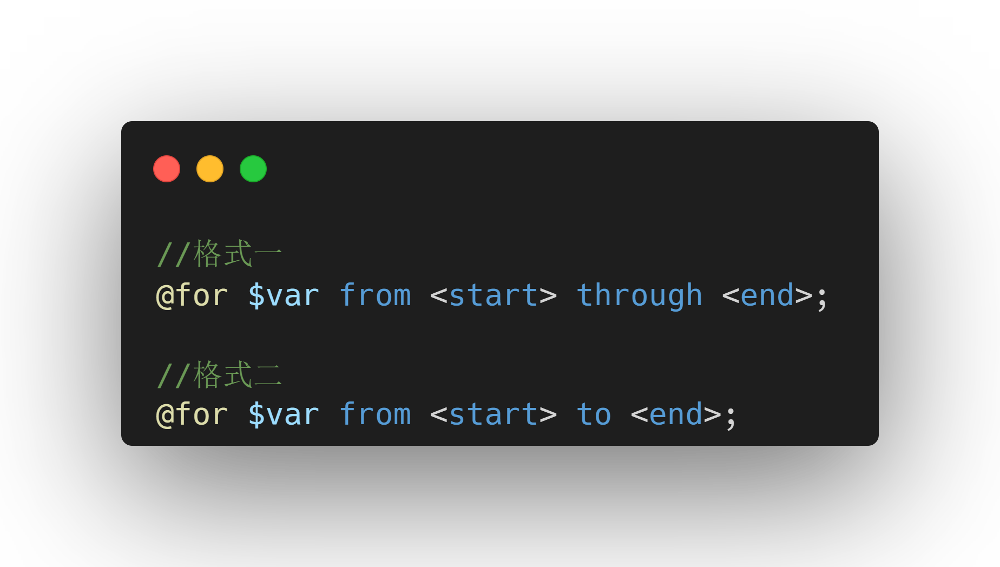

## 简介

CSS 预处理器用是一种专门的编程语言，CSS 预处理器可以对 web 页面进行样式设计，最终会被编译成正常的 CSS 文件。 CSS 预处理器增加一些原生 CSS 不具备的特性，例如代码混合，嵌套选择器，继承选择器等。这些特性让 CSS 的结构更加具有可读性且易于维护。目前市场主流的 CSS 预处理器有：less、sass(scss)、stylus 等。

本文主要介绍 sass 的用法，包括变量、混入、函数等。sass 支持两种语法格式：scss 和 sass。

## 变量

让我们先来回顾一下在 css 中是如何定义和使用变量的

```css
/* 定义变量 */
:root {
  --color: #fff;
}
body {
  --border-color: #fff;
}
.header {
  /* 局部变量，只能在.header选择器下使用 */
  --background-color: #fff;

/* 使用变量 */
p {
  color: var(--color);
  border-color: var(--border-color)
}
.header {
  background-color: var(--background-color)
}
```

在 scss 中定义变量的语法如下：

```js
$变量名：值;
```

```scss
// 全局变量
$background-color: #fff;
p {
  //全局变量
  $font-size: 16px !global;
  //局部变量
  $color: #fff;

  background-color: $background-color;
  color: $color;
  font-size: $font-size;
}
```

:::tip
scss 变量定义规则：

1. 变量以美元符号($)开头，后面跟变量名；
2. 变量名是不以数字开头的包含字母、数字、下划线、横线；
3. 变量一定要先定义后使用。
   :::

:::warning
通过连接符与下划线定义的同名变量是同一个变量，即，border_color 与 border-color 是同一变量，后面定义的值会覆盖前面定义的值。
:::

并不是所有数据类型都可以充当 sass 中变量的值，在 sass 中，变量的值主要可由以下 6 种数据类型组成：

:white_square_button: 数字。1，10%，10px；

:white_square_button: 字符串，有引号字符串与无引号字符串，"foo" , "'bar', baz；

:white_square_button: 颜色。blue、#04a3f9、rgba(255,0,0,0.5)；

:white_square_button: 布尔值。true、false；

:white_square_button: 空值。null；

:white_square_button: 数组，用空格或逗号分隔。1.5em，1em 2em；

:white_square_button: map，相当于 JavaScript 的 object，(key1: value1, key2 value2)

## 导入

首先我们回忆一下 css 中的导入，如果我们要在 index.css 中导入 test.css，我们可以在 index.css 文件开始处使用`@import url()`直接引入

```css
@import url('./test.css');
```

而在 scss 中，我们可以直接使用`@import`语法引入另一个 sass 文件

```scss
@import './test';
```

:::tip
在 scss 中，`@import url()` 语法是不会被识别和编译的。即，不会引入对应的文件
:::

## 混入

混入(mixin)用于定义可重复使用的样式,可以有效的减少重复样式的书写。混入的强大之处在于可以通过参数功能引入变量，从而输出多样化的样式。混入使用`@mixin`定义，并使用`@include`引入

1、基本用法

```scss
//定义
@mixin mixin-name {
  //一些样式
}
// 使用
选择器 {
  @include mixin-name;
}
```

```scss
@mixin block {
  color: #eee;
}

.title {
  @include block;
}
```

2、嵌套语法

```scss
@mixin waring-text {
  .warn-text {
    color: 'red';
  }
}

.container {
  @include warning-text;
}

//上面的语法编译后则呈现：
.container {
  .warn-text {
    color: 'red';
  }
}
```

3、传递参数

```scss
@mixin flex-align($aitem) {
  align-items: $aitem;
}

.container {
  @include flex-align(center); //传递参数
  @include flex-align($aitem: center); //指定参数传递
}
-----------------------------------------------------------------------------------------
//多个参数
@mixin block-padding($top, $right, $bottom, $left) {
  padding: $top $right $bottom $left;
}

.content {
  //多个参数时，每个参数都必须指定值
  @include block-padding($top: 10px, $left: 10px, $bottom: 0, $right: 0);
}
-----------------------------------------------------------------------------------------

//默认参数
@mixin block-margin($top: 0, $right: 0, $bottom: 0, $left: 0) {
  margin: $top $right $bottom $left;
}

.content {
  //未指定的，则使用默认值
  @include block-margin($top: 10px, $bottom: 10);
}
-----------------------------------------------------------------------------------------

//长度不定的参数
@mixin linear-gradient($direction, $gradients...) {
  //获取第一个元素，即#F00
  background-color: nth($gradients, 1);
}

.content {
  @include linear-gradient(to right, #f00, orange, yellow);
}
```

## 继承

scss 的继承允许我们赋值一个元素的所有样式。当然，也允许我们在此基础上添加样式。scss 中继承语法是`@extend`

```scss
%alert {
  font-size: 20px;
}

.warning {
  @extend %alert;
  color: red;
}
```

## 运算符

scss 中也加入了 css 不具备的运算符，从而使得 scss 可以书写一些简单的逻辑。

### 关系运算符

| 符号 | 说明     |
| ---- | -------- |
| ==   | 等于     |
| !=   | 不等于   |
| <    | 小于     |
| >    | 大于     |
| <=   | 小于等于 |
| >=   | 大于等于 |

```scss
$theme: 1;
.container {
  @if $theme==1 {
    color: 'red';
  } @else {
    color: 'blue';
  }
}
```

### 逻辑运算符

| 符号 | 说明   |
| ---- | ------ |
| and  | 逻辑与 |
| or   | 逻辑或 |
| not  | 逻辑非 |

```scss
$width: 100;
$height: 200;
@if $width>50 and $height<300 {
  font-size: 16px;
} @else {
  font-size: 10px;
}
```

## 指令

scss 中的指令以`@`开头，允许做一些简单的逻辑操作和流程控制。

### @if 指令

@if 函数允许我们根据条件进行分支，并仅返回可能结果中的一种

```scss
$color: 'red';
.content {
  @if ($color== 'red') {
    color: 'red';
  } @else if ($color== 'green') {
    color: 'green';
  } @else {
    color: 'yellow';
  }
}
```

### @for 指令

@for 函数可以在限制的范围内重复输出格式，每次按要求对输出结果做出变动，这个指令包含两种格式



through 和 to 的区别在于：

当使用 through 时，条件范围包含`<start>`和`<end>`的值

当使用 to 时，条件范围只包含`<start>`不包含`<end>`的值

:::tip
值得注意的是，$var 可以是任意变量，但`<start>`和`<end>`必须是整数值
:::

```scss
for $i from 1 to 4 {
  .p#{$i} {
    width: 100 * $i;
  }
}
```

### @each 指令

@each 指令和@for 的功能差不多，都是循环，不过@each 是循环一个列表结构。

@each 的格式是 `@each $var in <list>`，$var 可以是任何变量名，而`<list>`是一连串的值，也就是值列表。

```scss
$color-list: red green blue;
@each $color in $color-list {
  //获取下标
  $index: index($color-list, $color);
  .p#{$index - 1} {
    background-color: $color;
  }
}
```

## 函数

scss 允许我们自定义函数，我们可以把一些复杂或经常使用的内容进行抽离封装，以便重复使用

```scss
@function function-name([$param1, $param2, ……]) {
  //函数体
  @return $value;
}
```

:::tip
@return 只允许在@函数体中使用，并且每个@function 必须以@return 结束。当遇到@return 时，它会立即结束函数并返回其结果。
:::

```scss
@function background-gradient($direction, $start-color, $end-color: blue) {
  @return linear-gradient($direction, $start-color, $end-color);
}

//正常使用
body {
  background-image: background-gradient(to right, red, yellow);
}

//省略默认值
body {
  background-image: background-gradient(to right, red);
}

//按照key进行传参
body {
  background-image: background-gradient(
    $direction: to right,
    $start-color: red
  );
}
```

```scss
//可变参数
@function background-gradient($direction, $gradients...) {
  @return linear-gradient($direction, $gradients);
}

body {
  background-image: background-gradient(to right, red, yellow, green);
}

$width: 20px 30px 40px;
.top {
  width: min($width...);
}
```

## 三元条件函数

```scss
if($condition, $if-true, $if-false);
```

判断$condition，如果条件成立，则返回$if-true，条件不成立，则返回$if-false

```scss
$theme: 'dark';
.container {
  color: if($theme== 'dark', #000, #fff);
}
```

## 模块

scss 中的模块使用的是@use。从其他 scss 样式表加载 mixin，function 和变量，并将来自多个样式表的 css 组合在一起，@use 加载的样式表就被称之为'模块'，@use 可以看作是@import 的增强。

```scss
@use '<url>' [as alias | namespace];
```

:::tip
:large_blue_diamond: @use 引入同一个文件多次，不会重复引入，而@import 会重复引入

:large_blue_diamond: @use 引入的文件都是一个模块，默认以文件名作为模块名，可通过 as alias 取别名

:large_blue_diamond: @use 引入多个文件时，每个文件都是单独的模块，相同变量名不会覆盖，通过模块名访问，而@import 变量会被覆盖

:large_blue_diamond: @use 方式可通过@use 'xxx' as\*来取消命名空间，建议不要这么做

:large_blue_diamond: @use 模块内可通过$-或$来定义私有成员，也就是说或者-开头的 Variables mixins functions 不会被引入

:large_blue_diamond: @use 模块内变量可通过! default 定义默认值，引入时可通用 with ...）的方式修改
:::
