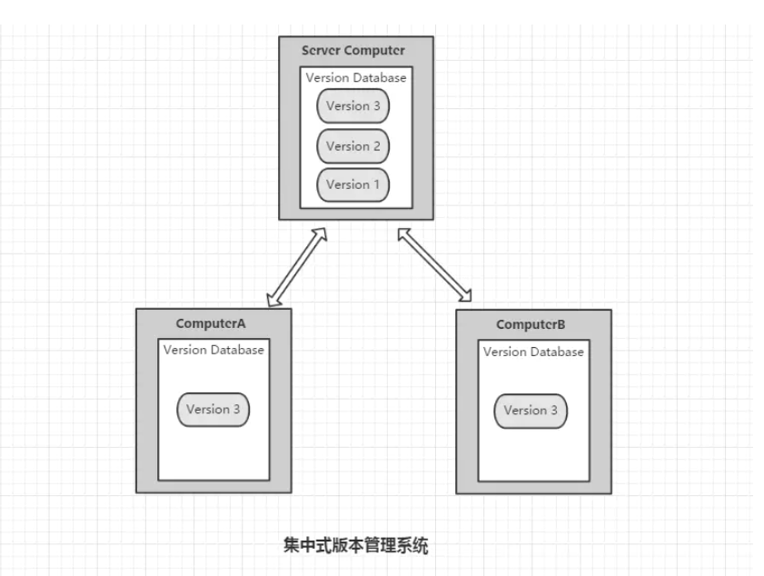
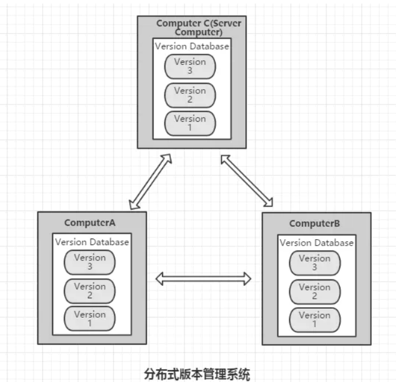
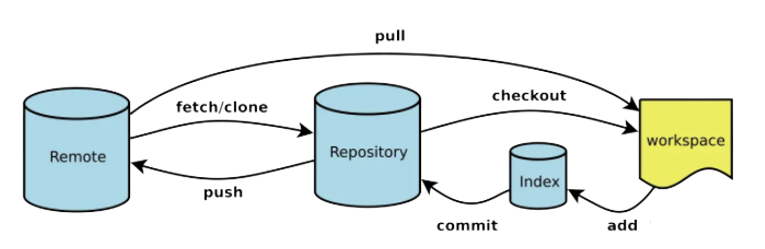
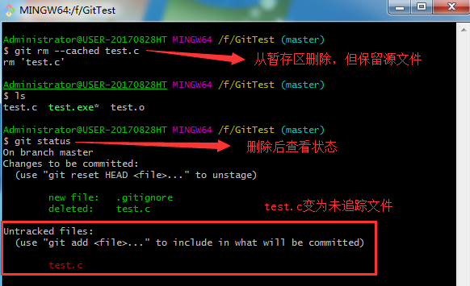

我们经常听到一句话：git 是一个分布式版本控制系统，而 svn 是一个集中式版本控制系统。

<div style="margin: auto; width: 200px; hight: 200px">

</div>

集中式版本控制系统最大的特点就是版本库集中存放于中央服务器中，每个开发人员都需要从中心服务器拉取代码到本地，而且每次拉取的只是对应的某个特定版本(默认为最新版本)，开发完之后在把自己的代码推送到中央服务器中，如下图所示：



由于每次本地都是拉取一个指定的版本，所以**本地始终只会存在一个版本，没有版本库的修改记录，因此集中式版本控制系统最大的毛病就是必须联网才能工作。** 如果在局域网内还好，带宽够大，速度够快，可是一旦在中央服务器宕机，本地将无法推送。

而分布式版本控制系统则完全不同。首先，它完全没有中央服务器，又或者说，每个开发者的电脑都是一台中央服务器。因为每个人的电脑上都是一个完整的版本库，这样，你工作的时候，就不需要联网了，下图所示：



既然每个人的电脑都有一个完整的版本库，那么如何多人协作呢？

其实很简单，比如你在电脑上改了文件 A，你同事也在他的电脑上改了文件 A，这时，你们俩只需将各自的修改推送给对方，就可以互相看到对方的修改了。但是这也麻烦了吧，总不能每次开发前都把公司每个人的修改同步一遍吧。

所以，既然是多人协作，那么我们就指定一个人的电脑作为总仓库，所有人都将自己的修改推送给他，同时也从他的电脑上拉取其他人的修改，这样就能保证他的仓库保留了所有人的改动，这个人的电脑其实就相当于集中式版本控制库中的中央服务器。

因此，我们通常说的分布式版本控制系统的服务器其实就是找一台电脑充当服务器的角色，每天 24 小时开机，分布式版本控制系统中没有中央服务器也是可以正常工作的，只是同步其他人的代码很不方便，而中央服务器存在的意义就仅仅式为了方便同步其他人的代码。

另外分布式也比集中式更加安全，每次提取项目，就是把整个项目完全的镜像下来，这样一来，任何一个人的电脑发生故障，事后都可以用其他人的镜像仓库恢复。

## Git 流程

在 git 当中，有四个区域是需要区分的：

- 工作区(Workspace)：代码存放在磁盘的目录位置，我们写代码的位置
- 暂存区(Index/Stage)：临时存储的位置，还未生成历史版本，即没有 sha1 值，可以直接删掉。
- 本地库(Repository)：提交到本地仓库的代码会生成历史版本，是删不掉的。
- 远程库(Remote)：代码托管中心。GitLab、Github、Gitee

下图展示了四个工作区的操作：


## 获取 git 仓库

获取 git 仓库分为两种情况：本地新建仓库和克隆现有项目。

### 新建本地仓库

当我们开始一个项目时，项目的代码还未托管到远程库中，这个时候我们就需要在本地初始化一个本地仓库，然后再把本地仓库托管到远程库中。初始化本地仓库可以在`Git Bash`中输入以下命令实现：

```js
git init
```

此时，git 会在当前目录下新建一个`.git`的文件，表明本地仓库已建成。

### 克隆现有仓库

如果我们不是重新开发一整个项目，而是基于原有功能扩展新功能，那么我们只需要把之前的代码版本库复制到本地就行，这个过程称为克隆。

```js
git clone <url>
```

也可以克隆并自定义名字

```js
git clone <url> <name>
```

## 查看日志

有三种方式帮助我们查看日志

```js
// 查看精简的版本日志，记录全部版本，可以帮助我们"后悔"
git reflog

// 查看完整详细的版本日志
git log

// 查看最新n条日志
git log -n
```

## 查看未暂存和已暂存的区别

最常用的查看状态的命令是：

```js
git status
```

但是它只能查看文件目前处于哪个区域，而要查看文件在工作区和暂存区的具体内容差异可以使用`diff`命令，具体如下：

```js
// 比较暂存区和工作区的差异，-代表暂存区；+代表工作区
git diff
```

## 忽略文件

一般情况下，我们在工程下的每一个文件都会被交由 git 管理，但这其实大可不必，很多文件我们也许并不需要 git 管理，比如`node_modules`。这个时候，我们可以在工程目录下新建一个`.gitignore`的文件，并列出需要 git 忽略的文件的匹配规则，那么 git 在提交的时候就会忽略`.gitignore`文件中所列出的文件了。

下面是`.gitignore`文件的几个简要规则：

```js
*   -------任意字符
!   -------非
目录名/  -------忽略文件下的所有文件
```

```js
// 忽略所有txt结尾的文件，除了a.txt文件

*.txt
!a.txt
```

## 移除文件

通过`git add`可以将文件从工作区加入到暂存区，如果需要把这个文件从暂存区移入到工作区，这个过程称为**移除文件**。从 git 的暂存区移除文件有两种情况：
1、从暂存区移除，同时删除工作区域内的文件，此时状态仍处于暂存区：

```js
git rm -f <文件名>
```

2、从暂存区删除，但保留工作区的源文件

```js
git rm --cached <文件名>
```

<div style="text-align: center">

</div>

## 版本穿梭

我们每提交一个版本就会生成一个 sha1 值，也称版本号。在开发过程中，有时我们可能需要在各个版本之间切换，比如我们可能需要切到某个版本上从而放弃该版本后面的开发，又或者我们只是想去查看某个版本具体的修改内容，总之，开发过程中，我们无法避免版本穿梭。

:::tip
git 的版本穿梭实质就是移动`HEAD指针`
:::

```js
// 回退到特定sha1值的版本，一般会结合reflog指令一起
git reset --hard <sha1值>

// 回退n步，有几个^,代表回退多少步
git reset --hard HEAD^^
git reset --hard HEAD~n
```
