我们经常听到一句话：git 是一个分布式版本控制系统，而 svn 是一个集中式版本控制系统。

<div style="margin: auto; width: 200px; hight: 200px">

</div>

集中式版本控制系统最大的特点就是版本库集中存放于中央服务器中，每个开发人员都需要从中心服务器拉取代码到本地，而且每次拉取的只是对应的某个特定版本(默认为最新版本)，开发完之后在把自己的代码推送到中央服务器中，如下图所示：


由于每次本地都是拉取一个指定的版本，所以**本地始终只会存在一个版本，没有版本库的修改记录，因此集中式版本控制系统最大的毛病就是必须联网才能工作。** 如果在局域网内还好，带宽够大，速度够快，可是一旦在中央服务器宕机，本地将无法推送。

而分布式版本控制系统则完全不同。首先，它完全没有中央服务器，又或者说，每个开发者的电脑都是一台中央服务器。因为每个人的电脑上都是一个完整的版本库，这样，你工作的时候，就不需要联网了，下图所示：


既然每个人的电脑都有一个完整的版本库，那么如何多人协作呢？

其实很简单，比如你在电脑上改了文件 A，你同事也在他的电脑上改了文件 A，这时，你们俩只需将各自的修改推送给对方，就可以互相看到对方的修改了。但是这也麻烦了吧，总不能每次开发前都把公司每个人的修改同步一遍吧。

所以，既然是多人协作，那么我们就指定一个人的电脑作为总仓库，所有人都将自己的修改推送给他，同时也从他的电脑上拉取其他人的修改，这样就能保证他的仓库保留了所有人的改动，这个人的电脑其实就相当于集中式版本控制库中的中央服务器。

因此，我们通常说的分布式版本控制系统的服务器其实就是找一台电脑充当服务器的角色，每天 24 小时开机，分布式版本控制系统中没有中央服务器也是可以正常工作的，只是同步其他人的代码很不方便，而中央服务器存在的意义就仅仅式为了方便同步其他人的代码。

另外分布式也比集中式更加安全，每次提取项目，就是把整个项目完全的镜像下来，这样一来，任何一个人的电脑发生故障，事后都可以用其他人的镜像仓库恢复。

## Git 流程

在 git 当中，有四个区域是需要区分的：

- 工作区(Workspace)：代码存放在磁盘的目录位置，我们写代码的位置
- 暂存区(Index/Stage)：临时存储的位置，还未生成历史版本，即没有 sha1 值，可以直接删掉。
- 本地库(Repository)：提交到本地仓库的代码会生成历史版本，是删不掉的。
- 远程库(Remote)：代码托管中心。GitLab、Github、Gitee

下图展示了四个工作区的操作：


## 获取 git 仓库

获取 git 仓库分为两种情况：本地新建仓库和克隆现有项目。

### 新建本地仓库

当我们开始一个项目时，项目的代码还未托管到远程库中，这个时候我们就需要在本地初始化一个本地仓库，然后再把本地仓库托管到远程库中。初始化本地仓库可以在`Git Bash`中输入以下命令实现：

```js
git init
```

此时，git 会在当前目录下新建一个`.git`的文件，表明本地仓库已建成。

### 克隆现有仓库

如果我们不是重新开发一整个项目，而是基于原有功能扩展新功能，那么我们只需要把之前的代码版本库复制到本地就行，这个过程称为克隆。

```js
git clone <url>
```

也可以克隆并自定义名字

```js
git clone <url> <name>
```

## 本地分支和远程分支

### 本地分支推送到远程

如果本地有某个分支，而远程没有，想要将这个分支推送到远程，可以使用下面命令：

```js
git push
```

但是有的时候，直接使用上面命令会报错。

<div style="text-align: center">
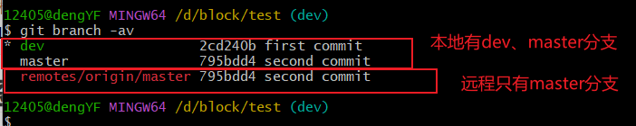
</div>

如上图，本地有 dev 和 master 分支，而追踪分支只有 master 分支，即远程只有 master 分支，现要将本地的 dev 分支提交到远程的 dev 分支中，如果直接 push，将会出现下面的错误：

<div style="text-align: center">
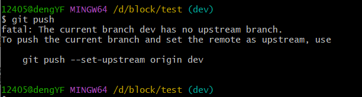
</div>

这是由于 git 并不知道你要提交到远程仓库的那个分支，即未指定任何远程分支作为本地 dev 分支的追踪分支。所以，当本地新建的分支第一次提交时，需要指定提交到哪个分支。具体方法如下：

**方法一：**

```js
// 将本地dev分支推送到远程origin仓库的dev分支
git push -u origin dev

// 也可以推到不同分支下，例如将本地dev分支推送到远程的dev2分支中
git push origin dev:dev2
```

**方法二：**

```js
// 设置本地dev分支追踪分支为origin仓库的dev分支
git push --set-upstream origin dev
```

值得注意的是，只需要第一次提交时指定追踪分支即可，后续的提交均会同步到该追踪分支中。

### 远程分支拉取到本地

如果是想要把远程的某个分支拉取到本地，有以下三种方案：

**方案一：**

```js
git pull
```

开发中不建议直接使用 pull 方法，因为此时拉取下来的代码并未指定追踪分支，如果后面要 push 的话，仍然需要指定追踪分支方能提交。

**方案二：**

前面直接 pull 方法的痛点在于拉取远程分支时没有指定追踪分支，那么我们在拉取的时候就指定追踪分支不就可以完美的解决这个问题了吗。事实上，在 pull 的时候，可以直接给本地分支指定对应的远程分支作为其追踪分支的：

```js
// 将远程分支拉取到本地分支，并自动关联
git pull origin 本地分支 : 远程分支

// 将远程分支拉取到本地当前分支
git pull origin 远程分支
```

**方案三：**

我们也可以通过 checkout 完成指定追踪分支、创建分支、切换分支一条龙服务。

```js
// 创建并切换到dev_local分支，而且将dev_local分支和追踪分支origin/dev关联
git checkout -b dev_local origin/dev
```

## 查看日志

有三种方式帮助我们查看日志

```js
// 查看精简的版本日志，记录全部版本，可以帮助我们"后悔"
git reflog

// 查看完整详细的版本日志
git log

// 查看最新n条日志
git log -n
```

## 查看未暂存和已暂存的区别

最常用的查看状态的命令是：

```js
git status
```

但是它只能查看文件目前处于哪个区域，而要查看文件在工作区和暂存区的具体内容差异可以使用`diff`命令，具体如下：

```js
// 比较暂存区和工作区的差异，-代表暂存区；+代表工作区
git diff
```

## 忽略文件

一般情况下，我们在工程下的每一个文件都会被交由 git 管理，但这其实大可不必，很多文件我们也许并不需要 git 管理，比如`node_modules`。这个时候，我们可以在工程目录下新建一个`.gitignore`的文件，并列出需要 git 忽略的文件的匹配规则，那么 git 在提交的时候就会忽略`.gitignore`文件中所列出的文件了。

下面是`.gitignore`文件的几个简要规则：

```js
*   -------任意字符
!   -------非
目录名/  -------忽略文件下的所有文件
```

```js
// 忽略所有txt结尾的文件，除了a.txt文件

*.txt
!a.txt
```

## 移除文件

通过`git add`可以将文件从工作区加入到暂存区，如果需要把这个文件从暂存区移入到工作区，这个过程称为**移除文件**。从 git 的暂存区移除文件有两种情况：
1、从暂存区移除，同时删除工作区域内的文件，此时状态仍处于暂存区：

```js
git rm -f <文件名>
```

2、从暂存区删除，但保留工作区的源文件

```js
git rm --cached <文件名>
```

<div style="text-align: center">

</div>

## 版本穿梭

我们每提交一个版本就会生成一个 sha1 值，也称版本号。在开发过程中，有时我们可能需要在各个版本之间切换，比如我们可能需要切到某个版本上从而放弃该版本后面的开发，又或者我们只是想去查看某个版本具体的修改内容，总之，开发过程中，我们无法避免版本穿梭。

:::tip
git 的版本穿梭实质就是移动`HEAD指针`
:::

```js
// 回退到特定sha1值的版本，一般会结合reflog指令一起
git reset --hard <sha1值>

// 回退n步，有几个^,代表回退多少步
git reset --hard HEAD^^
git reset --hard HEAD~n
```

:::warning
reset 的三个参数区别：

--soft：仅仅移动本地库 HEAD 指针，已经 add 的缓存以及工作区的所有东西都不变

--mixed：移动本地库 HEAD 指针，重置暂存区，已经 add 的缓存也会丢失，工作区的代码不会变动

--hard：移动本地库指针，重置暂存区，重置工作区
:::

<div style="text-align: center">
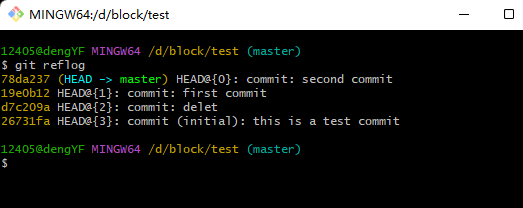
</div>

<div style="text-align: center; margin: 20px 0">
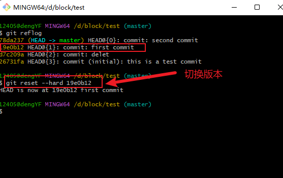
</div>

<div style="text-align: center">
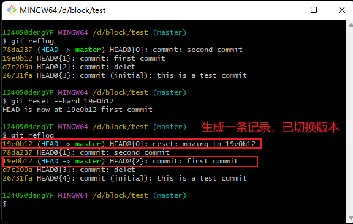
</div>

还有一种方法也可以实现版本穿梭：checkout

```js
git checkout <sha1值>
```

:::tip
checkout 版本穿梭处于一种游离状态：1、修改后必须提交；2、创建分支的好时机。
:::

## 重写提交说明

```js
// 修改上次的提交说明
git commit --amend -m "提交说明"
```

## 创建分支

创建分支可以同时并行开发多个功能，从而提高开发效率。另外，使用多个分支开发，即使某个分支开发失败也不会影响其他分支。

创建分支有两种方式：

```js
git branch <分支名>

// 创建并切换分支
git checkout -b <分支名>
```

## 查看分支

```js
// 查看本地所有分支
git branch

// 查看本地所有分支及各分支当前的sha1值
git branch -v

// 查看本地分支和线上分支以及所有分支当前的sha1值
git branch -av
```

## 切换分支

git checkout <分支名>

## 保存现场

假如，你现在正在某个分支上开发，但是领导突然让你去切换到另一个分支上修复一个紧急的 bug，这个时候你该如何操作呢？

一种方式是先 commit 目前未完成功能的代码，然后再切换到目标分支上去修复缺陷。但是这种方式不是很好，因为一般而言，不建议在功能开发完毕前 commit 代码，这样到时候一个功能会出现许多次的 commit，维护起来不太方便。

一种比较优雅的方式就是使用保存现场：git stash。因此，如果功能未开发完毕就想切换分支，通常需要执行两步：保存现场、切换分支

```js
// 在dev分支中保存现场
git stash
// 切换到master分支
git checkout master
// 做其他工作
……

// 切回dev分支
git checkout dev
// 查看保存的现场
git stash list
// 恢复现场(默认还原最后一次)
git stash pop
```

上面保存现场的操作并没有给现场命名，事实上，我们是自定义命名的：

```js
git stash save "现场名字"
```

<div style="text-align: center; margin: 10px 0">
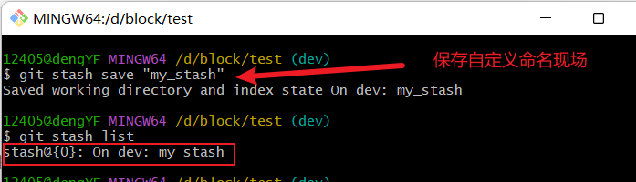
</div>

**恢复现场**

```js
// 恢复现场，并删除现场中所恢复的数据
git stash pop

// 恢复现场，保留现场中的数据
git stash apply
```

<div style="text-align: center">
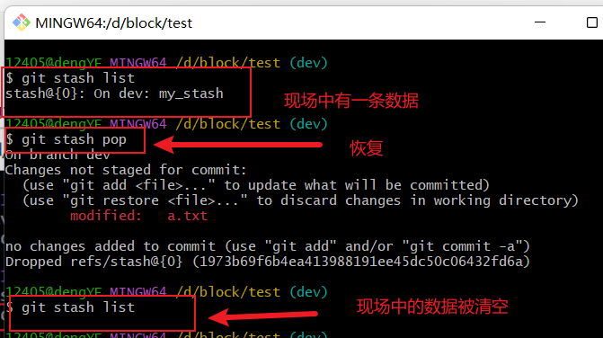
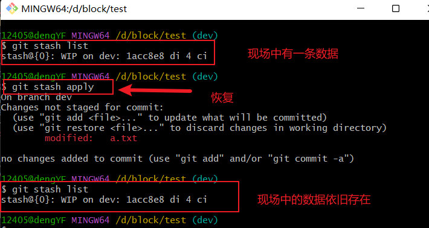
</div>

**手动删除现场**
当然除了使用 pop 删除现场，我们也可以手动删除现场

```js
git stash drop stash@{n}
```

<div style="text-align: center; margin: 10px 0">
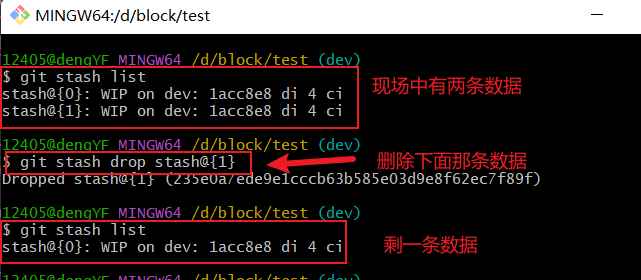
</div>

## 分支重命名

```js
git branch -m 原名 新名
```

## 删除分支

由于分支分为本地分支和远程分支，并且两种分支的删除方式是不一样的。

### 删除本地分支

```js
git branch -d <其他分支名>
```

:::tip
上面的操作只能删除已合并内容的分支，而无法删除未合并内容的分支。

注：存在其他分支没有的内容的分支称为未合并内容的分支。
:::

<div style="text-align: center">

</div>

当然，如果你想强硬点，不管三七二十一，就是要删掉某个分支，也是可以的：

```js
// 强制删除，不合并也可以
git branch -D <其他分支名>
```

:::tip
如果在分支 A 中进行了新建和删除文件操作，且未 add 和 commit，此时 master 分支上是能够看到该操作的，并且在 master 分支上可以直接删除分支 A，无需合并。如果进行了 commit 操作，则 master 分支上就无法观察到此文件的变动了。
:::

### 删除远程分支

删除远程分支的方案是：通过将本地的空分支推送到远端的某个分支，从而达到删除远程分支。

```js
// 删除远程的dev分支
git push origin  :dev
```

<div style="text-align: center; margin: 10px 0;">
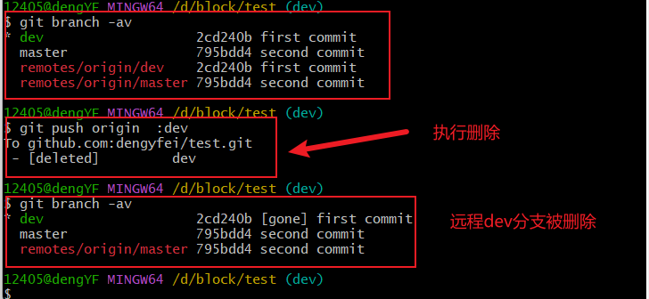
</div>

## 合并分支

合并分支指的是将我们本地仓库的分支合并到远程仓库的某个分支，这样其他同事也可以通过远程仓库拉取你开发的内容，从而实现多人开发。

要将一个分支所做的更新合并至远程仓库，有两种方法：

### merge

如果将 B 分支合并到 A 分支，merge 需要在 A 分支中操作，具体需要进行如下两个操作：

1、切换到要合并的主分支上(A 分支)

2、执行命令：

```js
git merge <待合并的分支名>
```

<div style="text-align: center">
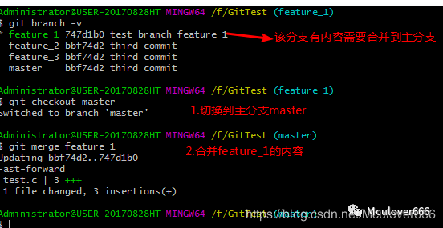
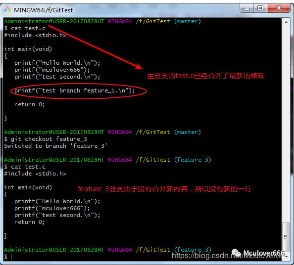
</div>

为了方便理解，举个例子，如果此时你在 feature 分支上开发，与此同时，你的同时在 master 分支上提交了新的内容，此时的分支图如下图：

<div style="text-align: center">
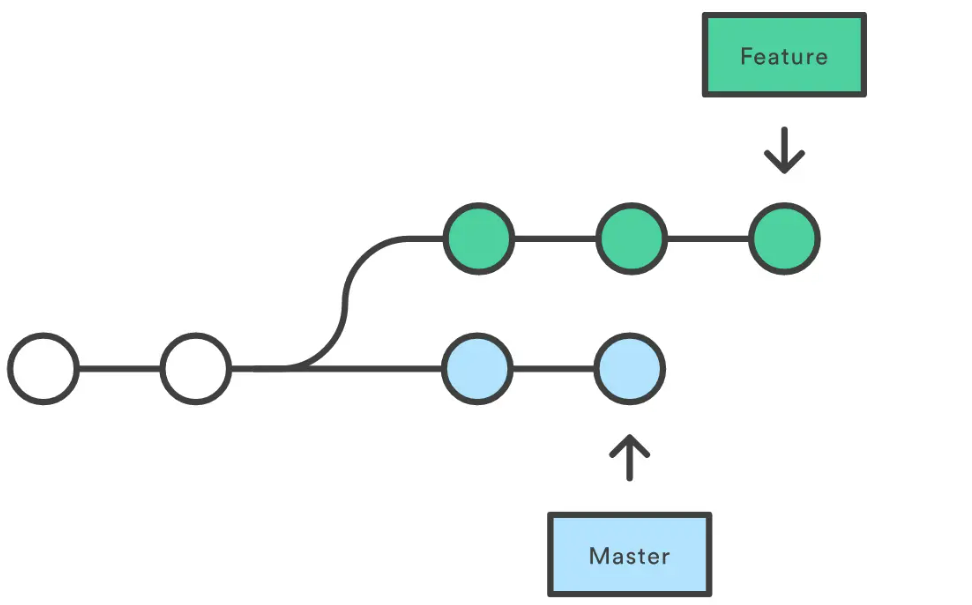
</div>

为了将 master 分支上的内容合并到正在开发的 feature 分支上，可以在 feature 分支上执行下面的语句：

```js
git merge master
```

此时，feature 分支上 git 会自动产生一个新的 commit(merge commit)

<div style="text-align: center">
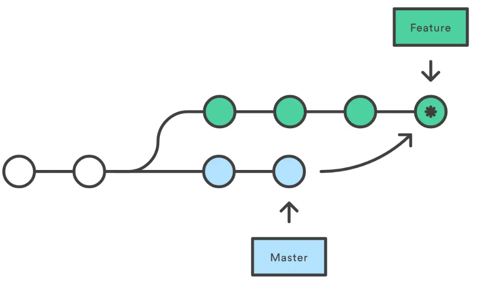
</div>
如果合并期间产生了冲突，则修改后再重写提交。

我们可以看到，merge 时如果一个分支靠前，另一个分支落后，落后的分支可以通过 merge 直接追赶靠前的分支，这个过程称为 fast forward。

git 在 merge 时，默认使用的都是 fast forward。fast forward 后，两个分支会归于同一 commit。当然，我们也可以不使用 fast forward，即，禁止 fast forward。此时，fast forward 之后，两个分支不会归于同一 commit，主动合并的分支会前进一步。具体命令如下：

```js
git merge --no-ff <分支名>
```

:::tip
merge 的特点：

1、自动创建一个新的 commit，

2、如果出现冲突，只需要修改冲突部分，然后重新 commit 即可

优点：记录了真实的 commit 情况，包括每个分支的详情

缺点：每次 merge 都会新增一个 merge commit，所以使用 GUI tools 查看分支图时，非常的杂乱。
:::

### rebase

合并分支的另一种方案就是 rebase，称为变基。

如果将 B 分支合并到 A 分支，rebase 需要在 B 分支中操作(注意和 merge 的区别)，具体需要进行如下两个操作：

1、切换到被合并的分支上(B 分支)

2、执行命令：

```js
git rebase <主分支名>
```

同样那个栗子，如果是 rebase 操作，最后的分支图是这样的：

<div style="text-align: center">
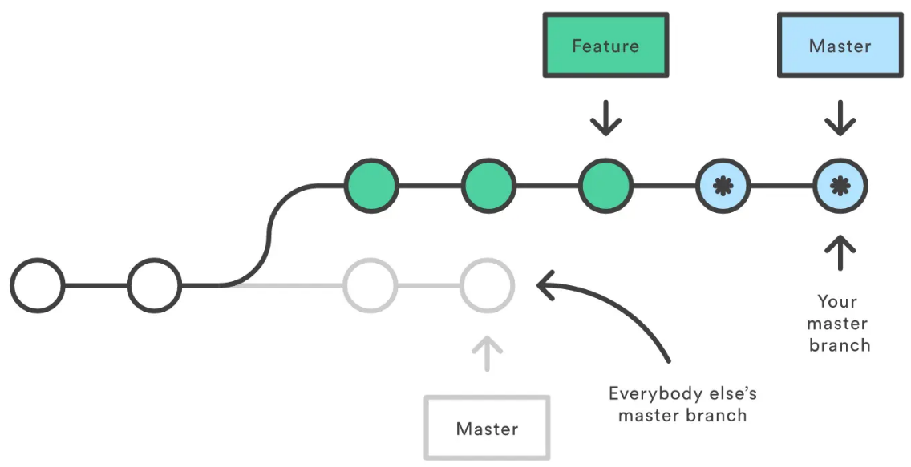
</div>

什么是变基，变基就是找公共祖先。事实上，rebase 就是先找到 master 和 feature 的公共祖先，然后把 master 上所有的 commit 都移动到 feature 的顶端。

如何在 rebase 期间出现了冲突，可按以下步骤解决：

- 修改冲突
- git add .
- git rebase --continue

:::tip
rebase 特点：将之前的 commit 合并

优点： 更加简洁的 commit 图

缺点：由于 re-write 了分支 history，丢失了部分 commit，得到的不是真实的 commit。
:::

:::danger
merge 和 rebase 的区别：

- merge 合并会新增一个 merge commit，然后将两个分支的历史联系起来，这是一种非破坏性的操作，对现有分支不会造成任何更改，但是会导致历史记录比较杂乱。

- rebase 会将整个分支移动到另一个分支上，使得历史记录更加清晰，但是会破坏 commit 的历史。

因此，开发期间更加推荐 rebase，但是 rebase 由于会改变分支 commit，如果你在公共分支(如 master)上使用了 rebase，它会移动 master，git 会认为主分支的历史与其他人的有分歧，从而产生冲突。**所以永远只在你自己开发的分支上使用 rebase。**
:::

## 标签

git 可以给仓库中的某一个提交打上标签，以示重要，通常会使用这个功能来标记发布节点(V1.0、V2.0 等)。标签使用于整个项目，和具体的分支没关系。也就是说：在一个分支中打标签，删除标签，其他分支也是可以看见的。

### 查看标签

```js
// 查看标签列表
git tag

// 查看某个标签详细信息
git tag show 标签名
```

### 打标签

```js
// 打上v1.0标签
git tag v1.0
```

### 推送标签到远程

```js
// 将v1.0推送到远程
git push origin v1.0

// 将本机所有的标签推送到远程
git push origin --tags
```

### 删除标签

```js
// 删除本地标签
git tag -d v1.0

// 删除远程标签
git push origin   : v1.0
```
