## webpack 简介

官方对 webpack 的解释为：webpack 是一个静态的模块化打包工具。

由于浏览器只支持 ES Module 一种模块化方式，并不支持 CommonJs、AMD 等其他模块化开发，而 webpack 默认支持多种模块化开发，并且可以将模块化语法转化成浏览器能够理解的 JavaScript 代码。在打包构建过程中，webpack 会分析各个文件间的依赖关系，然后生成一个依赖图并以文件的方式保存下来，将来浏览器在运行代码时就可以读取这个文件，并得到各模块之间的引用关系。

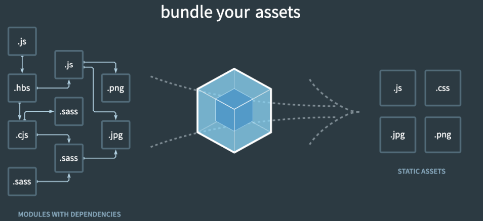

那么，我们为什么需要使用 webpack？

- webpack 可以帮助我们解决开发时调用后端接口的跨域问题
- webpack 可以帮助我们在改动源代码后自动将变动更新至浏览器
- 由于 js 和 css 的兼容性问题，浏览器并不支持那些新特性，webpack 可以将其转换成浏览器识别的对应的特性

## webpack 初体验

### 安装

使用 webpack 需要安装两个工具：webpack、webpack-cli

```js
npm i webpack webpack-cli -D
```

为什么 webpack 需要安装两个包呢？它们之间的关系又是怎样的呢？

解答这个问题我们首先需要了解 webpack 的打包流程：当我们在命令行输入 webpack 或者利用各类框架的脚手架执行 webpack 命令时，首先会执行`node_modules/bin/webpack`文件中的代码，而 webpack 在执行核心打包代码之前，需要解析传入的参数以及配置文件内部的配置项，而解析参数和配置项的任务就是由`webpack-cli`来完成的。比如在命令行中输入`webpack --config w.config.js`，后面的参数就是由`webpack-cli`负责解析的。`webpack-cli`在完成参数的解析后会调用`webpack`中的核心代码进行编译和打包。

了解了 webpack 的打包流程，我们就自然而然的明白了为什么我们使用 webpack 需要安装两个包，以及这两个包的分工是如何的。从 webpack 打包流程我们可以知道，webpack-cli 的作用无非就是解析参数和配置文件描述的配置项。事实上，我们也可以自己编写一个类似于 webpack-cli 的工具来替代它解析参数和配置项，这样，我们就完全可以不用安装 webpack-cli 了。许多第三方脚手架内部就并没有依赖 webpack-cli，比如 Vue 使用的就是自己生态内部的一个叫 vue-service-cli 的工具。

### 使用

有两种方式运行 webpack：

1、直接在终端输入以下命令：

```js
npx webpack
```

当在命令行输入`webpack`时，webpack 默认会将当前目录下的`src/index.js`文件作为入口文件去寻找依赖并构建依赖图进行编译打包，如果当前目录下找不到`src/index.js`文件，则会抛出如下错误：

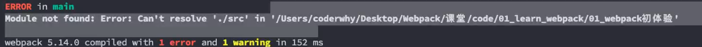

当然，我们也可以增加参数更换入口文件：

```js
npx webpack --entry ./src/main.js
```

执行上面的命令，那么 webpack 就会把`./src/main.js`当作入口文件了，更多参数，可以查阅[webpack 官方文档](https://webpack.docschina.org/api/cli/#configtest)。

webpack 打包后默认会在根目录下输出一个`dist/main.js`文件，里面的代码默认都是经过压缩和丑化的。

2、通过脚本执行
我们也可以在`package.json`文件中对打包命令进行自定义

```json
//package.json

{
  "scripts": {
    "build": "webpack"
  }
}
```

当然我们也可以在后面添加参数：

```json
//package.json

{
  "scripts": {
    "build": "webpack --entry ./src/main.js"
  }
}
```

如此一来，我们就可以直接在命令行内输入以下命令运行 webpack：

```js
npm run build
```

## 配置文件

前面有介绍，我们可以通过在命令行或者`package.json`文件的脚本中，向 webpack 传递参数。但是当我们有许多参数需要传递给 webpack，比如，我们需要传递入口路径、出口路径、各种 loader 和 plugin 等等，这个时候，如果依旧采用这种方法传递参数，显示是非常冗余且不灵活的。

此时我们就可以采用配置文件的方式传递参数。webpack 在执行时，默认会寻找根目录下一个名为`webpack.config.js`的文件并解析文件内部的配置项。因此，我们可以在根目录下创建一个`webpack.config.js`文件，并传入配置项。
:::tip
当执行 webpack 命令时，webpack 会通过 commonjs 的方式读取这个配置，因此，在配置文件中，我们也需要通过 commonjs 的方式导出一个对象
:::

### 上下文 context

context 的配置必须使用绝对路径，用于从配置中解析入口点(entry point)和 加载器(loader)。即，entry 和 loader 配置中的相对路径都是相对于 context 配置而言的。

Webpack 设置 context 默认值源码为:

```js
this.set('context', process.cwd())
```

process.cwd()获取的是 webpack 的运行目录(等同于 package.json 所在路径)。

我们可以通过配置项改变 context 的值：

```js
module.exports = {
  context: path.resolve(__dirname, 'app'),
}
```

当然也可以通过在 package.json 中传递参数更改：

```js
{
  "build": "webpack --context ./app"
}
```

### 入口及出口配置

```js
//webpack.config.js

//引入path
const path = require('path')

module.exports = {
  //配置入口
  entry: './src/main.js',

  // 配置出口
  output: {
    // 打包后的文件名
    filename: 'build.js',
    // 打包后的路径，需要写绝对路径
    path: path.resolve(__dirname, './bundle'),
  },
}
```

entry：指定入口文件，相对路径。
:::danger
entry 要求传入的是一个相对路径，并不是相对文件所在的路径，而是相对 context 配置的路径，context 属性默认使用的是当前根目录。
:::

output：指定出口文件

- filename：打包后输出的文件名
- path：打包后文件的输出目录，要求传入一个绝对路径
- publicPath：该属性是指定 index.html 文件打包引用的一个基本路径，默认为：/

:::danger
output 中的 publicPath 属性应该写以根目录方式表示的路径(如：/dist/)，或者绝对路径，不应该是相对路径
:::

```js
//webpack.config.js

const path = require('path')
module.exports = {
  entry: './src/main.js',
  output: {
    filename: 'build.js',
    path: path.resolve(__dirname, './bundle'),

    // 此处并不是相当路径
    publicPath: '/dist/',
  },
}
```

:::warning
在生产环境下，当使用 webpack 打包构建时，会在 index.html 引入静态资源路径前面加上 publicPath 的值。

在开发环境下，使用 webpack-dev-server 进行开发时，它并不会在 index.html 的引入静态资源的路径前拼接 publicPath 的值。相反，它指的是 webpack-dev-server 在进行打包时生成的静态文件所在的位置，默认时 webpack-dev-server 服务器的根目录下。

总而言之，publicPath 在不同环境下，有不同的含义
:::

生产环境下，在我们打包后的 index.html 文件中，它会通过 script 标签的 src 属性来引入打包后的静态资源，比如 js、css 文件等等，具体如下图：

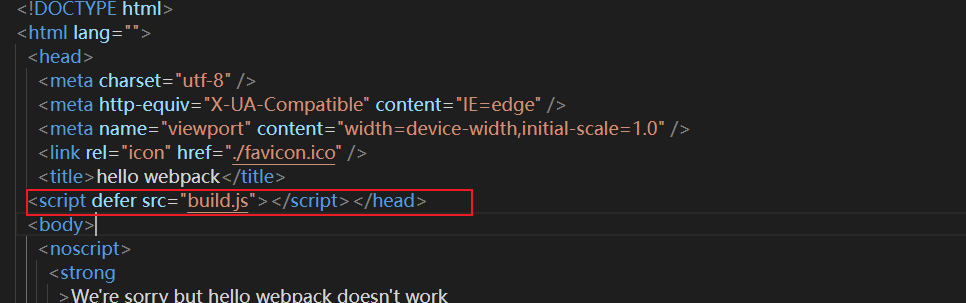

src 里面的这个路径其实是由`output配置`中的`publicPath + 资源路径`构成的。由于 publicPath 的默认值是一个空字符串，所以我们打包后引入 js 文件时，路径是 build.js。在开发中，我们也经常会将其设置为`/`，此时路径是一个相对路径`./build.js`，那么浏览器会根据所在域名+路径去请求对应的资源。**开发环境下，一般我们直接使用默认值`/`。**

开发环境下具体使用见 webpack-dev-server 部分。

### 指定配置文件

默认情况下，webpack 只会把当前目录下`webpack.config.js`作为其配置文件，如果想要更改配置文件的路径或者文件名，可以在`package.json`中传入参数

```json
//package.json

{
  "script": {
    // 将wk.config.js文件作为webpack配置文件
    "build": "webpack --config ./wk.config.js"
  }
}
```

## Loader

webpack 只能解析 js 和 json 文件，对于其他文件，webpack 是无法识别和解析的。这个时候，我们就需要通过各种各样的 loader 来帮助我们解析其他的文件并且把它们转化成有效的模块，最终添加到依赖图中。

loader 可以用于对模块源代码的转换，**loader 的本质是一个函数，** 它的作用就是将匹配到的源文件内容进行处理然后输出。当某个规则使用了多个 loader 处理时，就会按照从下往上的顺序依次执行，后一个 loader 拿到的都是前一个 loader 处理完成的内容，可以理解为链式调用。所以开发 loader 时，最要关心的就是它的输入和输出。

### css-loader

我们可以将 css 文件看成一个模块，然后通过 import 或@import 来读取这个模块。但是在加载这个模块时，webpack 并不知道如何引入 css 模块，所以我们必须使用 loader 来帮助我们完成对 css 文件的引入。

对于加载 css 文件来说，我们需要一个可以读取 css 文件的 loader，最常用的就是 css-loader。css-loader 的作用就是完成对 css 文件的读取，并且将其转换成一个 commonjs 对象插入到引入的 js 文件中。除此之外，css-loader 不会对引入的 css 文件做任何操作。当然 css 文件中@import 引入另一个 css 文件的操作也是由 css-loader 来完成。

**安装**

```js
npm install css-loader -D
```

**使用方式**

有两种方式使用 css-loader：

- 方式一：**内联方式。** 在引入的样式前加上使用的 loader，并且使用`!`分割，内联样式由于不方便管理，所以使用的较少

```js
import 'css-loader!../css/style.css'
```

- 方式二：**配置文件方式。** 在`webpack.config.js`中 module 属性下面的 rules 数组中配置 loader 使用的规则。

module.rules 的配置如下：

rules 属性对应的值是一个数组： [Rule]

数组中存放的是一个个的 Rule，Rule 是一个对象，对象中可以设置多个属性：

- test 属性：用于对 resource(资源)进行匹配的，通常设置成正则表达式；
- use 属性：对应的值是一个数组：[UseEntry]，UseEntry 是一个对象，可以通过对象的属性来设置一些其他属性：

  1、loader：必须有一个 loader 属性，对应的值是一个字符串

  2、options：可选的属性，值是一个字符串或者对象，值会被传入到 loader 中

UseEntry 也可以简写成一个字符串(如：use:['style-loader'])，它其实式 loader 属性的简写方式(如：use:[{ loader: 'style-loader' }])

- loader 属性：Rule.use:[{loader}]的简写

```js
const path = require('path')

module.exports = {
  entry: './src/main.js',
  output: {
    filename: 'build.js',
    path: path.resolve(__dirname, './dist'),
  },
  module: {
    rules: [
      {
        test: /\.css$/,
        // loader: 'css-loader',           //写法一
        // use: ['css-loader'],            //写法二

        // 写法三
        use: [
          {
            loader: 'css-loader',
          },
        ],
      },
    ],
  },
}
```

- importLoaders 属性

importLoaders 属性的作用在于当 css-loader 解析到@import 命令时，能够把引入的 css 文件重新交回到前面的 loader 解析。它的值是一个整数，默认是 0。

这样解释可能有些抽象，直接上案例，有以下代码：

```js
// webpack.config.js

module.export = {
  ……
  module: {
    rules: [
      {
        test: /\.css$/,
        use: [
          'style-loader',
          {
            loader: 'css-loader',
            options: {
              importLoaders: 1             //将css文件中引入的其他css文件重新交回到前面1个loader解析，即postcss-loader。
            }
          },
          'postcss-loader']
      }
    ]
  }
}
```

### style-loader

前面有讲到 css-loader 的唯一作用就是解析`import`和`@import`语句，并不会将解析之后的 css 插入到页面中。因此，对于 css 文件，如果仅仅使用 css-loader 来编译的话，最终是无法在页面上看到效果的。如果我们希望再完成插入 style 的操作，那么我们还需要另外一个 loader，就是 style-loader。

style-loader 的作用是将 css-loader 解析后的 css 文件插入到页面中，具体是通过 head 标签中插入 style 标签实现的。

**安装**

```js
npm i style-loader -D
```

**配置**

在配置文件中，添加 style-loader。

:::tip
注意：因为 loader 的执行顺序是从右向左(或者说从下到上，从后到前)，所以我们需要将 style-loader 写到 css-loader 的前面。
:::

```js
module.exports = {
  ……
  module: {
    rules: [
      {
        test: /\.css$/,
        use: ['style-loader', 'css-loader'],
      },
    ],
  },
}
```

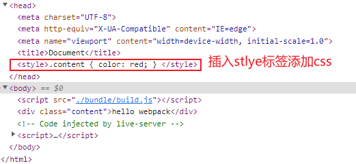

### less-loader

如果我们编写的是 less 文件，首先我们需要将 less 文件转化成 css 文件，这个过程是 less 包来完成的。

less-loader 首先会通过 less 包将 less 文件转成 css 文件，然后按照之前的步骤进行编译和打包

**安装**

```js
npm i less less-loader -D
```

**配置**

```js
module.export = {
  ……
  module: {
    rules: [
      {
        test: '/\.less$/',
        use: [
          'style-loader',
          {
            loader: 'css-loader',
            options: {
              importLoaders: 2
            }
          },
          'postcss-loader',
          'less-loader'
        ]
      }
    ]
  }
}
```

### file-loader

要处理 jpg、png 等格式的图片，我们也需要有对应的 loader：file-loader。file-loader 的作用就是帮助我们处理`import/require`方式引入的一个文件资源，并且将它放到我们输出的文件夹中。

**安装**

```js
npm i file-loader -D
```

**配置**

```js
// index.js

const img = document.createElement('img')

// 通过require引入文件
img.src = require('./assets/img/icon.jpg').default
document.body.appendChild(img)
```

```js
{
  test: /\.(png | jpe?g | gif | svg)$/i,
  use: {
    loader: 'file-loader'
  }
}
```

如此配置后，打包出来的文件如下：

<div style="text-align: center">
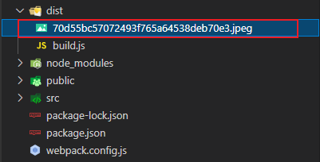
</div>

可以看见，打包后输出的文件名是一串 32 位的 hash 值，这样我们就无法将文件和源文件很好的对应起来。再者，当有许多图片需要打包时，所有的图片都放到根目录下，就会造成根目录过于冗余。为了解决这个问题，我们可以将 file-loader 配置成如下形式：

```js
{
  test: /\.(png | jpe?g | gif | svg)$/,
  use: [
    {
      loader: 'file-loader',
      options: {
        name: 'img/[placeholder]'         //将图片打包到img文件夹下，并重新命名
      }
    }
  ]
}
```

- [ext]：输出文件的扩展名
- [name]：输出文件的名称
- [hash]：文件的 hash 值。使用 MD4 的散列函数处理，生成的一个 128 位的 hash 值(32 位十六进制)
- [contentHash]：在 file-loader 中和[hash]的结果是一致的
- [hash:length]：截取部分 hash 值，32 个字符太长了
- [path]：文件相对于 webpack 配置文件的路径

具体配置如下：

```js
{
  test: /\.(png | jpe?g | gif | svg)$/,
  use: [
    {
      loader: 'file-loader',
      options: {
        name: 'img/[name].[hash:6].[ext]'
      }
    }
  ]
}
```

最终打包结果入下：

<div style="text-align: center">

</div>

### url-loader

使用 file-loader 打包后的图片会生成另外一个文件，也就是说，当浏览器运行时，它需要再次发起一个 http 请求，去请求这张图片。这样的话，当一个项目中有许多张图片时，就需要发送大量的网络请求，这显然不符合开发需求。

url-loader 和 file-loader 的作用是相似的。它可以将文件转成 base64 的 URI，并且直接嵌入到打包后的 js 文件中，不过这样虽然能够减少网络请求，却也增加了 js 的大小，使得 js 的下载需要花费更长的时间。

因此，在项目中，一般小图片使用 url-loader 处理，而大文件则使用 file-loader 处理。

```js
{
  test: /\.(png | jpe?g | gif | svg)$/,
  use: [
    {
      loader: 'url-loader',
      options: {
        name: 'img/[name].[hash:6].[ext]',
        limit: 100 * 1024         //100kb以下使用url-loader处理
      }
    }
  ]
}
```

如果文件大于该阈值，会自动的交给 file-loader 处理，因此，无需另外配置 file-loader。

### vue-loader

**安装**

```js
// vue-template-compiler的作用是帮助我们解析template标签

npm install vue-loader vue@2 vue-template-compiler -D
```

**配置**

```js
// index.js

import App from './app.vue'
import Vue from 'vue'

new Vue({
  render: (h) => h(App),
}).$mount('#app')
```

```js
// webpack.config.js

const VueLoaderPlugin = require('vue-loader/lib/plugin')
module.exports = {
  ……
  module: {
    rules: [
      {
        test: /\.css$/,
        use: ['style-loader', 'css-loader'],
      },
      {
        test: /\.jsx?$/,
        loader: 'babel-loader',
      },
      {
        test: /\.vue$/,
        loader: 'vue-loader',
      },
    ],
  },
  plugins: [new VueLoaderPlugin()],
}
```

### eslint-loader

在公司中，很少有一个人单独负责某一个项目全部功能的开发，更多时候是多人协作开发。但是由于每个人编码习惯的差异，可能会导致代码冲突。而 eslint 就是目前市场主流的限制 js 代码规范的工具。

**webpack 中使用 eslint**

1、安装 loader

```js
npm i eslint-loader -D
```

2、配置 eslint 规范

在目录中新建`.eslintrc.js`文件，然后配置规范，具体可以查找[eslint 网站](https://eslint.org/docs/latest/use/configure/)

3、在`webpack.config.js`中使用 loader

```js
module.exports = {
  rules: [
    {
      test: /\.js/,
      exclude: /node_modules/,
      loader: ['babel-loader', 'eslint-loader'],
    },
  ],
}
```

4、使用 prettier 格式化，在目录下新建`.prettierrc`文件并配置参数，具体参数可查看[prettier 官网](https://prettier.io/playground/)

### 自定义 loader

loader 本质上是导出一个函数的 JavaScript 模块，webpack 在解析过程中，loader runner 库会调用这个函数，然后将上一个 loader 产生的结果或资源文件传入进去。

**自定义 Loader 过程：**

1、新建一个 loaders 文件夹，并在文件夹下新建 my-loader.js 文件。

my-loader.js 模块导出一个函数，该函数接收三个参数：

- content：资源文件的内容

- map：sourcemap 相关的数据

- meta：一些元数据

这个函数必须有返回值，且返回值必须是一个字符串或者 buffer

```js
module.exports = function (content) {
  console.log(content)
  return content
}
```

2、webpack.config.js 文件中使用。

```js
module.export = {
  module: {
    rules: [
      {
        test: /\.js$/,
        loader: './loaders/my-loader.js', //使用的是相当路径，相对于前面介绍的context路径
      },
    ],
  },
}
```

我们在自定义中暴露出来的这个函数称为：NormalLoader，其实 loader 中还存在另外一个函数，称为：PitchLoader。

```js
// NormalLoader
module.exports = function (content) {
  console.log(content)
  return content
}

// PitchLoader
module.exports.pitch = function () {
  console.log('pitch loader')
}
```

前面我们介绍过，Loader 的执行顺序是从后往前的，这其实指的是 NormalLoader 的执行顺序，而 PitchLoader 的执行顺序是从前往后的，并且 PitchLoader 会先于 NormalLoader 执行。

原因在于 loader runner 在执行 loader 时，会维护一个 loaderIndex 的变量，就是 loader 数组的下标。在 Pitching 阶段，会挨个执行 PitchLoader 函数，它会执行 loaderIndex++，直至最后一个，执行完 PitchLoader 后，进入到 Normal 阶段，他又会执行 loaderIndex-- 的操作，然后一个个执行 NormalLoader。

### 向自定义 loader 中传入参数

前面介绍过，loader 的本质就是导出一个函数的模块，既然是这样，那么我们是不是可以向这个函数内部传入参数呢？当然也是可以的。

```js
module.exports = {
  ……
  rules: [
    {
      test: /\.js$/,
      loader: './loaders/my_loader.js',
      options: {
        name: 'xiaodeng',
        age: 27
      }
    }
  ]
}
```

```js
module.exports = function (content) {
  // 获取参数
  const options = this.getOptions()
  console.log(options)
  return content
}
```

除此之外，我们还可以对传入函数的参数进行校验，这里我们需要借助 webpack 官方给我们提供的一个校验库：schema-utils

1、安装

```js
npm i schema-utils -D
```

2、新建一个 schema.json 文件

```json
{
  "type": "object", //参数类型
  "properties": {
    "name": {
      "type": "string", //name字段类型
      "description": "请输入姓名" //报错时的提示
    },
    "age": {
      "type": "number",
      "description": "请输入年龄"
    }
  }
}
```

2、在导出函数中进行参数校验

```js
const { validate } = require('schema-utils')
const loaderSchema = require('../schema.json')

module.exports = function (content) {
  const options = this.getOptions()
  validate(loaderSchema, options)
  return content
}
```

### 同步 loader 和异步 loader

**同步 loader：**

默认创建的 loader 都是同步的 loader，这个 loader 必须通过 return 或者 this.callback 将返回结果交给下一个 loader 来处理。通常在有错误的情况下，我们会使用 this.callback 返回。this.callback 接受：第一个参数必须是 Error 或者 null，第二个参数是一个 string 或 buffer。

```js
module.exports = function (content) {
  this.callback(null, content)
}
```

**异步 loader：**

有时候我们使用 loader 时会进行一些耗时的异步操作，我们希望在异步操作完成后，再返回这个 loader 处理的结果，这个时候，我们就需要使用异步的 loader 了。方法很简单，只需调用一下 this.async 方法就可以了，这个方法会返回一个 callback。

```js
module.exports = function (content) {
  const callback = this.async()
  setTimeout(() => {
    console.log(content)
    callback(null, content)
  }, 1000)
}
```

### enforce 属性

虽然说 loader 的默认执行顺序是从后往前的，但是我们也可以更改 loader 的执行顺序。我们可以拆分成多个 rule，然后通过 enforce 来决定它们执行的顺序。

enforce 有四个值可选：normal(默认)、inline(行内)、pre、post

:::tip
执行顺序：

pitching 阶段： post、inline、normal、pre

normal 阶段：pre、normal、inline、post
:::

```js
module.export = {
  module: {
    rules: [
      {
        test: /\.js$/,
        loader: 'loader1',
      },
      {
        test: /\.js$/,
        loader: 'loader2',
        enforce: 'pre',
      },
      {
        test: /\.js$/,
        loader: 'loader3',
      },
    ],
  },
}
//执行顺序 loader2 --> loader3 --> loader1
```

### resolveLoader 属性

resolveLoader 属性其实是 resolve 属性的一个简化版，只不过这个简化版只适用于 loader 的配置。

我们在使用自定义 loader 时，传入的是一个相对路径，当我们有很多自定义 loader 时，每一个都要写很长的一段路径，这样就过于冗余了。resolveLoader 就可以帮我们直接去加载自己的 loaders 文件夹。

```js
module.export = {
  resolveLoader: {
    modules: ['node_modules', 'loaders'], //先去node_modules中找，找不到了就去loaders文件夹下找
  },
}
```

经过 resolveLoader 属性配置后，前面自定义 loader 就可以用以下方式引入：

```js
module.exports = {
  module: {
    rules: [
      {
        test: /\.js/,
        loader: 'my_loader',
      },
    ],
  },
}
```

## asset modules

在 webpack5 之前，加载某些资源我们需要使用一些 loader，比如 raw-loader 、url-loader、file-loader； 而在 webpack5 之后，我们可以直接使用资源模块类型（asset module type），来替代上面的这些 loader。

资源模块类型(asset module type)通过添加 4 种新的模块类型，来替换所有这些 loader：

**asset/resource：** 发送一个单独的文件并导出 URL。之前通过使用 file-loader 实现；

**asset/inline：** 导出一个资源的 data URI。之前通过使用 url-loader 实现；

**asset/source：** 导出资源的源代码，前通过使用 raw-loader 实现。

**asset：** 在导出一个 data URI 和发送一个单独的文件之间自动选择。之前通过使用 url-loader，并且配置资源体积限制实现，默认 8k 以下文件大小采用 asset/inline，8k 以上使用 asset/resource。

```js
const el = document.createElement('img')
el.src = require('./assets/img/icon.jpeg')
document.body.appendChild(el)
```

```js
//asset/resource
{
	test: /\.(png|jpe?g|gif|svg)$/,
    type: 'asset/resource',                      //选择资源类型模块
    generator: {
       filename: 'assets/img/[name].[hash:6][ext]'      //定义打包后图片放置的位置,注意此时[ext]包括了符号.
    }
}

//asset/inline
{
	test: /\.(png|jpe?g|gif|svg)$/,
    type: 'asset/inline',             //会把图片转成base64位嵌进去，因此不用generator来定义图片位置
}

//asset
{
	test: /\.(png|jpe?g|gif|svg)$/,
    type: 'asset',
    generator: {
       filename: 'assets/img/[name].[hash:6][ext]'
    },
    parser: {
        dataUrlCondition: {
            maxSize: 100 * 1024    //配置100k以下使用asset/inline，100k以上使用asset/resource
        }
    }
}
```

除了图片，其他的一些资源，比如字体文件，文本文件等都可以采用 asset modules type 的方式来处理。

```js
{
  test: /\.(ttf|eot|woff2?$)/i,
  type: 'asset/resource'         //字体文件一般是直接复制，不使用base64位
}，
{
  test: /\.txt/,
  type: 'asset/source'          //将文本转成字符串插入
}
```

## browserslist

在开发过程中，我们经常会碰到浏览器兼容性问题，比如有的浏览器兼容 ES6 语法，有的浏览器却不兼容；某些 css 特性，尤其是一些最新通过的 css 特性，也并不是所有浏览器都支持。因此为了保证用户在不同浏览器均可以访问我们写的代码，我们就需要通过各种工具来实现浏览器间的兼容性。比如 Autoprefixer 可以帮助我们给某些 css 特性自动添加前缀以实现浏览器兼容，babel 可以帮助我们实现 js 在浏览器间的兼容。但是我们并不知道什么时候要使用 Autoprefixer 和 babel 来转换我们的代码以适配对应浏览器，Browserslist 就是一个这样的工具，它提供需要在多个不同前端工具(Autoprefixer、babel 等)之间共享的配置，并且根据这些配置查询需要适配的浏览器。

由于 webpack 本身就依赖了 browserslist，所以当我们使用 webpack 构建项目时，无需重新下载安装，直接配置即可。

**配置：**

在根目录下新建一个`.browserslistrc`文件，并做如下配置：

```js
>1%                   //只兼容市场占有率超过1%的浏览器，去caniuse网站中寻找
last 2 version       //只兼容每个浏览器的最后2个版本
not dead            //只兼容24个月内官方依旧支持或更新的浏览器
```

当然，我们也可以在 package.json 当中新增一个 browserslist 属性来配置 browserslist：

```json
"browserslist": [
  ">1%",
  "last 2 version",
  "not dead"
]
```

我们配置的每一项，如`>1%`，称为查询条件，而多个条件的组合称为组合查询，那么组合查询中每个查询条件的关系是如何的呢？见下图：

<div style="text-align: center">
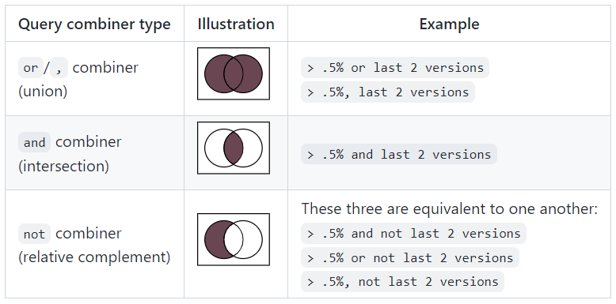
</div>

## PostCSS

PostCSS 是一个通过 JavaScript 插件来转换样式的工具；这个工具可以帮助我们进行一些**CSS 的转换和适配**，换句话说 PostCSS 的功能就是处理 css 的兼容性问题。比如自动添加浏览器前缀、css 样式的重置；但是实现这些工具，我们需要借助于 PostCSS 对应的插件。
:::tip
PostCSS 是依据`.browserslistrc`文件中所限定的浏览器来适配的。
:::

PostCSS 是一个允许使用 JS 插件转换样式的工具。 这些插件可以检查编写的 CSS， 编译那些尚未被对应浏览器所支持的先进 CSS 语法和特性、内联图片、以及其它很多优秀的功能。

**安装**

postcss-loader 是为了在 webpack 中使用 postcss，所以需要同时安装 postcss-loader 和 postcss

```js
npm i postcss-loader postcss -D
```

PostCSS 接收一个 CSS 文件并提供了一个 API 来分析、修改它的规则（通过把 CSS 规则转换成一个抽象语法树的方式）。在这之后，这个 API 便可被许多插件利用来做有用的事情。因此我们需要配置许多的 PostCSS 插件来帮助我们完成 CSS 适配，比如寻错或自动添加 CSS vendor 前缀。

但是针对不同的浏览器可能需要配置不同的 PostCSS 插件，而且对于同一浏览器中的不同 CSS 特性也需要不同的 PostCSS 插件来转换，这样就会导致 PostCSS 的配置非常的庞大且难以维护。

此时，我们还需要安装一个 postcss 插件：**postcss-preset-env**。它可以帮助我们将一些现代化的 css 特性转成大多数浏览器都能识别的特性，并且能够根据目标浏览器或者运行环境添加所需的 polyfill。

```js
npm i postcss-preset-env
```

**配置：**

```js
module.exports = {
  ……
  module: {
    rules: [
      {
        test: /\.css$/,
        loader: [
          'style-loader',
           'css-loader',
           {
            loader: 'postcss-loader',
            options: {
              // 配置postcss插件
              postcssOptions: {
                plugins: ['postcss-preset-env']
              }
            }
           }
        ]
      }
    ]
  }
}
```

但是，这样配置只会转换 css 文件，而不会转换 less 或者 sass 文件。如果在 less 和 sass 中配置同样的配置，就会重复许多配置代码。因此在项目开发中，一般会进行下面操作：

1、在根目录下新建一个 postcss.config.js 文件，配置如下：

```js
module.exports = {
  plugins: [require('postcss-preset-env')],
}
```

2、配置 webpack.config.js

```js
module.exports = {
  ……
  module: {
    rules: [
      {
        test: /\.css$/,
        loader: [
          'style-loader',
          {
            loader: 'css-loader',
            importLoaders: 1
          },
          'postcss-loader'
        ]
      },
      {
        test: /\.less$/,
        loader: [
          'style-loader',
          {
            loader: 'css-loader',
            importLoaders: 2
          },
          'postcss-loader',
          'less-loader'
        ]
      },
    ]
  }
}
```

## Plugin

Loader 是用于特定的模块类型进行转换，也就是说 loader 仅在特定模块加载时使用。

Plugin 可以用于执行更加广泛的任务，目的在于解决 loader 无法实现的其他事。比如打包优化、资源管理、环境变量注入等；plugin 的类型都是一个个的类，它可以贯穿 webpack 整个生命周期。

:::warning
**插件本质上是一个构造函数，它的原型上必须有一个 apply 方法**。在 Webpack 初始化 compiler 对象之后会调用插件实例的 apply 方法，传入 compiler 对象。然后插件就可以在 compiler 上注册想要注册的钩子，Webpack 会在执行到对应阶段时触发注册事件。
:::

### CleanWebpackPlugin

**作用：** 当我们重新打包时，会自动帮助我们删除 output 指定输出目录中上次打包生成的目录文件夹，

```js
npm i clean-webpack-plugin -D
```

**配置：**

```js
const { CleanWebpackPlugin } = require('clean-webpack-plugin')
module.exports = {
  ……
  plugins: [
    new CleanWebpackPlugin()
  ]
}
```

:::tip
该插件可以通过在 output 中配置`clean: true`来替换
:::

### HtmlWebpackPlugin

在进行项目部署的时，是需要有对应的入口文件`index.html`；然而，通过 webpack 最终打包的 dist 文件夹中是没有`index.html文件`的。

**HtmlWebpackPlugin**就是对 HTML 进行打包处理的插件，它可以通过 ejs 模块来自动生成一个 index.html 文件。

```js
npm i html-webpack-plugin -D
```

**配置：**

```js
const HtmlWebpackPlugin = require('html-webpack-plugin')
module.exports = {
  ……
  new HtmlWebpackPlugin()
}
```

当然，我们也可以在 htmlWebpackPlugin 实例化的时候传入参数

```js
const HtmlWebpackPlugin = require('html-webpack-plugin')
module.exports = {
  ……
  new HtmlWebpackPlugin({
    title: '小邓同学',                         // 打包后的index.html的标题标签
    template: './public/index.html',           // 以public文件夹下的index.html为模板来打包
    chunks: ['bundle']              // html中要使用到的chunks
  })
}
```

```html
<!-- public/index.html -->
<!-- 通过ejs语法引入title -->
<title><%= htmlWebpackPlugin.options.title %></title>
```

### DefinePlugin

<div style="text-align: center; margin-top: 20px">
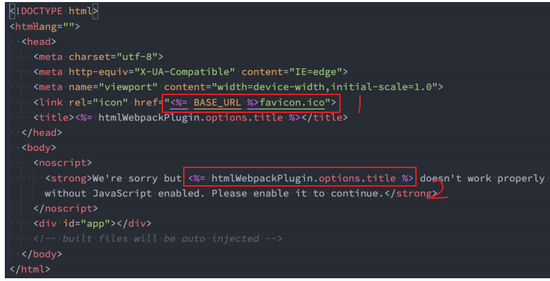
</div>

上面是 vue 工程中`public/index.html`部分内容，其实 vue 也是基于这个文件生成打包后的 index.html 文件的。我们可以看到代码中会有一些类似这样的语法`<%= 变量 %>`，这个是 EJS 模块填充数据的方式。

其中`<%= htmlWebpackPlugin.options.title %>` 即为之前我们在配置 HtmlWebpackPlugin 插件时配置的 title。但是另外的`<%= BASE_URL %>`会用到一个全局变量`BASE_URL`，但是我们没有配置这个变量，这个时候编译就会出错。

**DefinePlugin**允许在编译时创建配置的**全局常量**，这是一个 webpack 内置的插件（不需要单独安装）。

```js
const {DefinePlugin} = require('webpack')
module.exports = {
  ……
  plugins: [
    new DefinePlugin({
      BASE_URL: "'./'"，        //注意写法，相当于const BASE_URL = './'
      BASE_PATH: JSON.stringify('./')   //另一种写法，同上面的效果一样
    })
  ]
}
```

这个时候，就能读取到 BASE_URL 的值并正确编译了。

### CopyWebpackPlugin

我们知道，在 vue 的打包过程中，如果我们将一些文件放到 public 的目录下，那么这个目录会被复制到 dist 文件夹中，当然 index.html 除外，它是作为模板供`html-webpack-plugin`使用来生成 dist 文件夹下的 index.html。

CopyWebpackPlugin 就可以完成这样的复制功能。

```js
npm i copy-webpack-plugin -D
```

**配置：**

复制的规则在`patterns属性`中设置；

**from：** 设置从哪一个源中开始复制；

**to：** 复制到的位置，可以省略，会默认复制到打包的目录下；

**globOptions：** 设置一些额外的选项，其中可以编写需要忽略的文件：

- DS_Store：mac 电脑自动生成的一个文件；

* index.html：也不需要复制，因为我们已经通过 HtmlWebpackPlugin 完成了 index.html 的生成；

```js
const CopyWebpackPlugin = require('copy-webpack-plugin')

module.exports = {
  ……
  plugins: [
    new CopyWebpackPlugin({
      patterns: [
        {
          from: './public',
          to: 'public',
          globOptions: ['**/DS_Store：mac', '**/index.html']
        }
      ]
    })
  ]
}
```

### MiniCssExtractPlugin

MiniCssExtractPlugin 可以帮助我们将 css 提取到一个独立的 css 文件中。

```js
npm i mini-css-extract-plugin -D
```

**配置：**

```js
const MiniCssExtractPlugin = require('mini-css-extract-plugin')

module.exports = {
  ……
  module: {
    rules: [
      {
        test: /\.css/,
        use: [ MiniCssExtractPlugin.loader, 'css-loader']       //单独分包
      }
    ]
  },
  plugins: [
    new MiniCssExtractPlugin({
      filename: 'css/[name].[contentHash:6].css'    //命名
    })
  ]
}
```

:::tip
**hash、contentHash、chunkHash 的区别：**

**hash：** hash 值的生成和整个项目有关系，并且和 webpack 中的 compilation 对象相关。比如我们现在有两个入口 index.js 和 main.js ，它们分别会输出到不同的 bundle 文件中，并且在文件名称中我们有使用 hash ，这个时候，如果修改了 index.js 文件中的内容，这时，webpack 中的 compilation 对象就会发生变化， hash 值也会收到 compilation 对象的影响而发生变化，那就意味着两个文件的名称都会发生变化。

**chunkHash：** chunkhash 可以有效的解决上面的问题，它会根据不同的入口来解析生成 hash 值，即和 webpack 打包的 chunk 有关。比如我们修改了 index.js，那么 main.js 的 chunkhash 是不会发生改变的。但是由这个入口构成的依赖图上的其他文件名会跟随变化，也就是会重新打包。

**contentHash：** contenthash 表示生成的文件 hash 名称，只和内容有关系，即，文件内容不变，contentHash 不变。比如我们的 index.js，引入了一个 style.css ， style.css 又被抽取到一个独立的 css 文件中，这个 css 文件在命名时，如果我们使用的是 chunkhash ，那么当 index.js 文件的内容发生变化时，css 文件的命名也会发生变化，这个时候我们可以使用 contenthash。
:::

### CssMinimizerWebpackPlugin

CssMinimizerWebpackPlugin 的作用是对 css 代码的压缩，通常是去除无用的空格等。

```js
npm i css-minimizer-webpack-plugin -D
```

```js
const cssMinimizerPlugin = require('css-minimizer-webpack-plugin')
module.exports = {
  plugins: [new cssMinimizerPlugin()],
}
```

### Scope Hoisting

它的作用是对作用域进行提升，并且让 webpack 打包后的代码更小，运行更快。

默认情况下 webpack 打包后的成果物中，每一个引入的模块都是一个函数，因此 webpack 的构建成果物中存在许多的函数作用域和闭包代码，包括一些(比如最外层的)IIFE。所以无论是从最开始的代码运行，还是加载一个模块，都需要执行一系列的函数。

这样会导致两个问题：

- 大量函数闭包包裹代码，导致体积增大，而且模块越多越明显；
- 运行代码时创建的函数作用域变多，内存开销随之变大。

  Scope Hoisting 可以将函数合并到一个模块中来运行。它的原理就是将所有模块的代码按照引用顺序放到一个函数作用域中，然后适当的重命名一些变量，以防止变量名冲突。比如 a 模块引用了 b 模块，那么 scope hoisting 会先定义 b 模块，然后再定义 a 模块，这个时候 a 中就可以直接引用 b 模块了。

**开启 scope Hoisting**

```js
const webpack = require('webpack')

module.exports = {
  plugins: [new webpack.optimize.ModuleConcatenationPlugin()],
}
```

:::tip
在 production 模式下，默认这个模块就会启用，仅对 ES6 语法起作用，对 CommonJS 无效;

在 development 模式下，我们需要自己来打开该模块;
:::

### 自定义 Plugin

#### Tapable 库

webpack 有两个非常重要的类：Compiler 和 Compilation。他们通过注入插件的方式，来监听 webpack 的所有生命周期，插件的注入离不开各种各样的 Hook，而他们的 Hook 其实就是创建了 Tapable 库中的各种 Hook 的实例。

在 Webpack 的编译过程中，本质上通过 Tapable 实现了在编译过程中的一种发布订阅者模式的插件 Plugin 机制。既然这样，我们就先来了解下 Tapable 的 hooks：

<div style="text-align: center">
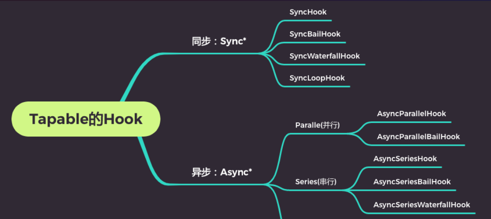
</div>

上图描述的是 Tapable 中的 hooks。可以看出，大体分为同步 hooks 和异步 hooks 两种

其他类别：

- bail：当有返回值时，就不会执行后续事件的触发了;

- Loop：当返回值为 true，就会反复执行该事件，当返回值为 undefined 或者不返回内容，就退出事件

- Waterfall：当返回值不为 undefined 时，会将这次返回的结果作为下次事件的第一个参数

- Parallel：并行，会同时执行多个事件处理回调;

- Series：串行，会等待上一是异步的 Hook ;

```js
const { SyncHook } = require('tapable')

class LearnTapable {
  constructor() {
    this.hooks = {
      // 注册钩子
      syncHook: new SyncHook(['name', 'age']),
    }
    // 监听事件
    this.hooks.syncHook.tap('event1', (name, age) => {
      console.log('event1', name, age)
      return 111
    })
    this.hooks.syncHook.tap('event2', (name, age) => {
      console.log('event2', name, age)
    })
  }
  // 触发事件
  emit() {
    this.hooks.syncHook.call('xiaodeng', 27)
  }
}

const lt = new LearnTapable()
lt.emit()
/**
 * 输出：
 * event1 xiaodeng 27
 * event2 xiaodeng 27
 */
```

```js
const { AsyncParallelHook } = require('tapable')

class LearnTapable {
  constructor() {
    // 注册钩子并传入参数
    this.hooks = {
      asyncParallelHook: new AsyncParallelHook(['name', 'age']),
    }
    // 事件注册方式一，代码执行完成后要调用callback函数
    this.hooks.asyncParallelHook.tapAsync('event1', (name, age, callback) => {
      setTimeout(() => {
        console.log(name, age), callback()
      }, 1000)
    })

    // 事件注册方式二
    this.hooks.asyncParallelHook.tapPromise('event2', (name, age) => {
      return new Promise((resolve, reject) => {
        setTimeout(() => {
          console.log(name, age)
          resolve()
        }, 500)
      })
    })
  }
  // 事件触发方式一，前面注册的两个事件均会被触发
  emit1() {
    this.hooks.asyncParallelHook.callAsync('xiaodeng', 27, () => {
      console.log('event1 finish')
    })
  }
  // 事件触发方式一，前面注册的两个事件均会被触发
  emit2() {
    this.hooks.asyncParallelHook.promise('xiaodeng', 26).then(() => {
      console.log('event2 finish')
    })
  }
}

const lt = new LearnTapable()
lt.emit1()
lt.emit2()
/**
 * 输出：
 * xiaodeng 27
 * xiaodeng 26
 * xiaodeng 27
 * event1 finish
 * xiaodeng 26
 * event2 finish
 */
```

#### 自定义 plugin

首先要了解 plugin 是如何被注册到 webpack 生命周期的。

1、在 webpack 函数的 createCompiler 方法中，注册了所有的插件；

2、在注册插件时，会调用插件函数或者插件对象的 apply 方法;

3、插件方法会接收 compiler 对象，我们可以通过 compiler 对象来注册 Hook 的事件;

4、某些插件也会传入一个 compilation 的对象，我们也可以监听 compilation 的 Hook 事件;

创建`src/plugins/autoUploadPlugin`文件，并编写如下代码：

```js
module.exports = class AutoUploadPlugin {
  constructor(options) {
    // 接收参数
    this.options = this.options
  }
  // 声明apply方法
  apply(compiler) {
    /**
     * 监听钩子，具体监听那个钩子，可根据业务在官网API处查找，此处监听afterEmit钩子
     * 注册事件，事件名一般和插件名相同
     * 参数也可以从官网获取，afterEmit钩子的参数就是compilation
     */
    compiler.hooks.afterEmit.tapAsync(
      'AutoUploadPlugin',
      (compilation, callback) => {
        // 处理自己要做的事
        console.log(111)
        // 调用callback 函数
        callback()
      }
    )
  }
}
```

```js
// webpack.config.js

const AutoUploadPlugin = require(./src/plugins/autoUploadPlugin)
module.export = {
  plugins: [
    new AutoUploadPlugin(
      {
        参数： 值
      }
    )
  ]
}
```

## devtool

我们的代码通常是通过**打包压缩**运行在浏览器上，这期间经过了丑化压缩和一些转换，因此当我们的代码出现问题时，我们是没有办法精确定位到某个文件的某个地方的。而 devtool 可以帮助我们将已转换的代码映射到原始的源文件中，使我们更好的排错。

**配置 devtool**

```js
module.exports = {
  devtool: 'source-map',
}
```

此时打包会多出一个`bundle.js.map`的 source-map 文件。

而在打包后的文件最后结尾处，会多出如下语句：

```js
//# sourceMappingURL= bundle.js.map
```

上面语句的作用就是将打包压缩后的文件映射到源文件。

:::tip
当 webpack 的 mode=development 时，devtool=‘eval'，此时不会生成 source-map 文件，但是会通过 eval 函数映射到源文件，方便调试。

当 webpack 的 mode=production 时，缺省值(不写)，此时不会生成 source-map 文件，也不会产生映射.
:::

### 值

官方文档介绍 devtool 的值多达 26 种选择，不同的值有效果不同，打包时间、加载运行时间也会有所差异。但其实这 26 种可选值都是由以下几个短语拼凑而成，因此，只要明白这些短语的含义，就能选择性能较好的效果。

inline：将`//# sourceMappingURL= bundle.js.map`放到文件的最后面，不会生成 sourc-map 文件，而是将 source-map 的内容直接放到 js 文件的后面

hidden：隐藏`//# sourceMappingURL= bundle.js.map`注释，但会生成 sourc-map 文件

eval: 将`//# sourceMappingURL= bundle.js.map`放到 eval 函数里面，不会生成 source-map 文件

cheap： 低开销，只定位错误行，不定位错误列，会生成 suorce-map 文件

module：如果有，则必须跟着 cheap 后面，表明对源自 loader 的 sourcemap 处理效果会更好

:::warning
推荐 devtool 的值：

开发阶段：推荐使用 `source-map`或者`cheap-module-source-map`

测试阶段：推荐使用 `source-map`或者`cheap-module-source-map`。测试阶段我们也希望在浏览器下看到正确的错误提示；

发布阶段：false、缺省值（不写）
:::

## webpack 模块化原理

前面介绍过，webpack 是一个静态的模块化打包工具。由于浏览器只认识 ES6 module 的模块化方式，不能识别诸如 commonjs、AMD 等其他模块化方式，而 webpack 就能够将其他模块化方式转换成浏览器能够识别的方式。接下来将介绍这部分的原理。

### commonJS 转换原理

假设有以下代码：

```js
// src/js/formatter.js

const formate = function (date) {
  return '2022-10-29'
}

module.exports = {
  formate,
}
```

打包后的 webpack 代码如下：

```js
// 定义一个对象， 对象中放的是模块映射
var __webpack_modules__ = {
  './src/js/formatter.js': function (module) {
    const formate = function (date) {
      return '2022-10-29'
    }
    //给module的exports属性赋值，值为模块中的内容,这里的module是后面定义并传入进来的。
    module.exports = {
      formate,
    }
  },
}
//定义一个对象，作为加载模块的缓存
var __webpack_module_cache__ = {}
//一个函数，当我们加载一个模块时，都会通过这个函数来加载
function __webpack_require__(moduleId) {
  // 从缓存中取出对应的模块
  var cachedModule = __webpack_module_cache__[moduleId]
  // 如果存在，直接返回
  if (cachedModule !== undefined) {
    return cachedModule.exports
  }
  // 将module和缓存赋值到同一个对象
  var module = (__webpack_module_cache__[moduleId] = { exports: {} })
  //执行上面定义的函数
  __webpack_modules__[moduleId](module, module.exports, __webpack_require__)
  return module.exports
}

var __webpack_exports__ = {}
// 一个立即执行函数
!(function () {
  const { formate } = __webpack_require__('./src/js/formatter.js')
  console.log(formate())
})()
```

### es module 实现原理

假设有以下代码：

```js
// src/math.js

export function sum(a, b) {
  return a + b
}
```

webpack 打包后的代码如下：

```js
//定义一个对象，对象中放的是模块映射
var __webpack_modules__ = {
  './src/math.js': function (
    __unused_webpack_module,
    __webpack_exports__,
    __webpack_require__
  ) {
    // 调用r的目的是记录一个__esModule: {value: true}
    __webpack_require__.r(__webpack_exports__)
    // 给exports设置代理了一个definition代理，exports本质上是没有对应函数的，只是通过代理取到
    __webpack_require__.d(__webpack_exports__, {
      sum: function () {
        return sum
      },
    })
    function sum(a, b) {
      return a + b
    }
  },
}
//缓存
var __webpack_module_cache__ = {}

//require函数的实现(加载模块)
function __webpack_require__(moduleId) {
  var cachedModule = __webpack_module_cache__[moduleId]
  if (cachedModule !== undefined) {
    return cachedModule.exports
  }
  var module = (__webpack_module_cache__[moduleId] = { exports: {} })

  __webpack_modules__[moduleId](module, module.exports, __webpack_require__)

  return module.exports
}

!(function () {
  //__webpack_require__这个函数对象添加了一个属性：d --》值为function
  __webpack_require__.d = function (exports, definition) {
    for (var key in definition) {
      if (
        __webpack_require__.o(definition, key) &&
        !__webpack_require__.o(exports, key)
      ) {
        // 给exports设置代理，重写get函数
        Object.defineProperty(exports, key, {
          enumerable: true,
          get: definition[key],
        })
      }
    }
  }
})()

!(function () {
  //__webpack_require__这个函数对象添加了一个属性：o --》值为function
  __webpack_require__.o = function (obj, prop) {
    return Object.prototype.hasOwnProperty.call(obj, prop)
  }
})()

!(function () {
  //__webpack_require__这个函数对象添加了一个属性：r --》值为function
  __webpack_require__.r = function (exports) {
    if (typeof Symbol !== 'undefined' && Symbol.toStringTag) {
      Object.defineProperty(exports, Symbol.toStringTag, { value: 'Module' })
    }
    // 给传入进来的对象添加一个'esModule'属性，标明这是es module模块语法
    Object.defineProperty(exports, '__esModule', { value: true })
  }
})()

var __webpack_exports__ = {}
!(function () {
  // 调用__webpack_require__.r
  __webpack_require__.r(__webpack_exports__)
  // _math__WEBPACK_IMPORTED_MODULE_0__ === exports
  var _math__WEBPACK_IMPORTED_MODULE_0__ = __webpack_require__('./src/math.js')

  // console.log( _math__WEBPACK_IMPORTED_MODULE_0__.sum(20, 30))
  console.log((0, _math__WEBPACK_IMPORTED_MODULE_0__.sum)(20, 30))
})()
```

## webpack-dev-server

webpack-dev-server 允许 webpack 搭建一个本地服务器。为什么需要搭建本地服务器？这是因为之前当我们改动打包后的代码时，需要重新打包才能看到我们改动后的效果，这个过程很影响开发效率。

为了完成自动编译，webpack 提供了几种可选的方式：

- webpack watch mode；
- webpack-dev-server；
- webpack-dev-middleware

这里介绍前面两种方式：

### webpack watch

webpack 给我们提供了 watch 模式： 在该模式下，webpack 依赖图中的所有文件，只要有一个发生了更新，那么代码将被重新编译； 不需要我们再次手动去运行 npm run build 指令了。

**方式一：使用指令**

在终端中输入，或在 package.json 中配置脚本`webpack --watch`，这个时候就会启动 watch 模式。

**方式二：配置文件**

在`webpack.config.js`文件中配置`watch: true`

```js
module.exports = {
  watch：true,
  module: {……}
}
```

**watchOptions**
webpack 文件监听的原理是轮询判断文件最后的编辑时间是否变化，当某个文件发生变化时，并不会立刻告诉监听者，而是先缓存起来，等待一段时间后，将这段时间内发生变化的文件列表一起构建打包。而 watchOptions 就是一组用来定制 watch 的配置。

```js
module.exports = {
  // 默认为false，也就是不开启
  watch: true,
  // 只有开启监听模式时，watchOptions才有意义
  watchOptions: {
    // 默认为空，不监听的文件或文件夹，支持正则匹配
    ignored: /node_modules/,
    // 监听到变化后等300ms再执行，默认300ms
    aggregateTimeout: 300,
    // 判断文件是否发生变化是通过不停询问系统指定文件有没有变化实现的，默认每秒问1000次
    poll: 1000,
  },
}
```

watch 模式的缺点：

1、一旦某个文件发生改变，所有的源代码都将重新进行编译

2、编译成功后，都会重新生成 dist 包，然后再引入到 index.html 中，即进行文件操作

3、每次都会重新刷新整个页面 （HMR 可以解决）

因此该方法的开发效率其实并不算特别高。

### webpack-dev-server

**webpack-dev-server 的本质是通过 express 启动一个本地服务**，wds 是一个本地开发服务器，会自动监听变化，自动打包构建并将打包的结果通过 memfs(一个第三方库)暂时存放在内存中，而且自动刷新浏览器。

- webpack-dev-server 本身也是一台运行在计算机内存中的服务器，具体是运行在根目录下的 public 目录中

<div style="text-algin: center">
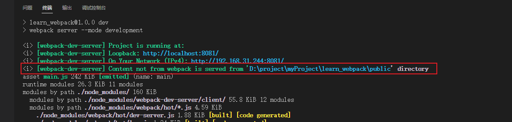
</div>

- 不会产生 dist 文件，把打包后的资源直接放到 webpack-dev-server 服务器下面，放到服务器的什么地方，就是由 publicPath 决定的，同时，它也决定了怎么才能访问这些资源。默认情况下，publicPath 的取值是 '/', 也就是说，会把打包后的文件放到 webpack-dev-server 服务器的根目录下，文件名是在 output 配置中的 filename. 如果配置了 publicPath，webpack-dev-server 会把所有的文件打包到 publicPath 指定的目录下，相当于在项目根目录下创建了一个 publicPath 目录, 然后把打包后的文件放到了里面，只不过我们看不到而已, 文件名还是 output 配置中的 filename。
- 减少磁盘的读取，提高构建效率。

**使用：**

```js
npm i webpack-dev-server -D
```

安装后在 package.json 脚本中做如下配置

```js
"serve": "webpack server"
```

:::warning
webpack-dev-server 的优势在于，编译后不会写入任何输出文件，包括 dist 包，而是使用一个 memfs 第三方包将打包后的文件保留在内存中，然后直接从内存中读取文件。

但是 wepack-dev-server 默认是没有启动模块热更新的。也就是说，**webpack-dev-server 默认还是会重新刷新整个页面**。
:::

### devServer 配置

### contentBase

contentBase 是配置当某个文件不通过 webpack 打包时，服务器要向哪个路径下去寻找该资源，默认是根目录下的`public`文件夹，

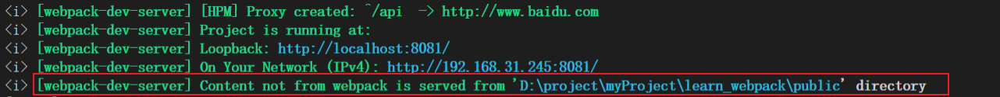

此时，对于那些没有通过 webpack 打包(如在 index.html 中直接 script 引入)的资源，服务器就会来到根目录下的`public`中寻找。

:::tip
开发阶段，一般通过配置 contentBase 来指定资源路径，以避免文件 copy，优化性能，提高效率

打包阶段，一般是通过 copyWebpackPlugin 插件来 copy 文件。
:::

#### 模块热替换(HMR)

HMR 的全称是`HotModuleReplacement`，翻译为模块热替换；模块热替换是指在应用程序运行过程中，只替换、添加、删除某个模块，而无需重新刷新整个页面。

刷新我们一般分为两种：

- 一种是页面刷新，不保留页面状态，就是简单粗暴，直接`window.location.reload()`。
- 另一种是基于`WDS (Webpack-dev-server)`的模块热替换，只需要局部刷新页面上发生变化的模块，同时可以保留当前的页面状态，比如复选框的选中状态、输入框的输入等。

`HotModuleReplacement`已经被内置到 webpack 当中，所不需要额外引入

```js
const webpack = require('webpack')

module.exports = {
  plugins: [new webpack.HotModuleReplacement()],
}
```

**热替换的优势：**

1、不重新加载整个页面，这样可以保留某些应用程序的状态不丢失；

2、只更新需要变化的内容，节省开发的时间；

3、修改了 css、js 源代码，会立即在浏览器更新，相当于直接在浏览器的 devtools 中直接修改样式。

**HMR 的原理：**

HMR 是如何可以做到只更新一个模块中的内容呢？

`webpack-dev-server`在启动时会创建两个服务：提供静态资源的服务（express）和 Socket 服务（net.Socket）；其中 express server 负责在首次渲染时直接提供静态资源（打包后的资源直接被浏览器请求和解析）；

而 HMR Socket Server，是一个 socket 的长连接：长连接有一个最大的好处在于建立连接后双方可以互相通信（即，服务器也可以直接发送文件到客户端）。当服务器监听到对应的模块发生变化时，会生成两个文件，`.json（manifest 文件）`和`.js 文件（update chunk）`；通过长连接，可以直接将这两个文件主动发送给客户端（浏览器）；浏览器拿到两个新的文件后，通过 HMR runtime 机制，加载这两个文件，并且针对修改的模块进行更新，具体过程如下图。

<div style="text-algin: center">
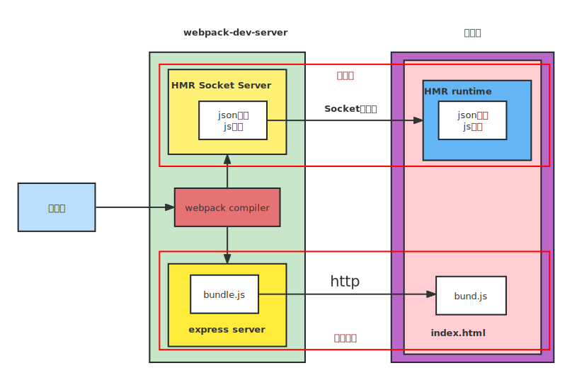
</div>

#### 开启模块热替换

```js
module.exports = {
  devServer: {
    hot: true,
  },
}
```

开启之后，我们还需要告诉 webpack，哪些模块需要开启模块热替换，比如，我们有个 element.js 文件需要开启模块热更新，那么在引入 element.js 文件的时候，需要按如下方式引入：

```js
// 第一次导入模块
import './element.js'

if (module.hot) {
  module.hot.accept('./element.js', () => {
    console.log('element模块发生了热更新')
  })
}
```

:::tip
vue-loader 已经帮我们实现了上面的代码，所以我们在使用 vue 开发的时候，已经是模块热更新了，react 也是一样的。
:::

#### hotOnly

源代码出错时，编译会失败，而当我们修改好错误，重新回到浏览器时，浏览器会自动刷新整个页面。如果我们不希望浏览器重新刷新整个页面，而仅仅是刷新出错的地方时，就需要配置`hotOnly:true`。

```js
module.exports = {
  devServer: {
    hot: true,
    hotOnly: true,
  },
}
```

#### compress

是否为静态文件开启 gzip 压缩，这回大大减少静态文件的大小，默认开启。

#### proxy 代理

```js
module.exports = {
  devServer: {
    proxy: {
      '/api': {
        target: 'http://www.baidu.com',
        pathRewrite: {
          '^/api': '',
        },
        secure: false,
        changeOrigin: true,
      },
    },
  },
}
```

proxy 是我们开发中非常常用的一个配置选项，它的值是一个对象，目的是通过设置代理来解决跨域访问的问题。

我们可以进行如下的设置：

- `target`：表示的是代理到的目标地址，比如` /api/moment`会被代理到`http://localhost:8888/api/moment`；

- `pathRewrite`：重写路径，使用值去替换键，默认情况下，我们的 /api-hy 也会被写入到 URL 中，如果希望删除，可以使用 pathRewrite；

- `secure`：默认情况下不接收转发到 https 的服务器上，如果希望支持，可以设置为 false； 默认为 true

- `changeOrigin`：它表示是否更新代理后请求的 headers 中 host 地址，即 changeOrigin = true 时，后端接收到的请求头中的 host 是目标地址 target。

上面例子中，我们的请求是需要通过`http://www.baidu.com`来发送的。但是，通过 proxy.target 配置后，只是做了个代理(映射)，实际仍然是通过`http://localhost:8000`发送请求的。如果服务器做了验证，发现不是由`http://www.baidu.com`发生的请求，就会发生跨域问题，它是不会返回数据的。当我们把 changeOrigin 设置为 true 时，它会在本地启动一个代理服务，这个代理服务就是`http://www.baidu.com`。请求首先由`http://localhost:8000`转发给代理服务`http://www.baidu.com`，再由代理服务转发到最终服务器上，就是同源的了。

#### historyApiFallback

当我们使用的路由模式是 history 时，如果我们直接刷新浏览器页面，是会返回 404 的。这是由于我们所有的路由跳转都是由前端完成的，而当我们刷新页面时，浏览器会去服务器请求路由，开发模式下就是是向本地的 dev-server 服务器请求，但是服务器并没有这个路由，因此就会返回 404。

historyApiFallback 就是解决当服务器返回 404 时，我们可以直接映射到某个页面中。它可以是一个布尔值，也可以是一个对象。

```js
module.exports = {
  devServer: {
    // 直接映射到首页
    historyApiFallback: true

    // 指定具体映射页面
    historyApiFallback: {
      rewrite: [
        {from: /^\/about/, to: 'index.html'}
      ]
    }
  }
}
```

## resolve 模块解析

首先我们来认识 webpack 能解析的三种文件路径：

- 绝对路径：由于已获得文件的绝对路径，因此不需要再进一步解析；
- 相对路径：这种情况下，使用 import 或 require 的资源文件所处的目录会被认为是上下文目录；在 import/require 中给定的相对路径会拼接此上下文路径，从而生成模块的绝对路径；
- 模块路径： 在 resolve.modules 中指定的所有目录检索模块；默认值是 ['node_modules']，所以默认会从 node_modules 中查找文件；我们可以通过设置别名的方式来替换初识模块路径，具体后面讲解 alias 的配置；

**查找规则：**

1、如果是一个文件且具有扩展名，则直接打包文件；否则，将使用 resolve.extensions 选项作为文件扩展名解析。

2、如果是一个文件夹，会根据 resolve.mainFiles 配置选项中指定的文件顺序查找。`resolve.mainFiles`的默认值是 ['index']； 再根据`resolve.extensions`来解析扩展名。

**常用配置：**

- extensions: extensions 是解析到文件时自动添加扩展名，默认值为['.wasm', '.mjs', '.js', '.json']，所以如果我们代码中想要加载`.vue`、`jsx`或者`ts`等文件时，我们必须自己写上扩展名。
- alias: 配置别名。特别是当我们项目的目录结构比较深，或者一个文件的路径可能需要`../../../`这种路径片段时，我们就可以给某些常见的路径起一个别名。

```js
module.exports = {
  resolve: {
    extensions: ['.wasm', '.mjs', '.js', '.json', '.vue'],
    alias: {
      '@': path.resolve('__dirname', './src'),
    },
    // 该配置告诉webpack，导入文件时，先去src下找，然后再去node_modules目录下找，默认为['node_modules']
    modules: [path.resolve(__dirname, 'src'), 'node_modules'],
  },
}
```

值得注意的是，当我们代码中出现`import 'vue'`时，webpack 会采用向上递归搜索的方式去`node_modules`目录下找，最终找到`vue/dist/vue.runtime.esm.js`文件并引用。为了减少搜索范围，我们可以直接告诉 webpack 去哪个路径下查找，也就是别名(alias)的配置。

```js
alias: {
  'vue$': 'vue/dist/vue.runtime.esm.js'
}
```

## 配置文件的分离

我们可以看到，前面我们在 webpack.config.js 中的配置其实有些是开发环境才需要的，有些又是针对生产环境配置的，有些又是两者都需要的通用配置项。所以当我们的配置项太多时，最好是将配置文件做一个分离，区分开来，后面也方便维护和管理。这里提供两种分离配置文件的方案。

**方案一：编写两个不同的配置文件，开发和生产环境，分别加载不同的文件**

1、在根目录下创建一个 config 文件夹，并在文件夹下创建`webpack.dev.js`和`webpack.prod.js`文件。

2、将生产环境的配置项放入到`webpack.prod.js`文件中，将开发环境的配置项放入到`webpack.dev.js`文件中

3、修改 package.json 中的打包命令如下，让生产和开发分别去找到对应的两个配置文件

```js
"script": {
  "build": "webpack --config ./config/webpack.prod.js",
  "serve": "webpack --config ./config/webpack.dev.js"
}
```

**方案二：使用同一个入口配置文件，通过设置参数来区分它们**

方案一完全区分了生产时和开发时的配置，其实不是很合理，因为很多配置项是我们生产和开发时都需要的通用配置。我们可以使用同一个入口配置文件，将通用的配置项放到这个文件中，然后通过设置参数来决定合并生产环境下配置或是开发环境下配置。

1、在根目录下创建一个 config 文件夹，并在文件夹下创建`webpack.dev.js`、`webpack.prod.js`和`webpack.common.js`文件，将通用配置、开发环境配置、生产环境配置分别放至`webpack.common.js`、`webpack.dev.js`、`webpack.prod.js`文件中。

2、修改`package.json`中的打包命令，并传递参数。

```js
"script": {
  "build": "webpack --config ./config/webpack.common.js --env production",
  "dev": "webpack --config ./config/webpack.common.js --env development"
}
```

3、合并配置

```js
npm i webpack-merge -D
```

```js
const { merge } = require('webpack-merge')
const prodConfig = require('./webpack.prod.js')
const devConfig = require('./webpack.dev.js')
const commonConfig = {
  //公共webpack配置项
}
module.exports = function (env) {
  const isProduction = env.production
  return isProduction
    ? merge(commonConfig, prodConfig)
    : merge(commonConfig, devConfig)
}
```

## 代码分离

webpack 默认会将所有依赖的文件打包输出到一个 bundle.js 中（单入口时），当应用程序逐渐复杂，这个 bundle.js 文件也会随之越来越大，浏览器加载 bundle.js 文件的速度也会越来越慢，从而导致首页渲染推迟，即首页容易出现长时间的空白状态。此时就需要使用代码分割来将不同代码单独打包成不同 chunk 输出。

了解代码分离之前，首先必须了解一个概念：chunk。

何为 chunk？首先，我们在 webpack 中谈的最多的其实是一个叫 module(模块)的概念，我们编写的任何一个文件，对于 webpack 而言，都是一个的模块。所以 webpack 配置中有一个 module 配置项，而 module.rules 就是配置处理某个模块的规则，即处理这个模块所使用的 loader。

而 chunk 是 webpack 在打包过程中一堆 module 所形成的一个代码块。webpack 会由入口文件开始，根据模块依赖图将这条打包路径上所有被引用的 module 都打包到一起，形成一个 chunk。

**代码分离（Code Splitting）** 是 webpack 一个非常重要的特性：它的作用就是将原先打包输出的一个 bundle.js 文件拆分成多个 chunk，主要的目的是将代码分离到不同的 chunk 中，之后我们可以按需加载，或者并行加载这些文件。比如默认情况下，所有的 JavaScript 代码（业务代码、第三方依赖、暂时没有用到的模块）在首页全部都加载，就会影响首页的加载速度，代码分离可以拆分出更小的 chunk，以及控制资源加载优先级，提供代码的加载性能，缩短首屏渲染时间。

webpack 中，以下三种情况将会分离出一个新的 chunk：

- 入口起点：使用 entry 配置分离代码；
- 代码分割：使用`SplitChunksPlugin`去重和分离代码；
- 动态导入：通过异步加载模块分离代码

### 入口起点

入口起点的含义非常简单，就是使用 entry 属性配置多个入口。比如，配置一个 index.js 和 main.js 的入口，它们分别有自己的代码逻辑。

```js
const path = require('path')
module.exports = {
  entry: {
    main: './src/main.js',
    index: './src/index.js',
  },
  output: {
    filename: '[name].bundle.js',
    path: path.resolve(__dirname, 'dist'),
  },
}
```

上面的配置就会产生两条不同的打包路径，每条打包路径都会生产一个 chunk，因此最终会生成两个 chunk 文件。

但是当 main.js 和 index.js 同时引入同一文件，比如 about.js，此时 about.js 会同时被打包到两个 chunk 文件中，这显然还是会影响性能。此时我们可以稍微修改一下 entry 配置：

```js
const path = require('path')
module.exports = {
  entry: {
    main: { import: './src/main.js', dependOn: 'shared' },
    index: { import: './src/index.js', dependOn: 'shared' },
    shared: ['./src/about.js'],
  },
  output: {
    filename: '[name].bundle.js',
    path: path.resolve(__dirname, 'dist'),
  },
}
```

这个时候，about.js 文件就会被分离出来单独打包成一个 chunk：`shared.bundle.js`.然后在打包生成的`a.bundle.js`和`b.bundle.js`文件中引入，这样就可以使源代码中即使被多次引用的代码块最终也只生成一个 chunk，防止重复打包。

<div id='1'></div>

### splitChunks

另一种分包模式是 splitChunks，它是目前使用最多的代码分离方式，主要是通过`SplitChunksPlugin`对多处复用的公共包进行单独抽离打包来实现代码分离。比如我们在 main.js 和 index.js 中都使用的某个包，那么 splitChunks 就会单独把这个公共的资源包进行抽离打包。

由于 webpack 已默认安装和集成`SplitChunksPlugin`插件了，所以我们可以在项目中直接使用该插件，只需要提供 SplitChunksPlugin 相关的配置信息即可。

- chunks：指明哪些 chunk 将进行优化分离，可选值为：async(异步)、initial(同步)、all(所有)。默认为 async，即，只有异步请求才进行代码分离，推荐使用 all。
- minSize：生成 chunk 的最小体积，即，如果需要拆分出了一个 chunk，那么这个 chunk 最小体积为 miniSize。单位为 bytes，默认为 20000bytes
- maxSize：将大于 maxSize 的包进行拆分，拆分成不小于 miniSize 的包，默认为 0，一般设置为与 minSize 相同的值。
- minChunks：表示引入的包，至少被导入多少次才拆分，默认为 1。

```js
module.exports = {
  optimization: {
    splitChunks: {
      chunks: 'all',
      minSize: 20000,
      maxSize: 20000,
      minChunks: 1,
    },
  },
}
```

- cacheGroups：用于对拆分的包进行分组。

```js
module.exports = {
  optimization: {
    splitChunks: {
      chunks: 'all',
      cacheGroups: {
        vendors: {
          test: /[\\/]node_modules[\\/]/, //正则匹配位于node_modules文件夹下的所有文件，是一个路径
          filename: '[id]._vendors.js',
          priority: -10, //优先级，通常为负数
        },
        default: {
          minChunks: 2,
          filename: 'common_[id].js',
          priority: -20,
        },
      },
    },
  },
}
```

上面的配置表示所有引用的第三方包将会被打包到 vendors 模块下的`[id]_vendors.js`中，而所有被引用了两次的包会被打包到 default 模块下的`common_[id].js`中，当某个文件同时符合上面两个条件时，会依据优先级高的规则打包。比如，当匹配到 lodash(一个第三方包)时，webpack 不会立刻拆分它，而是会缓存起来，等到所有匹配都加载完成后，再和其他的第三方包一起打包输出到一个文件中。
:::warning
splitChunks 中的配置项，如 name、minSize、chunks 等，都可以在 cacheGroups 配置。
:::

### 动态导入(dynamic import)

对于通过异步加载方式动态导入的代码，webpack 一定会将其单独打包的。常见的异步加载方式就是 ECMAScript 中的 import 函数。

webpack 遇到动态导入的代码会将其单独打包输出，输出的文件名是依据[optimization.chunksId](https://webpack.docschina.org/configuration/optimization/#optimizationchunkids)的算法生成的。

当然我们也可以通过`output.chunkFilename`属性自定义输出的文件名，比如如下配置：

```js
output: {
  chunkFilename: '[name].chunk.js'
}
```

但是，我们会发现即使配置了`output.chunkFilename`属性，我们打包出来的文件名依旧会`id.chunk.js`的形式，并不能做到见名知义，如果想打包输出的文件名和原模块一一对应，除了上面的配置，我们还应在动态引入模块的时候使用一种叫做魔法注释的特殊语法，让 webpack 知道打包后应该输出的文件名。

```js
// webpack将会输出about.chunk.js文件
import(/*webpackChunkName: 'about'*/ './about.js')
```

#### prefetch(预获取)和 preload(预加载)

单页面应用由于页面过多从而导致代码体积太大，使得首屏渲染速度变慢。为了解决这个问题，我们可以使用代码分离技术来切分代码。但是当我们切割代码后，首屏渲染速度确实是会提高不少，但同时也会引起另一个问题，就是当我们跳到其他页面时，需要先下载对应页面的 js 文件，然后才能渲染，这样的话，就会频繁出现 loading，用户体验感也不是太好。

我们都知道，当动态导入一个模块时，浏览器并不会马上请求加载这个模块，而是等到需要用到时才发送请求下载并编译。然而当动态导入的模块体积很大时，浏览器下载这个模块就需要耗费较多的时间，导致用户长时间看不到效果。

prefetch 和 preload 是告诉浏览器等到首屏渲染完成后，浏览器空闲下来的时候提前将后面需要用到的异步 js 代码先下载到缓存中，真正需要的时候直接从缓存中获取，这样就可以缩短渲染时间，提高性能。

:::warning
虽然 prefetch 和 preload 都是告诉浏览器要提前下载对应的 chunks，但是它们也有许多不同之处：

1、preload chunk 会在父 chunk 加载时，以并行的方式加载；而 prefetch chunk 则需等到父 chunk 加载结束后才能开始加载的。

2、preload chunk 具有中等优先级，并立即下载；而 prefetch chunk 会在浏览器闲置时下载。

3、preload chunk 会在父 chunk 中立即请求，用于当下时刻；而 prefetch chunk 会用于未来的某个时刻。

因此，开发中 prefetch 的使用频率会高于 preload
:::

```js
// webpack将会输出about.chunk.js文件
import(
  /*webpackChunkName: 'about'*/
  /*webpackPrefetch: true*/
  './about.js'
)
```

:::warning
prefetch 是以`<link rel="prefetch" as="script">`的形式预获取资源的
:::

## optimization(优化)

### splitChunks

[详情见代码分离](#1)

### runtimeChunk

runtimeChunk 用于配置 runtime 相关的代码是否抽取到一个单独的 chunk 中。runtime 相关的代码指的是在运行环境中，对模块进行解析、加载、模块信息相关的代码； 比如通过 import 函数相关的代码加载，就是通过 runtime 代码完成的。

抽离出来后，会在打包目录下多出一个`runtime.build.js`的文件，这会有利于浏览器缓存的策略： 比如我们修改了业务代码（main），那么 runtime 和 component、bar 的 chunk 是不需要重新加载的； 比如我们修改了 component、bar 的代码，那么 main 中的代码是不需要重新加载的。

```js
module.exports = {
    optimization: {
        //true或者multiple：针对每个入口打包一个runtime文件
        runtimeChunk: true
        //single：将所有runtime代码打包到一个runtime文件中
        runtimeChunk: single
        //object: 给打包后的runtime包命名
        runtimeChunk: {
        	name: 'runtime'
    	}
    }
}
```

### minimize

告知 webpack 使用`TerserPlugin`或其它在`optimization.minimizer`中定义的插件压缩构建，通常和`optimization.minimizer`一起使用。

```js
module.exports = {
  ……
  optimization: {
    minimize: false
  }
}
```

### minimizer

允许用户定义一个或多个`TerserPlugin`来压缩对应成果物。

```js
const TerserPlugin = require('terser-webpack-plugin')

module.exports = {
  ……
  optimization: {
    minimize: true,
    minimizer: [ new TerserPlugin() ]
  }
}
```

## Tree Shaking

Tree Shaking 依赖于 ES Module 的静态语法分析(在编译阶段，不执行任何的代码，就能明确知道模块的依赖关系)，其他的模块化引入方式(commonJS、AMD)无法实现 Tree Shaking

Tree Shaking(树摇)：**移除 JavaScript 上下文中的未引用代码(dead-code)**。将整个应用程序想象成一棵树，绿色的树叶表示实际用到的 source code（源码）和 library（库），灰色的树叶则表示未被使用的代码，是枯萎的树叶。为了除去这些死去的无用的树叶，你需要摇动这棵树使其落下。这就是 Tree Shaking 的名称由来。

在 webpack 中，有两种方案可以实现 [Tree Shaking](https://webpack.docschina.org/guides/tree-shaking/):

**方案一：**

在 optimization 中配置 usedExports 为 true，来帮助 Terser 进行优化。usedExports 的作用是通过标记某些函数是否被使用，之后通过 Terser 来进行优化的，默认情况下，生产模式使用的就是这种方式进行 Tree Shaking 的;

**方案二：**

在 package.json 中配置 sideEffects，直接对模块进行优化。sideEffects 可以跳过整个模块/文件，直接查看该文件是否有副作用。

那到底怎么设置 Tree Shaking？其实不用特别配置，只要将 mode 设置为"production"，Webpack 就自动启用 Tree Shaking 了。有两点说明下:

- 源代码必须使用 静态的 ES6 模块化语法。原因是 Webpack 在构建时通过静态分析，分析出代码之间的依赖关系。而动态导入如 require 语法只有在执行时才知道导入了哪个模块，所以无法做 Tree Shaking。

- 三方库无法做 Tree Shaking。原因是 Webpack 无法保证三方库导入是否会直接对程序产生影响。

## HTTP 压缩

HTTP 压缩是一种内置在服务器和客户端之间的，以改进传输速度和带宽利用率的方式。

### HTTP 压缩流程：

第一步： HTTP 数据在服务器发送前就已经被压缩了(可以在 webpack 中完成)

第二步：兼容浏览器在项服务器发送请求时，会告知服务器自己支持哪些压缩格式，比如下面浏览器向服务器请求 app.js 文件，就会告诉服务器自己支持 gzip 格式

<div align=center>
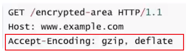
</div>

第三步：服务器在浏览器支持的格式下，直接返回对应压缩后的文件，并且在响应头中告知浏览器。比如服务器直接返回 app.js.gz 的 gzip 文件，并告知浏览器。然后浏览器会将 app.js.gz 压缩文件解压成 app.js 文件。

<div align=center>
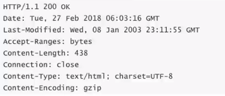
</div>

### webpack 对文件压缩

webpack 中可以通过`compressionPlugin`插件来压缩文件，相当于实现了 HTTP 压缩流程中的第一步。

```js
npm i compression-webpack-plugin -D
```

```js
// webpack.prod.js
new CompressionPlugin = require('compression-webpack-plugin')

module.exports = {
  plugin: [
    new CompressionPlugin(
      {
        test: /\.[css|js]$/i      只压缩css和js文件
      }
    )
  ]
}
```

## webpack 打包组件和第三方库

webpack 不仅可以打包应用，也可以用来打包 js 库。打包 js 库用到的属性主要是`output.library`，下面是一个例子：

```js
const TerserPlugin = require('terser-webpack-plugin')

module.exports = {
  // 输出 large-number和large-number.min文件
  entry: {
    'large-number': './src/index.js',
    'large-number.min': './src/index.js',
  },
  output: {
    filename: '[name].js',
    library: {
      name: 'largeNumber', //输出库的名字
      target: 'umd', //输出的格式，umd代表可以通过commonjs，esModule, amd等多种格式引入
      export: 'default', //指定导出的哪个模块被暴露为一个库，通常设置为default，因为暴露时通常使用export default
    },
  },
  mode: 'none',
  optimization: {
    minimize: true,
    minimizer: [
      new TerserPlugin({ include: /\.min\.js$/ }), //只压缩min.js文件
    ],
  },
}
```

## webpack 性能分析

### 速度分析

webpack 打包的速度分析主要是借助一个插件：[speed-measure-webpack-plugin](https://github.com/stephencookdev/speed-measure-webpack-plugin)。它可以帮我们输出整个打包构建过程中每一个 plugin 和 loader 所花费的时间，绿色表示速度较快，红色表示耗费时间过高，需要重点关注。使用起来也非常简单，只需要引入插件并用生成的实例将原本构建配置包裹即可。

```js
npm i speed-measure-webpack-plugin
```

```js
// 引入插件
const speedMeasureWebpackPlugin = require('speed-measure-webpack-plugin')

// 生成实例
const smp = new speedMeasureWebpackPlugin()

module.exports = smp.wrap({
  module: {……},
  plugins: [……]
})
```

### 体积分析

体积分析也是借助一个插件：[webpack-bundle-analyzer](https://github.com/webpack-contrib/webpack-bundle-analyzer)，这个插件会以可视化的方式展示构建包各个部分的大小，面积占比越大，体积则越大，以帮助我们了解哪个组件需要优化。

```js
npm i bundle-webpack-analyzer -D
```

```js
const { BundleAnalyzerPlugin } = require('bundle-webpack-analyzer')

module.exports = {
  plugins: [new BundleAnalyzerPlugin()],
}
```

### 并行构建

默认情况下，webpack 只会开启一个进程构建打包，当我们的包比较大的时候，就会出现耗时较久的现象。此时，我们可以使用 thread-loader 来开启多进程打包，加快构建速度。

thread-loader 需要放到其他 loader 的前面，即 thread-loader 需要最后执行。thread-loader 会形成一个线程池，放置在 thread-loader 后面的 loader 都会被放入到这个线程池中运行，并且不会阻塞主线程的运行，即该线程池和主线程是并发进行的。

```js
npm i thread-loader -D
```

```js
module.exports = {
  module: {
    rules: [
      {
        test: /\.js$/,
        use: [
          {
            loader: 'thread-loader',
            options: {
              worker: 3,
            },
          },
          // 其他loader
        ],
      },
    ],
  },
}
```

## webpack 其他相关知识

### compiler 和 compilation 的区别

compiler 对象是在 webpack 构建之初就会创建的一个对象，并且在 webpack 的整个生命周期中都会存在(before -- run -- beforeCompiler --compile -- make -- finishMake -- afterCompiler -- done)。只要是做 webpack 编译，都会创建一个 compiler 对象，并且只有当配置项发生改变并重新 npm run build 的时候才会改变

compilation 是到准备编译模块(比如 main.js)，才会创建。具体是在 compile(之后)-- make(之前)阶段创建。只要源码发生改变，就会重新创建一个 compilation

### Terser

定义： Terser 是一个 JavaScript 的解析(Parser)、丑化(mangle)/压缩(compressor)的工具集，它的作用就是通过压缩、丑化代码，从而让我们的代码变得更小。事实上，在真实开发中，我们不需要手动的通过 terser 来处理我们的代码，因为默认情况下，webpack 的生产模式会自动使用 TerserPlugin 来处理代码。

### DLL

dll（动态链接库）：使用 dll 技术对公共库进行提前打包，可大大提升构建速度。公共库一般情况下是不会有改动的，所以这些模块只需要编译一次就可以了，并且可以提前打包好。在主程序后续构建打包时如果检测到该公共库已经通过 dll 打包了，就不再对其编译而是直接从动态链接库中获取。

### CDN

CDN 称之为内容分发网络（Content Delivery Network 或 Content Distribution Network，缩写：**CDN**） 它是指通过相互连接的网络系统，利用最靠近每个用户的服务器；更快、更可靠地将音乐、图片、视频、应用程序及其他文件发送给用户； 来提供高性能、可扩展性及低成本的网络内容传递给用户。

一般有两种方式：

方式一：将打包后的所有静态资源都放到 cdn 服务器上，用户所有资源都是从 cdn 服务器上下载的。我们直接修改`output中的publicPath`为 cdn 地址就可以了。不过这种方式需要收费，也不常用

方式二：第三方库的 cdn 服务器。就是我们打包的时候，不用打包第三方库，而是在 index.html 中通过 cdn 的方式引入第三方包。

通常一些比较出名的开源框架都会将打包后的源码放到一些比较出名的、免费的 CDN 服务器上。

## Gulp

gulp 的核心理念时 task runner，可以定义一系列任务，等待任务被执行，它是基于文件 stream 的构建流，我们可以使用 gulp 的插件体系来完成某些任务。

gulp 相对于 webpack 思想更加的简单、易用，更适合编写一些自动化的任务，但是由于 gulp 并不支持模块化，因此目前对于大型项目(Vue、React、Angular )并不会使用 gulp 来构建。

### gulp 的基本使用

每个 gulp 任务都是一个异步的 JavaScript 函数，这个函数接受一个 callback 作为参数，调用 callback 函数返回的是一个 stream、promise、event emitter、child process 或 observable 类型的函数用以表明任务结束。

```js
npm i gulp
```

新建一个 gulpfile.js 文件

```js
// 定义任务
const foo = (cb) => {
  console.log('foo')
  cb() //结束任务必须调用回调函数
}

module.exports = {
  foo,
}

// 定义默认任务
module.export.default = (cb) => {
  console.log('default task')
  cb()
}
```

使用 gulp 执行任务

```js
// 执行特定任务
npx gulp foo

// 执行默认任务
npx gulp
```

:::tip
当然也可以多个任务一起执行，gulp 提供了两种组合方式：

series()：串行任务组合

parallel()：并行任务组合
:::

```js
// gulpfile.js

const { series } = require('gulp')

const task1 = (cb) => {
  console.log('task1')
  cb()
}
const task2 = (cb) => {
  console.log('task2')
  cb()
}

const seriesTask = series(task1, task2)

module.exports = {
  seriesTask,
}
```

当执行 seriesTask 任务时，输出如下内容：

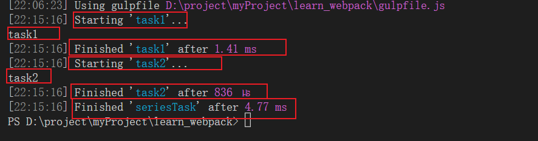l

### 读取和写入文件

gulp 暴露了`src()`和`dest()`方法用于处理计算机上存放的文件。

src()接受一个路径参数，并从文件系统中读取文件然后生成一个 Node 流(Stream)，它将所有匹配的文件读取到内存中并通过流( Stream)进行处理，由 src()产生的流( stream )应当从任务( task 函数）中返回并发出异步完成的信号。

dest()接受一个输出目录作为参数，并且它还会产生一个 Node 流(stream)，通过该流将内容输出到文件中。

流( stream )所提供的主要的 API 是`pipe()`方法，pipe 方法的原理是什么呢?

pipe 方法接受一个转换流(Transform streams)或可写流(Writable streams) ，那么转换流或者可写流，拿到数据之后可以对数据进行处理，再次传递给下一个转换流或者可写流。

```js
const { src, dest } = require('gulp')
const task = () => {
  return src('./src/*.js').pipe(dest('./dist')) //将src下的所有js文件输出到dist目录下
}
module.exports = {
  task,
}
```

### 使用 gulp 对文件进行转换

```js
const { src, task } = require('gulp')
const babel = require('gulp-babel')
const terser = require('gulp-terser')

const task = () => {
  return src('./src/*.js')
    .pipe(babel({ presets: ['@babel/preset-env'] })) // 将es6转成es5
    .pipe(terser({ mangle: { toplevel: true } })) //压缩
    .pipe(dest('./dist'))
}
```
