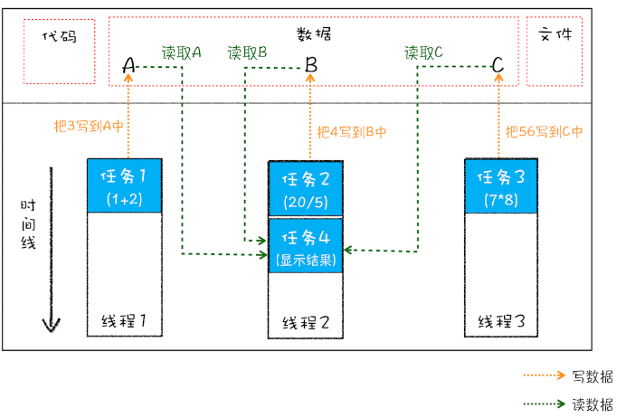
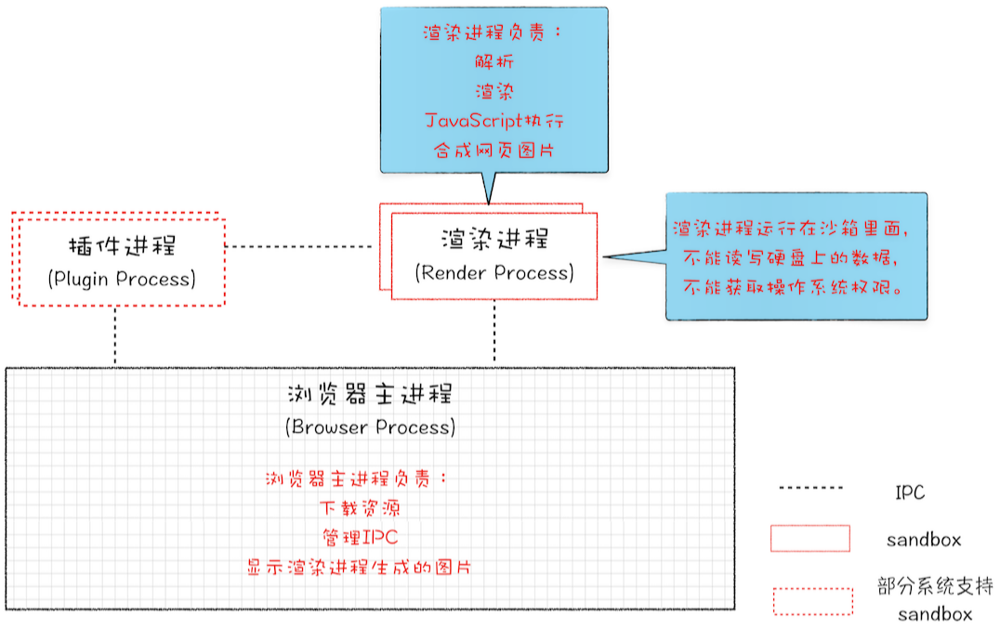
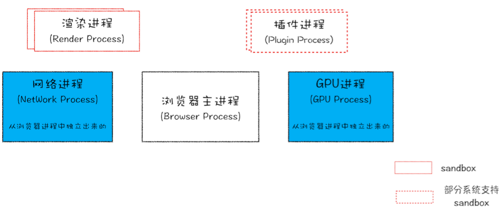

## 进程和线程

启动一个程序的时候，操作系统会为该程序创建一块内存，用来存放代码、运行中的数据和一个执行任务的主线程，我们把这样的一个运行环境叫进程。进程是操作系统进行资源分配和调度的一个独立单元，任一时刻，CPU只能执行一个进程。

而线程是不能单独存在的，它需要依附于进程，由进程来启动和管理，它是程序执行的最小单位。一个进程中可以开启多个线程并行完成不同的任务，我们称之为多线程。

我们可以把进程比作是一个工厂，而工厂里面的生产线就是线程。进程和线程直接有以下几个特点：

**1、进程中的任意线程执行出错，都会导致整个进程崩溃**

**2、同一进程间的线程，共享数据**

举个例子，如果我们使用多线程执行下面任务
```js
A = 1+2
B = 20/5
C = 7*8
```
那么线程之间是可以共享数据的，如下图:
<div style="text-align: center">

</div>

从上图可以看出，线程1、线程2、线程3分别把执行的结果写入A、B、C中，然后线程2继续从A、B、C中读取数据，用来显示执行结果。

**3、当一个进程关闭之后，操作系统会回收进程所占用的内存。**

当一个进程退出时，操作系统会回收该进程所申请的所有资源；即使其中任意线程因为操作不当导致内存泄漏，当进程退出时，这些内存也会被正确回收。

**4. 进程之间的内容相互隔离。**

进程不同于线程，进程间的数据是相互隔离的。进程隔离是为保护操作系统中进程互不干扰，正是因为进程之间的数据是严格隔离的，所以一个进程如果崩溃了，或者挂起了，是不会影响到其他进程的。如果进程之间需要进行数据的通信，这时候，就需要使用用于进程间通信（IPC）的机制了。

## 单进程浏览器
在了解了进程和线程之后，我们再来一起看下单进程浏览器的架构。顾名思义，单进程浏览器是指浏览器的所有功能模块都是运行在同一个进程里，这些模块包含了网络、插件、JavaScript运行环境、渲染引擎和页面等。一个进程运行那么多的任务是导致早期浏览器不稳定、不流畅以及不安全的主要原因。

### 不稳定
前面介绍过，线程的崩溃会导致整个进程都无法运行。

早期浏览器需要借助于插件来实现诸如Web视频、Web游戏等各种强大的功能，但是由于插件的性能良莠不齐，导致插件是最容易出问题的模块，并且还运行在浏览器进程之中，所以一个插件的意外崩溃会引起整个浏览器的崩溃。

除了插件之外，渲染引擎模块也是不稳定的，通常一些复杂的JavaScript代码就有可能引起渲染引擎模块的崩溃。和插件一样，渲染引擎的崩溃也会导致整个浏览器的崩溃。

### 不流畅
如果一个线程当中的某段逻辑非常耗时，会导致这个线程发生阻塞，线程后面所有的逻辑都需等待，这就导致浏览器非常的卡顿。

### 不安全
不安全体现在两个方面：插件和页面脚本。由于同一进程间的线程共享数据，而且插件可以使用c/c++等语言编写，通过插件可以获取到操作系统的任意资源，当你在页面运行一个插件时也就意味着这个插件能完全操作你的电脑。如果是恶意脚本也是可以获取系统权限的，这样使得早期浏览器非常的不安全。

## 多进程浏览器时代

### 早期多进程架构
下图2008年Chrome发布时的进程架构。
<div style="text-algin: center">

</div>

从图中可以看出，Chrome的页面是运行在单独的渲染进程中的，同时页面里的插件也是运行在单独的插件进程之中，而进程之间是通过IPC机制进行通信（如图中虚线部分）

由于进程是相互隔离的，所以当一个页面或者插件崩溃时，影响到的仅仅是当前的页面进程或者插件进程，并不会影响到浏览器和其他页面，这就完美地解决了页面或者插件的崩溃会导致整个浏览器崩溃，也就是不稳定的问题。

同样，JavaScript也是运行在渲染进程中的，所以即使JavaScript阻塞了渲染进程，影响到的也只是当前的渲染页面，而并不会影响浏览器和其他页面，因为其他页面的脚本是运行在它们自己的渲染进程中的。所以当我们在浏览器中运行较为复杂的脚本时，没有响应的仅仅是当前的页面。

最后我们再来看看上面的两个安全问题是怎么解决的。采用多进程架构的好处是可以使用安全沙箱，沙箱可以看成是操作系统给进程上了一把锁，沙箱里面的程序可以运行，但是不能在硬盘上写入任何数据，也不能在敏感位置读取任何数据。Chrome把插件进程和渲染进程锁在沙箱里面，这样即使在渲染进程或者插件进程里面执行了恶意程序，恶意程序也无法突破沙箱去获取系统权限。

### 目前多进程架构

随着Chrome的发展是滚滚向前的，相较之前，目前的架构又有了很多新的变化。我们先看看最新的Chrome进程架构
<div style="text-algin: center">

</div>

从图中可以看出，最新的Chrome浏览器包括：1个浏览器（Browser）主进程、1个 GPU 进程、1个网络（NetWork）进程、多个渲染进程和多个插件进程

下面我们来逐个分析下这几个进程的功能。

* 浏览器进程。主要负责界面显示、用户交互、子进程管理，同时提供存储等功能。
* 渲染进程。核心任务是将 HTML、CSS 和 JavaScript 转换为用户可以与之交互的网页，排版引擎Blink和JavaScript引擎V8都是运行在该进程中，默认情况下，Chrome会为每个Tab标签创建一个渲染进程。出于安全考虑，渲染进程都是运行在沙箱模式下。
* GPU进程。网页、Chrome的UI界面都选择采用GPU来绘制。
* 网络进程。主要负责页面的网络资源加载。
* 插件进程。主要是负责插件的运行，因插件易崩溃，所以需要通过插件进程来隔离，以保证插件进程崩溃不会对浏览器和页面造成影响

不过凡事都有两面性，虽然多进程模型提升了浏览器的稳定性、流畅性和安全性，但同样不可避免地带来了一些问题

* 更高的资源占用。因为每个进程都会包含公共基础结构的副本（如JavaScript运行环境），这就意味着浏览器会消耗更多的内存资源。
*更复杂的体系架构。浏览器各模块之间耦合性高、扩展性差等问题，会导致现在的架构已经很难适应新的需求了