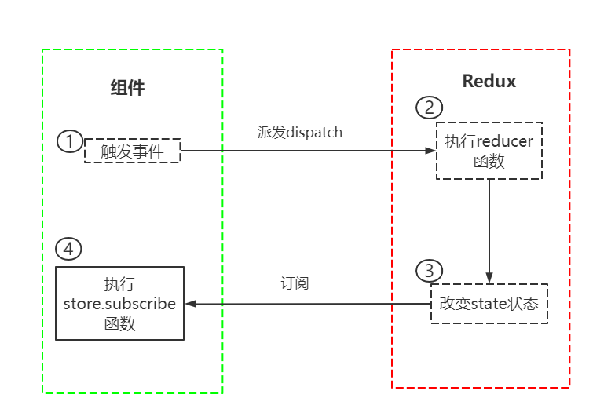

官方对 Redux 的定义为：Redux 是一个 JavaScript 应用程序的可预测状态容器。

通常我们更多的是在 React 当中使用 Redux，由于 react 只负责管理视图，而把所有的状态和数据都交由开发者自己管理，因此难以追踪和维护。而 redux 就是一个帮助我们管理 state 的容器，Redux 是 JavaScript 的状态容器，提供了可预测的状态管理，使得所有的状态都是可以控制和追踪的。

### redux 的三大原则：

- 单一数据源：整个应用程序的 state 被存放在一个对象中，并且这个对象只存储在一个 store 中。单一数据源可以让整个应用程序的 state 变得方便维护、追踪和修改。
- state 是只读的：唯一修改 state 的方法一定是派发 action，不要试图在其他地方通过任何方式来修改 state
- 使用纯函数来执行修改：所有的 reducer 都应该是纯函数，不能产生任何副作用。

## JavaScript 纯函数

前面提到，redux 中所有的 reducer 函数都应该是纯函数。那么什么是纯函数呢？作为一个纯函数，必须满足下面两点：

1、确定的输入，一定会产生确定的输出

2、函数执行过程中，不会产生副作用，不会修改其他变量

```js
let person = {
  name: 'tom',
  age: 13,
}

let constant = 10

function fn1(name) {
  person.name = name
  return person
}

function fn2(num) {
  return num + constant
}

function fn3(name) {
  return { ...person, name }
}
```

上面几个函数只有 fn3 是一个纯函数。首先 fn1 改变了 person 变量的值，产生了副作用；函数 fn2 的输出依赖一个外部变量 constant，如果 constant 的值发生改变时，特定的输入在 constant 改变前后的输出会变得不一样，即，特定的输入无法产生特定的输出。

## 核心概念

**store：** 用来管理公共数据的容器

**action：** 所有数据的变化，必须通过派发(dispatch)一个 action 来更新。action 是一个普通的 JavaScript 对象，用来描述这次更新的 type 和 content。

**reducer：** reducer 负责将 state 和 action 结合在一起形成一个新的 state。

:::tip
reducer 必须是一个纯函数
:::

## 基本使用

```js
npm i redux
```

```js
const redux = require('redux')

const initState = {
  count: 0,
}

// reducer函数，将state和action联系在一起
function reducer(state = initState, action) {
  switch (action.type) {
    case 'ADD_NUMBER':
      return { ...state, count: state.count + action.num }
    case 'SUB_NUMBER':
      return { ...state, count: state.count - action.num }
    default:
      return state
  }
}

// store(创建时需要传入一个reducer函数)
const store = redux.createStore(reducer)

//订阅store的改变
store.subscribe(() => {
  console.log('state发生了改变')
  //获取state中的值
  console.log('count:', store.getState().count)
})

//action，改变state的唯一途径
const action1 = { type: 'ADD_NUMBER', num: 6 }
const action2 = { type: 'SUB_NUMBER', num: 4 }

//派发action
store.dispatch(action1)
store.dispatch(action2)
```

上面就是 redux 的基本使用，但是有几点是需要注意的：
:::tip
reducer 函数接收两个参数，第一个是前一次的 state，由于第一次没有前一个 state，因此需要指定默认参数；第二个参数是 action。

由于 reducer 是一个纯函数，所以在 reducer 中，不能改变外部变量的值，每次都需要返回一个新对象。

订阅 store 修改的函数一定要在派发 action 之前执行，如果订阅在派发之后执行，那么派发的时候还没有订阅，而订阅的时候已经派发完了，相当于没有任何作用。
:::

## 结构划分

如果我们把所有有关 redux 代码都放到一个文件中，随着项目的庞大，这个文件后期会变得非常的复杂、庞大且难以维护。

因此，我们需要以上代码进行拆分，将 store、reducer、action 拆分到单独的文件中。我们首先在 src 目录下创建一个 store 文件夹，专门用于存放 redux 的文件。

1、创建一个`store/index.js`文件，作为入口文件

```js
import { createStore } from 'redux'
import reducer from './reducer'

const store = createStore(reducer)

export default store
```

2、在创建 store 的时候，需要传入一个 reducer 函数，所以我们需要在建一个`store/reducer.js`文件用于导出 reducer 函数，并且可以将 reducer 中`action.type`抽离到一个常量文件`store/constant.js`中。

```js
// store/constant.js

export const ADD_NUMBER = 'ADD_NUMBER'
export const SUB_NUMBER = 'SUB_NUMBER'
```

```js
//store/reducer.js

import { ADD_NUMBER, SUB_NUMBER } from './constant'
const initState = {
  count: 0,
}

function reducer(state = initState, action) {
  switch (action.type) {
    case ADD_NUMBER:
      return { ...state, count: state.count + action.num }
    case SUB_NUMBER:
      return { ...state, count: state.count - action.num }
    default:
      return state
  }
}

export default reducer
```

3、最后是`store/actionCreators.js`，用于生成 action

```js
import { ADD_NUMBER, SUB_NUMBER } from './constant'

export const addAction = (num) => ({
  type: ADD_NUMBER,
  num,
})
export const subAction = (num) => ({
  type: SUB_NUMBER,
  num,
})
```

然后，我们就可以在组件中引入 redux 中管理的状态了。

```js
import React, { PureComponent } from 'react'
import store from './store'
import { addAction, subAction } from './store/action'

export default class hom extends PureComponent {
  constructor() {
    super()
    this.state = {
      count: store.getState().count,
    }
  }

  componentDidMount() {
    // 订阅
    this.unsubscribe = store.subscribe(() => {
      this.setState({
        count: store.getState().count,
      })
    })
  }

  componentWillUnmount() {
    // 取消订阅
    this.unsubscribe()
  }

  render() {
    return (
      <div>
        <h2>count: {this.state.count}</h2>
        <button onClick={(e) => this.addCount(5)}>+5</button>
        <button onClick={(e) => this.subCount(5)}>-5</button>
      </div>
    )
  }

  addCount() {
    store.dispatch(addAction(5))
  }
  subCount() {
    store.dispatch(subAction(5))
  }
}
```

整个流程可以用下图表示：首先组件内部触发事件，派发 action 到 redux，redux 检测到派发的 action 之后就会执行 reducer 函数，并依据相应的 action 改变 state 状态，当组件内部监听到 redux 的状态发生改变时就会执行`store.subscribe`订阅函数。


## 抽离公共组件

上面我们已经实现了 redux 对公共状态的管理了，但是上面的实现方式不是很优雅：当我们又有另外一个组件：About 组件需要订阅 redux 中管理的状态时，我们在 About 组件中又得原封不动的重新实现上面代码。当组件特别多时，就会造成代码冗余。因此，我们可以将公共部分的代码抽取到一个工具函数中。

在 src 文件夹下新建`util/connect.js`文件，由于每个订阅 redux 状态的组件都需要实现订阅、派发 action、取消订阅等操作，我们可以通过高阶组件的方式将公共代码进行抽取。

```js
//util/connect.js

import { PureComponent } from 'react'
import store from '../store'

// 由于每个组件中所需的公共state和dispatch函数不一定一样，因此connect函数接收两个参数
// 然后在函数内就可以获取对应组件所需的公共state和dispatch了
export function connect(mapStateToPops, mapDispatchToProps) {
  // 返回一个高阶组件
  return function enhanceHOC(WrappedComponent) {
    return class extends PureComponent {
      constructor() {
        super()
        this.state = {
          storeState: mapStateToPops(store.getState()),
        }
      }
      componentDidMount() {
        this.unsbuscribe = store.subscribe(() => {
          this.setState({
            storeState: mapStateToPops(store.getState()),
          })
        })
      }
      componentWillUnmount() {
        this.unsbuscribe()
      }
      render() {
        return (
          <WrappedComponent
            {...this.props}
            {...mapStateToPops(store.getState())}
            {...mapDispatchToProps(store.dispatch)}
          />
        )
      }
    }
  }
}
```

经过抽离后，我们就可以更简便的在组件中使用 redux 来管理状态了：

```jsx
import React, { PureComponent } from 'react'
import { addAction, subAction } from './store/action'
import { connect } from './utils/connect'

class home extends PureComponent {
  render() {
    // 从this.props中导入state和action
    const { count, addNumber, subNumber } = this.props
    return (
      <div>
        <h2>count: {count}</h2>
        <button onClick={(e) => addNumber(5)}>+5</button>
        <button onClick={(e) => subNumber(5)}>-5</button>
      </div>
    )
  }
}

// 告诉connect函数，我们需要的state和dispatch函数
const mapStateToProps = (state) => ({
  count: state.count,
})

const mapDispatchToProps = (dispatch) => ({
  addNumber(val) {
    dispatch(addAction(val)) //传递的是action的调用结果，即一个对象
  },
  subNumber(val) {
    dispatch(subAction(val))
  },
})

export default connect(mapStateToProps, mapDispatchToProps)(home)
```

:::tip
connect 是一个高阶函数，该函数接收 mapStateToProps、mapDispatchToProps 两个函数作为参数，并且返回一个高阶组件。
:::

## react-redux

刚刚我们介绍了 redux 的使用，并抽离出来一个公共函数 connect，其实社区已经存在一个第三方库帮我们完成了上面的抽取，我们只需要引入就可以直接使用了。这个第三方库就是：react-redux。
react-redux 完成的事情很简单，就是我们在 connect 中所完成的事。使用起来也是非常的简便：

1、首先我们需要传给 react-redux 一个 store，一般是通过 context 传递，这样每个组件都可以从 react-redux 中获取状态了。

```jsx
import { createRoot } from 'react-dom/client'
import { Provider } from 'react-redux'
import store from './store'

import App from './app'

const root = createRoot(document.getElementById('root'))

root.render(
  <Provider store={store}>
    <App />
  </Provider>
)
```

2、在组件中使用

```jsx
import React, { PureComponent } from 'react'
import { connect } from 'react-redux'
import { addAction, subAction } from './store/action'

class home extends PureComponent {
  render() {
    const { count, addNumber, subNumber } = this.props
    return (
      <div>
        <h2>count: {count}</h2>
        <button onClick={(e) => addNumber(5)}>+5</button>
        <button onClick={(e) => subNumber(5)}>-5</button>
      </div>
    )
  }
}

const mapStateToProps = (state) => ({
  count: state.count,
})

const mapDispatchToProps = (dispatch) => ({
  addNumber(val) {
    dispatch(addAction(val))
  },
  subNumber(val) {
    dispatch(subAction(val))
  },
})

export default connect(mapStateToProps, mapDispatchToProps)(home)
```

## redux-thunk

之前我们派发的 action 都是同步的，派发后都可以直接获取结果。但真实开发中，我们可能需要将服务器请求到的数据交由 redux 管理，这个时候我们就不能简单的派发 action 了，因为这个操作是异步的。

为了在 redux 执行过程中发送异步网络请求，我们需要使用一个中间件：redux-thunk

:::tip
中间件的作用是在 dispatch 的 action 和执行 reducer 函数之间做劫持，扩展一些其他的代码。
:::

我们都知道，action 其实质就是一个对象，所以默认情况下，`dispatch(action)`中的 action 要求必须是一个 JavaScript 对象。redux-thunk 可以允许`dispatch(action)`中的 action 是一个函数。

该函数在派发后会 redux 被调用，并且会主动传给这个函数一个 dispatch 函数和 getState 函数。

- dispatch 函数用于我们之后再次派发 action
- getState 函数考虑到我们之后的一些操作需要依赖原来的状态，用于获取之前的一些状态

**使用：**

1、安装

```js
npm i redux-thunk
```

2、在创建 store 是传入应用了 middleware 的 enhance 增强函数。

通过 applyMiddleware 来结合多个 middleware 中间件，该函数返回的是一个 enhancer，将 enhancer 作为第二个参数传入到 createStore 中。

```js
import { createStore, applyMiddleware } from 'redux'
import reducer from './reducer'
import thunkMiddleware from 'redux-thunk'

// 应用一些中间件，applyMiddleware(中间件1，中间件2，……)
const storeEnhancer = applyMiddleware(thunkMiddleware)

const store = createStore(reducer, storeEnhancer)

export default store
```

3、定义返回一个函数的 action。注意，这里返回的不是一个对象，而是一个函数，该函数在 dispatch 之后会被执行。

```js
import axios from 'axios'
import { CHANGE_BANNER } from './constant'

export const changeBannerAction = (banners) => ({
  type: CHANGE_BANNER,
  banners,
})

//用于网络请求的action
export const getHomeMultidataAction = (dispatch, getState) => {
  axios.get('http://123.207.32.32:8000/home/multidata').then(({ data }) => {
    //这里才是真正的dispatch
    dispatch(changeBannerAction(data.data.banner.list))
  })
}
```

4、而在组件中调用 dispatch，则需要传递一个函数，而不是对象

```js
import React, { PureComponent } from 'react'
import { getHomeMultidataAction } from './store/action'
import { connect } from 'react-redux'

class home extends PureComponent {
  componentDidMount() {
    this.props.getHomeMultidata()
  }
  render() {
    const { banner } = this.props
    return (
      <div>
        <ul>
          {banner.map((item) => {
            return <li>{item.title}</li>
          })}
        </ul>
      </div>
    )
  }
}

const mapStateToProps = (state) => ({
  banner: state.banner,
})

const mapDispatchToProps = (dispatch) => ({
  getHomeMultidata() {
    dispatch(getHomeMultidataAction) //此处并未手动调用action，而是将action作为函数传入到dispatch中
  },
})

export default connect(mapStateToProps, mapDispatchToProps)(home)
```

## redux devtools

类似于 vue.js devtools，redux devtools 也是用于追踪 redux 中状态的变化的。

使用该工具需要两步：

第一步：在对应浏览器上安装 redux devtools 插件

第二步：配置使用

```js
import { createStore, applyMiddleware, compose } from 'redux'
import reducer from './reducer'
import thunkMiddleware from 'redux-thunk'

const composeEnhancers = window.__REDUX_DEVTOOLS_EXTENSION_COMPOSE__ || compose
const storeEnhancer = applyMiddleware(thunkMiddleware)

const store = createStore(reducer, composeEnhancers(storeEnhancer))

export default store
```

## 拆分 store

目前我们是把所有组件的变量都放到一个文件中处理，不论是 reducer、constants、还是 actionCreators，当项目越来越大时，这显然是不合理的。所以，我们需要按照各个组件所用的变量拆分 store 文件夹，形成自己的 reducer、constants 和 actionCreators 文件。

```js
./store
|-- counter
|   |-- actionCreators.js
|   |-- constants.js
|   |-- index.js
|   |-- reducer.js
|
|
|-- banner
|   |-- actionCreators.js
|   |-- constants.js
|   |-- index.js
|   |-- reducer.js
|
|
|-- index.js
|-- reducer.js

```

这样我们就可以按组件将各个组件的状态分开管理，但是有一个问题，在创建 store 的时候需要传递一个 reducer 函数，然而我们现在拆分后存在多个 reducer 函数，放哪一个呢？

事实上，放哪一个都不合适，redux 为我们提供了一个 combineReducers 函数将若干个 reducer 函数整合成一个 reducer 函数。

```js
// store/reducer.js

import countReducer from './count/reducer.js'
import bannerReducer from './banner/reducer.js'
import { combineReducers } from 'redux'

const reducer = combineReducers({
  countInfo: countReducer,
  bannerInfo: bannerReducer,
})

export default reducer
```

combineReducers 实质是将我们传入的 reducers 合并到一个对象中，最终返回一个 combination 函数(相当于之前的 reducer 函数)。在执行 combination 函数的过程中，它会判断前后返回的数据是否相同来决定返回之前的 state 还是新的 state，新的 state 会触发订阅者发生对应的刷新，而旧的 state 可以有效的阻止订阅者的刷新。

## Redux Toolkit

Redux Toolkit 是官方推荐的编写 Redux 逻辑的方法，旨在解决 redux 编写逻辑过于繁琐和冗余，且代码分散多个文件中的问题。

```js
npm i @reduxjs/toolkit react-redux
```

Redux Toolkit 的核心主要有以下核心 API：

**configureStore：** 包装 createStore 以提供简化的配置选项和良好的默认值。它可以自动组合 slice reducer，添加用户提供的 redux 中间件，并且默认已经包含了 redux-thunk 中间件并已开启 Redux DevTools Extension。

**createSlice：** 接受 reducer 函数的对象、切片名称和初始状态值，并自动生成切片 reducer，并且带有相应的 actions。

**createAsyncThunk：** 接受一个动作类型字符串和一个返回承诺的函数，并且生成一个 pending/fulfilled/rejected 基于该承诺分派动作类型的 thunk。

configureStore 用于创建 store 对象，常见参数：

- reducer：将 slice 中的 reducer 组成一个对象传入此处
- middleware：可选参数，传入其他中间件
- devTools：是否开启 devTools 工具，默认为 true

createSlice 主要包含以下参数：

- name：用于标记 slice 的名字，在之后的 redux-devtools 中会显示对应的名字
- initialState：初始值，第一次初始化时的值
- reducers：相当于之前的 reducer 函数对象类型，并且可以添加很多的函数。函数类似于 redux 原来 reducer 中的一个个 case 语句，函数接受两个参数(state、action)

:::tip
createSlice 的返回值是一个对象，包含所有的 actions
:::

```js
//store/index.js

import { configureStore } from '@reduxjs/toolkit'
import countReducer from './modules/count'

const store = configureStore({
  reducer: {
    countInfo: countReducer,
  },
})

export default store
```

```js
//modules/count

import { createSlice } from '@reduxjs/toolkit'

const counterSlice = createSlice({
  name: 'count',
  initialState: {
    count: 0,
  },
  reducers: {
    addAction(state, action) {
      // 无需重新返回一个新的对象，Redux Toolkit内部会做处理
      state.count = state.count + action.payload
    },
    subAction(state, { payload }) {
      state.count = state.count - payload
    },
  },
})

export const { addAction, subAction } = counterSlice.actions

export default counterSlice.reducer
```

```jsx
//组件内

import React, { PureComponent } from 'react'
import { addAction, subAction } from './store/modules/count'
import { connect } from 'react-redux'

class home extends PureComponent {
  render() {
    const { count, addNumber, subNumber, banner } = this.props
    return (
      <div>
        <h2>count: {count}</h2>
        <button onClick={(e) => addNumber(5)}>+5</button>
        <button onClick={(e) => subNumber(5)}>-5</button>
      </div>
    )
  }
}

const mapStateToProps = (state) => ({
  count: state.countInfo.count,
})

const mapDispatchToProps = (dispatch) => ({
  addNumber(val) {
    dispatch(addAction(val))
  },
  subNumber(val) {
    dispatch(subAction(val))
  },
})

export default connect(mapStateToProps, mapDispatchToProps)(home)
```

### 异步操作

在之前的开发中，我们通过 redux-thunk 中间件实现了异步请求功能，而 Redux Toolkit 当中默认集成了 thunk 相关的功能：createAsyncThunk。

当 createAsyncThunk 创建出来的 action 被 dispatch 时，会存在三种状态：

- pending：action 被发出，但是还没有最终的结果
- fulfilled：获取到最终的结果
- rejected：执行过程中有错误或者抛出异常

我们可以在 createSlice 中的 extraReducer 中监听异步结果

```js
//store/index.js

import { configureStore } from '@reduxjs/toolkit'
import countReducer from './modules/count'
import bannerReducer from './modules/banner.js'

const store = configureStore({
  reducer: {
    countInfo: countReducer,
    bannerInfo: bannerReducer,
  },
})

export default store
```

```js
//modules/banner.js

import { createSlice, createAsyncThunk } from '@reduxjs/toolkit'
import axios from 'axios'

export const fetchBannerAction = createAsyncThunk(
  'fetchBannerData',
  async (extraInfo) => {
    //接受派发时传递的参数
    console.log(extraInfo)
    const res = await axios.get('http://123.207.32.32:8000/home/multidata')
    return res.data
  }
)

const bannerSlice = createSlice({
  name: 'banner',
  initialState: {
    banners: [],
  },
  //监听异步结果
  extraReducers: {
    [fetchBannerAction.fulfilled](state, { payload }) {
      state.banners = payload.data.banner.list
    },
  },
})

export default bannerSlice.reducer
```

```jsx
//组件内

import React, { PureComponent } from 'react'
import { fetchBannerAction } from './store/modules/banner'
import { connect } from 'react-redux'

class home extends PureComponent {
  componentDidMount() {
    this.props.getHomeMultidata()
  }
  render() {
    const { banners } = this.props
    return (
      <div>
        <ul>
          {banners.map((item) => {
            return <li>{item.title}</li>
          })}
        </ul>
      </div>
    )
  }
}

const mapStateToProps = (state) => ({
  banners: state.bannerInfo.banners,
})

const mapDispatchToProps = (dispatch) => ({
  getHomeMultidata() {
    //派发异步action并传递参数
    dispatch(fetchBannerAction({ name: 'tom', age: 14 }))
  },
})

export default connect(mapStateToProps, mapDispatchToProps)(home)
```

我们也可以在 extraReducers 中通过链式调用的方法监听异步结果：

```js
extraReducers: (builder) => {
  builder
    .addCase(fetchHomeBannerAction.pending, (state, action) => {
      console.log('pending')
    })
    .addCase(fetchHomeBannerAction.fulfilled, (state, { payload }) => {
      state.banners = payload.data.banner.list
    })
}
```

## 自定义中间件

前面我们有用到一个中间件：redux-thunk，这个中间件允许我们向 dispatch 中传入一个函数作为 action。其实质就是，当我们传入的是一个普通对象时，直接 dispatch；当我们传入的是一个函数时，那么就调用这个函数。那么我们能不能自己实现这个中间件呢？

```js
import { createStore } from 'redux'
import reducer from './reducer'

const store = createStore(reducer)

//自定义中间件
function thunk(store) {
  //保留store.dispatch的指向
  const next = store.dispatch
  function dispatchFn(action) {
    if (typeOf action === 'function') {
      // 如果action是一个函数，执行这个函数并传入参数
      action(store.dispatch, store.getState)
    } else {
      next(action)
    }
  }

  //将store.dispatch指向刚定义的函数，
  store.dispatch = dispatchFn
}

//执行函数
thunk(store)

export default store
```

自定义中间件的本质是改变 store.dispatch 的指向为自定义函数，这样用户在组件中 dispatch(action)实际上就是在执行我们自定义的这个函数。
