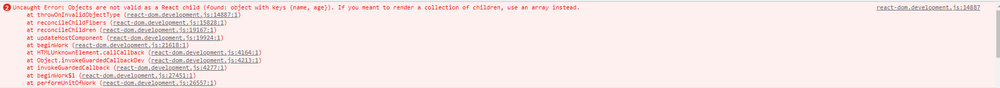
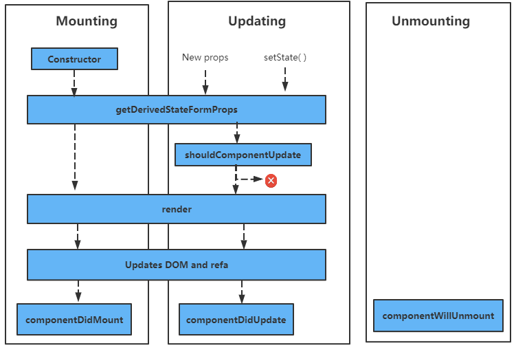
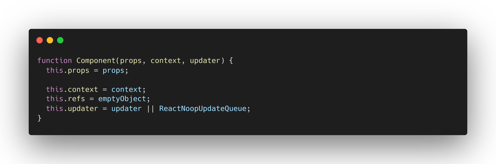
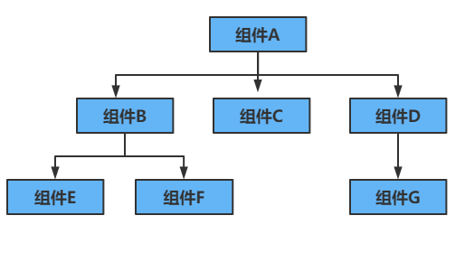
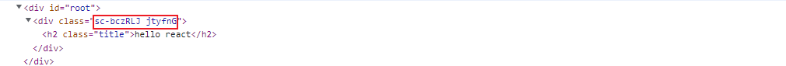
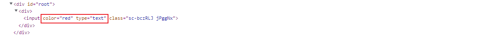
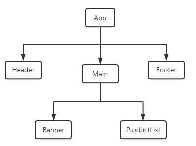

::: tip
:star:前言

React 作为和 Vue、Angular 并驾齐驱的前端三大主流框架之一，其地位自然不言而喻，很多大厂都选择使用 React 作为日常开发的框架，很多程序员也都偏爱 React，主要原因在于 React 使用的 JSX(一种酷似 JavaScript 的语言)编写，导致 React 的灵活性是其他两大框架所无法匹敌的。而且 Vue 和 Angular 中很多的思想都是借鉴 React。所以，每个致力于献身前端事业的小伙伴都是有必要了解 React 的。
:::

## 启动项目

React 使用的脚手架是`create-react-app`，并且默认使用`yarn`作为包管理工具。因此，开发前我们需要执行以下命令在全局安装这两个工具：

```js
npm install -g yarn
npm install -g create-react-app
```

然后就可以执行下面命令创建一个 React 工程了：

```js
create-react-app 项目名
```

创建好的项目路径如下：

```js
|-- public
|   |-- favicon.ico
|   |-- index.html
|   |-- logo192.png
|   |-- logo512.png
|   |-- manifest.json
|   |-- robots.txt
|
|
|-- src
|   |-- App.css
|   |-- App.js
|   |-- App.test.js
|   |-- index.css
|   |-- index.js
|   |-- logo.svg
|   |-- reportWebVitals.js
|   |-- setupTests.js
|
|
|-- package-lock.json
|-- package.json
|-- README.md
```

- `public`: 该目录下主要用于存放一些静态资源
- `src/App.js`: App 组件相关的代码
- `src/index.css`: 全局样式文件
- `src/index.js`: 整个应用程序的入口文件
  首先我们可以进入到全局入口文件`src/index.js`中，里面的主体代码大致是下面这样

```jsx
import React from 'react'
import ReactDOM from 'react-dom/client'
import App from './App'

const root = ReactDOM.createRoot(document.getElementById('root'))
root.render(<App />)
```

可以看到，`src/index.js`中只做了一件事，就是将 App 组件挂到了`id = root`的 DOM 元素上，接下来我们要做的，就是在 APP 组件中开发定制功能。
而在 React 中，组件可以使用类和函数的方式开发。

## 组件化开发

### 类组件

```jsx
import { Component } from 'react'
export default class App extends Component {
  constructor(props) {
    super(props)
    this.state = {
      name: 'tom',
    }
  }
  render() {
    return <div> {this.state.name} </div>
  }
}
```

::: tip
类组件的特点

1、类组件必须继承 React.Component

2、constructor 是可选的，通常用于初始化一些数据

3、this.state 用于维护组件内的数据

4、render 函数是类组件中唯一必须实现的方法
:::

### 函数式组件

```jsx
export default function App(props) {
  return <div> hello react </div>
}
```

::: tip
函数式组件的特点

1、没有生命周期函数

2、没有 this 对象

3、没有内部状态(state)
:::

::: warning
:bulb: 注意: 对于定义在类组件的 render 函数，不支持显示对象类型的数据，以下代码，react 内部会抛出异常
:::

```jsx
import React, { Component } from 'react'

export default class app extends Component {
  constructor() {
    super()
    this.state = {
      person: {
        name: 'tom',
        age: 13,
      },
    }
  }
  render() {
    return <div>{this.state.person}</div>
  }
}
```



## 状态管理

在类组件的`constructor函数`中，`this.state`对象用来维护组件内的状态的。在开发中，如果我们直接修改`state`，React 内部并不能检测到状态发生了变化，也就不会重新渲染界面。因此，React 推荐我们使用`setState函数`修改状态。`setState函数`并不需要我们定义，它是继承自`React.Component`。
::: warning
`setState函数`要求传入两个参数。第一个参数是必须的，可以是一个对象或者函数，如果是一个函数，则必须返回一个对象。对象的属性表明要更新的数据。第二个参数是可选参数，要求传入一个函数，在该函数中可以获取本次更新后的状态。
:::

```jsx
import React, { Component } from 'react'

export default class app extends Component {
  constructor() {
    super()
    this.state = {
      name: 'tom',
    }
  }
  render() {
    setTimeout(() => {
      this.state = { name: 'jake' }
    }, 0)
    return <div>{this.state.name}</div>
  }
}
```

此时界面上依然展示的是 tom，而不是 jake

```jsx
import React, { Component } from 'react'

export default class app extends Component {
  constructor() {
    super()
    this.state = {
      name: 'tom',
    }
  }
  render() {
    setTimeout(() => {
      this.setState({ name: 'jake' })
    }, 0)
    return <div>{this.state.name}</div>
  }
}
```

此时界面上显示的是 jake

### setState 是异步更新的

```jsx
import React, { Component } from 'react'

export default class app extends Component {
  constructor() {
    super()
    this.state = {
      name: 'tom',
      age: 18,
    }
  }
  render() {
    return (
      <div>
        {this.state.name}
        <button onClick={(e) => this.changeName()}>改变姓名</button>
      </div>
    )
  }
  changeName() {
    this.setState({
      name: 'jake',
    })
    console.log(this.state) // {name: tom, age:18}
  }
}
```

上面的代码执行后，即使界面上已经显示 jake 了，但是 setState 后面的打印却依旧是前一次的状态。可见 setState 是异步的。

::: danger
setState 设置为异步的原因

**1. 提升性能：** 如果 setState 是同步的，那么每次调用 setState 都会立马更新，意味着 render 函数会被频繁调用，界面就会不断的重新渲染，这样的效率是很低的。

**2.确保 state 和 props 保持同步：** react 中的 render 函数会比 setState 稍慢一些，如果立即更新了 state，但还没执行 render 函数，即在 setState 函数刚刚执行完的那一刻，state 和 props 是一致的。
:::
但如果 setState 是异步的，我们什么时候才能获取到更新后的状态呢？这里提供两种方案。

**通过回调函数** 前面提到过 setState 接收的第二个参数，这个参数需要传一个函数，并且在这个函数当中是可以获取到组件更新后的状态的。上面的代码如果这样写，就可以获取到最新的值

```jsx
changeName () {
    this.setState(
      {
        name: 'jake'
      },
      () => {
        console.log(this.state)  // {name: jake, age: 18}
      }
    )
  }
```

**通过生命周期函数** 在 react 中，组件的状态更新后，都会立马调用`componentDidUpdate`的[生命周期函数](#1)，在这个函数中也可以获取到组件本次更新的状态

### setState 数据的合并

上面例子中，我们通过 setState 更新组件状态时，传给了 setState 一个`{name: jake}` 的参数，参数里面并没有包含 age 属性，但是更新后的状态里面依旧包含了 age 属性。我们把 setState 的这种特性称为 **setState 的数据合并。**

那么为什么会有这种特性呢？这还得从 react 源码分析。react 在执行 setState 时，最后会通过`Object.assign`来合并数据的。比如上面的代码，react 内部最后会执行

```js
return Object.assign({}, this.state, { name: 'jake' })
```

这样，返回的对象中就包含了`this.state`中的所有属性。

### setState 的合并

setState 除了有数据合并的特性，其本身也是具有合并特性的。

```jsx
import React, { Component } from 'react'

export default class app extends Component {
  constructor() {
    super()
    this.state = {
      count: 0,
    }
  }
  render() {
    return (
      <div>
        <h2>当前计数： {this.state.count}</h2>
        <button onClick={(e) => this.increment()}>增加</button>
      </div>
    )
  }
  increment() {
    this.setState({ count: this.state.count + 1 })
    this.setState({ count: this.state.count + 2 })
  }
}
```

上面代码执行后，界面的数字是 2，而不是预期的 3。这是由于当多个连续`setState函数`传入的参数均为对象时，react 内部会把这些参数统一放到一个链表中，然后循环这个链表，执行下面操作来合并多个 setState 参数。

```jsx
/**
 * preState: 前一个setState函数
 * nextProps: 后一个setState函数
 */
Object.assign({}, preState, nextProps)
```

如此一来，当多个 setState 连续，且传入的对象的属性是一样的时候，只会执行最后一个 setState 中的改变。
那么有没有一种办法不让连续的多个 setState 函数合并呢？当然是有的。之前提到过，setState 函数的第一个参数也可以是一个函数，这个函数接收两个参数，第一个是 state，表示上一次的状态；第二个参数是 props。
::: tip
当 setState 传入的是一个函数时，react 内部就会依次执行每一个 setState 函数了
:::
所以上面的代码可以这样改写，使界面数字变为 3。

```jsx
increment () {
    this.setState((state, props) => ({ count: state.count + 1 }))
    this.setState((state, props) => ({ count: state.count + 2 }))
  }
```

### setState 的数据不可变性

react 建议除了构造函数(constructor)外，不应在任何地方修改`this.state`的值，即保证`this.state`中数据的不可变性。当使用`setState函数`更新状态时，我们通常都是**重新声明一个变量，而不应主动修改 this.state 中的值**。

```jsx
export default class App extends Component {
  constructor() {
    super()
    this.state = {
      friends: ['lilie', 'hanmeimei', 'lucy'],
    }
  }
  render() {
    return (
      <div>
        <ul>
          {this.state.friends.map((item) => {
            return <li>{item}</li>
          })}
        </ul>
        <button onClick={(e) => this.increment()}>添加朋友</button>
      </div>
    )
  }
  increment() {
    this.state.friends.push('tom') //错误的操作，改变了this.state中的数据
    this.setState({
      friends: this.state.friends,
    })
  }
}
```

基于 setState 的数据不可变性，increment 函数体中应该重新声明一个变量，而不能直接更改 this.state 的值

```jsx
increment() {
    const newFriends = [...this.state, 'tom'] //正确的操作，维持了this.state的不可变性
    this.setState({
      friends: newFriends,
    })
  }
```

## 生命周期

<h4 id="1">首先来看下 React 官方给出的生命周期图谱</h4>



图谱指出，一个组件大体会经历三个阶段：
::: tip

- 挂载阶段(Mounting)：首先 react 会调用构造函数初始化状态，然后依次经历 getDerivedStateFromProps、render 函数并更新 DOM 节点和 refs，最后调用 componentDidMount 钩子

* 更新阶段(Updating)：当改变传入组件的 props 或者调用 setState 函数时，显示通过 getDerivedStateFromProps，获取更新前后的 props 和 state，在 shouldComponentUpdate 钩子中判断更新前后的 props 和 state 是否发生变化，如果发生了变化，则更新界面，并执行 componentDidUpdate 钩子，否则，不刷新界面。

* 卸载阶段(Unmounting)：直接执行 componentWillUnmount 钩子，然后卸载组件。
  :::

生命周期中的函数称为生命周期函数或生命周期钩子，在 React 的生命周期中，有几个生命周期函数是值得注意的。
**1.constructor：** 初始化状态。

**2.componentDidMount：** 组件挂载后立即调用。通常在该函数中执行某些依赖 DOM 的操作，比如网络请求或者添加一些订阅。

**3.componentDidUpdate:** 在组件的 props 或者 state 更新后立即调用。

**4.componentWillUnmount:** 在组件卸载及销毁之前调用。一般用于执行一些清理操作，比如清除订阅。

**5.shouldComponentUpdate:** 这个生命周期函数的作用是提高性能，减少不必要的渲染。

shouldComponentUpdate 其实是通过控制是否调用 render 函数从而减少不必要的渲染来提高性能的。当一个组件 UI 界面所依赖的状态(包括 state 和 props)没有发生改变时，我们没有必要重新渲染组件。这个时候我们就需要通过 shouldComponentUpdate 函数控制组件不去调用组件的 render 函数。

shouldComponentUpdate 函数接收两个参数：

参数一：nextProps，表示修改之后最新的 props 属性

参数二：nextState，表示修改之后最新的 state 属性

:::tip
shouldComponentUpdate 函数返回的是一个 Boolean 值。如果返回的是 true，表明需要调用 render 函数；如果返回的是 false，表明不需要调用 render 方法。默认返回 true
:::

```jsx
import React, { Component } from 'react'

export default class App extends Component {
  constructor() {
    super()
    this.state = {
      message: 'hello world',
      name: 'tom',
    }
  }
  render() {
    console.log('render函数更新了')
    return (
      <div>
        <h2>{this.state.name}</h2>
        <button onClick={(e) => this.changeVal()}>改变</button>
      </div>
    )
  }
  changeVal() {
    this.setState({
      message: 'hello react',
    })
  }
}
```

上面这段代码每次点击按钮，render 函数都会执行一遍并打印。但是我们细想一些，render 函数所依赖的 this.state.name 从始至终都未曾改变过，因此，这种情况下的 render 函数其实就没必要重复执行了。这个时候，我们就可以使用 shouldComponentUpdate 函数来控制 render 的执行。

```jsx
import React, { Component } from 'react'

export default class App extends Component {
  constructor() {
    super()
    this.state = {
      message: 'hello world',
      name: 'tom',
    }
  }
  shouldComponentUpdate(nextProps, nextState) {
    if (this.state.name !== nextState.name) {
      return true
    }
    return false
  }

  render() {
    console.log('render函数更新了')
    return (
      <div>
        <h2>{this.state.name}</h2>
        <button onClick={(e) => this.changeVal()}>改变</button>
      </div>
    )
  }
  changeVal() {
    this.setState({
      message: 'hello react',
    })
  }
}
```

优化之后的代码只有当 UI 界面依赖的`this.state.name`(本次状态中的值)不等于`nextState.name`(更新后状态中的值)时，shouldComponentUpdate 函数才会返回 true，即允许 render 函数重新执行。否则，render 函数是不会重新执行的。

## 组件通信

在我们开发过程中，肯定会遇到许多的交互，比如点击某个按钮，界面弹出弹框。这个时候就需要组件间互相传递信息。React 中组件通信通常分为三类：父子组件通信、祖孙组件通信和全局事件传递。

### 父子组件通信

::: tip
父组件通过`属性=值`的形式来传递向子组件传递信息，而子组件则是通过 props 参数获取父组件传递过来的数据
:::

```jsx
import React, { Component } from 'react'

{
  /*类组件*/
}
class ChildCpn extends Component {
  constructor(props) {
    super(props)
  }
  render() {
    return (
      <div>
        {/*子组件通过props接收父组件传递过来的参数*/}
        <h2>当前计数：{this.props.curCount}</h2>
      </div>
    )
  }
}

{
  /*函数式组件*/
}
function ChildCpn2(props) {
  return (
    <div>
      <h2>当前计数：{props.curCount}</h2>
    </div>
  )
}

export default class app extends Component {
  constructor() {
    super()
    this.state = {
      count: 0,
    }
  }
  render() {
    return (
      <div>
        {/*父组件通过'属性=值'的形式传递参数*/}
        <ChildCpn curCount={this.state.count} />
        <ChildCpn2 curCount={this.state.count} />
      </div>
    )
  }
}
```

我们有没有想过一个问题，我们并没有在组件实例(this)上挂载 props，那为什么我们可以在子组件中直接通过 this.props 访问父组件传递过来的参数呢？

这个问题得用 React 源码来回答，我们声明的类组件都继承自 React 中的 Component，而在 React 中，我们可以找到它对 Component 的定义。

从源码中我们可以看到，React 在其内部主动将传入的 props 挂载到了组件实例(this)上，这样我们就能直接通过 this.props 访问父组件传递来的数据了。
::: tip
值得注意的是，实际上我们无需在组件的构建函数中手动接收 props 然后再传给 super 函数也可以直接访问 this.props，因为 React 实际上会主动将 props 传递给 Component。
:::

在子组件中也可以对父组件传递来的参数的类型进行校验，这里我们需要借用一个第三方库，感兴趣的可以自行了解一下[prop-types](https://github.com/facebook/prop-types)。首先我们需要安装一下 prop-types

```js
yarn add prop-types
```

然后在子组件中引入并使用

```jsx
import React, { Component } from 'react'
import PropTypes from 'prop-types'

class ChildCpn extends Component {
  constructor(props) {
    super(props)
  }
  render() {
    return (
      <div>
        <h2>当前计数：{this.props.curCount}</h2>
      </div>
    )
  }
}
//参数校验
ChildCpn.propTypes = {
  curCount: PropTypes.number.isRequired, //父组件传递过来的curCount必须是一个数值，且为必传参数
}
//设置默认值
ChildCpn.defaultProps = {
  curCount: 0,
}
```

::: danger
值得一提的是，React 规定，任何组件都必须向纯函数一样保护它们的 props 不被更改
:::

现在我们知道父组件是如何传递参数给子组件以及子组件又是如何接收参数的了，那如果现在这样的一个业务：点击子组件的某个按钮，新增一个对象到 personList 中。这又该如何处理呢？

前面讲到过，任何组件都不能修改其 props 对象。所以，我们不能直接修改 this.props.personList。在这里，我们应该采用子组件向父组件传递消息，通知父组件修改 nameList，当 React 检测到 nameList 修改时，会主动更新传入到子组件的 props 对象。

那么问题来了，我们如何才能在子组件中告知父组件更新呢。其实在 React 中，**子组件可以通过自定义事件传递数据给父组件。**

```jsx
import React, { Component } from 'react'

class ChildCpn extends Component {
  constructor(props) {
    super(props)
  }
  render() {
    return (
      <div>
        <h2>当前计数：{this.props.curCount}</h2>
        <button onClick={(e) => this.addNum()}>+5</button>
      </div>
    )
  }
  addNum() {
    this.props.addNum(5)
  }
}

export default class app extends Component {
  constructor() {
    super()
    this.state = {
      count: 0,
    }
  }
  render() {
    return (
      <div>
        <ChildCpn
          curCount={this.state.count}
          addNum={(val) => this.handleAddNum(val)}
        />
      </div>
    )
  }
  handleAddNum(val) {
    this.setState({
      count: this.state.count + val,
    })
  }
}
```

### 祖孙组件通信

前面介绍了父子组件间的通信，但是仅靠这一种方式显然是不够的。假设我们的组件树如下。


现在组件 A 想向组件 F 传递数据。使用父子组件间的通信，那么组件 A 需要先把数据传递给组件 B，再通过组件 B 传递给组件 F。这当中存在两个问题：一个是组件 B 并不需要这个数据却又不得不充当中途的接力棒、另一个就是当组件嵌套层级非常深的时候，这种传递方式显然是非常不友好的。接下介绍 React 中的第二种通信方式： **祖孙组件通信**。

对于祖孙组件间的通信，React 提供了一个共享对象：**Context**

Context 相关 API：

1、React.createContext：创建一个需要共享的 Context 对象。如果一个组件订阅了 Context，那么这个组件会从离自身最近的那个匹配的 Provider 中读取当前的 context 值。

2、Context.Provider：每个 Context 对象里面都有一个 React 组件：Provider。这个组件接收一个 value 属性作为共享数据，传递给消费组件，当 Provider 组件的 value 值发生改变时，它内部的所有消费组件都会重新渲染。

3、Class.contextType：每一个类组件都会自带一个 context 属性，默认为空对象。将挂载在 class 上的 contextType 属性重新赋值为一个 Context 对象时，类组件上的 context 属性就变成了 Context.Provider 传进来的 value 值。你可以在任何生命周期中访问它，包括 render 函数。

4、Context.Consumer：也是一个 React 组件，可以订阅到 context 的变更。由于函数式组件中不存在所谓的 contextType 属性和生命周期函数。这个组件可以帮助我们在函数式组件中共享数据。

```jsx
import React, { Component, createContext } from 'react'

const UserContext = createContext() //创建一个Context对象
//子孙组件
class Children extends Component {
  render() {
    return (
      <div>姓名： {this.context.name}</div> //通过this.context访问
    )
  }
}

Children.contextType = UserContext //将类组件的contextType赋值给一个Context对象

//父组件
class Main extends Component {
  render() {
    return <Children />
  }
}
// 祖先组件
export default class app extends Component {
  constructor() {
    super()
    this.state = {
      name: 'tom',
    }
  }
  render() {
    return (
      <UserContext.Provider value={this.state}>
        <Main />
      </UserContext.Provider>
    )
  }
}
```

可以看到，在作为祖先组件的 app 没有通过 Main 组件而直接将数据传递给了后代组件 Children 中。类组件中可以通过 this.context 访问祖先组件传递过来的参数，如果是函数式组件呢？函数式组件中可没有 this 实例，更别说 this.context 对象了，这个时候就需要使用到 Context.Consumer 组件了。所以，作为函数式组件，应该使用下面的代码模式来获取数据。

```jsx
function Children() {
  return (
    <UserContext.Consumer>
      {(value) => {
        return <div>姓名： {value.name}</div>
      }}
    </UserContext.Consumer>
  )
}
```

### 全局事件传递

上面我们已经介绍了两种组件间的数据通信。但是这两种通信方式都建立在组件间存在直接关系，如果上图中的组件 G 想和组件 B 或者组件 E 通信，仅仅依靠前面两种方式，实现起来还是略微有点麻烦的。所以接下来，我们再介绍一种更为通用的通信方式：**全局事件传递。**

使用全局事件传递需要依赖 Node 的事件发射器：[events](https://github.com/browserify/events)。那么首先得安装 events 包

```js
yarn add events
```

```jsx
import React, { Component } from 'react'
import { EventEmitter } from 'events'

const eventBus = new EventEmitter() //创建一个发射器

class Main extends Component {
  render() {
    return <button onClick={(e) => this.emitEvent()}>传递</button>
  }
  emitEvent() {
    eventBus.emit('showName', 'tom', 18) //触发全局事件，并传递参数
  }
}

class Children extends Component {
  constructor() {
    super()
    this.state = {
      name: '',
      age: 0,
    }
  }
  componentDidMount() {
    //监听全局事件
    eventBus.addListener('showName', this.handleShowName)
  }
  componentWillUnmount() {
    //取消事件监听
    eventBus.removeListener('showName', this.handleShowName)
  }
  render() {
    return <div>Children</div>
  }
  handleShowName(name, age) {
    console.log(name, age)
  }
}

export default class app extends Component {
  render() {
    return (
      <div>
        <Main />
        <Children />
      </div>
    )
  }
}
```

上面例子中，Main 组件和 Children 组件是同级组件，它们之间通过全局事件通信，整个过程中只涉及到了相关的两个组件，并且与组件层级无关。事实上，我们很容易发现，全局事件通信比前面两种通信方式更灵活，更通用。

## 样式书写

你可能已经发现我们之前写的 react 代码都缺少了 css 部分。确实，在 react 中，css 样式的书写一直困扰着前端人员，由于 React 官方并没有统一 css 的书写形式，因此，不同的开发人员有着不同的书写习惯。而且在 React 中，样式的书写的确没有 vue 中那么的灵活。下面，我们将介绍几种常见的 css 书写形式，它们各有千秋，实际开发中，大家也可以按照自己的习惯自行选择。

### 一、内联样式

内联样式是 React 官方比较推荐的一种 css 样式写法，在 React 中，可以对元素的 style 属性赋值以添加样式。**style 接收的是一个采用小驼峰命名属性的 JavaScript 对象，而不是 css 字符串。** 并且，内联样式可以引用 state 的状态来动态的设置相关样式。

```jsx
import React, { Component } from 'react'

export default class app extends Component {
  constructor() {
    super()
    this.state = {
      color: 'red',
    }
  }
  render() {
    const h2Style = {
      color: this.state.color, //引用组件状态动态的设置样式
    }
    return (
      <div>
        <h2 style={h2Style}>hello react</h2>
        {/*style接收一个对象*/}
        <h2 style={{ color: '#000', fontSize: '30px' }}>hello world</h2>
      </div>
    )
  }
}
```

可以看到，使用内联样式时，组件间的样式不会有冲突，而且还能动态设置样式，这也是为什么 React 官方比较推荐使用内联样式的原因。

但是，内联样式也有其致命的缺点。首先，内联样式需要为每个组件书写一遍样式，这就要求书写大量的样式代码，造成代码混乱。其次就是某些样式是无法通过内联样式编写的，比如伪类/伪元素。

### 二、引入 css 文件

这里首先要介绍一下如何给 React 元素添加类名。我们知道不管是在原生的 html 元素还是 vue 当中，我们都可以直接给某一元素添加`class属性`来给元素添加类名。

```html
<h2 class="test">hello world</h2>
```

但由于 React 组件都是通过 JSX 语法创建的，JSX 是一种 JavaScript 的语法扩展，它包含了 JavaScript 中的所有特性。而 JavaScript 中已经存在了一个创建类组件的关键字: "class"，所以在 React 中，我们通常都是通过给 React 元素添加一个`className属性`来定义类名。

前面讲到，JSX 拥有 JavaScript 的所有特性。所以，我们也可以在 JSX 中像 JavaScript 一样引入 css 文件。

```css
/* app.css文件 */
.title {
  color: red;
}
```

```jsx
// app.js文件

import React, { Component } from 'react'
//引入外部css文件
import './app.css'

export default class app extends Component {
  render() {
    return (
      <div>
        <h2 className="title">hello react</h2>
      </div>
    )
  }
}
```

这种引入外部 css 文件的方式很符合我们日常编码习惯，但是其最大的不足在于样式的权重难以控制，样式之间容易被覆盖，调试起来也是极为不方便的。

### 三、CSS modules

css modules 并不是 React 特有的解决方案，所有使用了类似于 webpack 配置环境下都可以使用 css modules。但是，如果在其他项目中使用，那我们需要自己配置，比如我们可以在 `webpack.config.js `中配置`module: true`，使项目支持 css modules。

不过 React 脚手架已经内置了 css modules 的配置，我们只需要将普通的`.css/.less/.sass`等文件的文件名都修改成`.module.css`、`.module.less`、`.module.scss`等，之后就可以引入并使用了。

我们可以在 app.module.css 文件中

```css
/* app.module.css文件 */
.title {
  color: red;
}
```

然后，我们就可以在 app.js 中引用 css module 文件了，css module 会暴露一个对象。

```js
import React, { Component } from 'react'

import AppStyle from './app.module.css'

export default class App extends Component {
  render() {
    return (
      <div>
        <h2 className={AppStyle.title}>hello react</h2>
      </div>
    )
  }
}
```

css module 可以解决局部作用域的问题，不会污染全局样式。但是 css module 引用类名时不能使用连字符(.home-title 是不被识别的)，因为 JavaScript 中不识别连字符。另外对于一些需要动态改变的样式，css module 也无法完成，这种情况下依然是需要靠内联模式来完成的。

### 四、css in js

css in js 指的是一种模式，其中 css 由 JavaScript 生成。这部分功能是由第三方库实现的，目前最为流行的主要有：[styled-components](https://github.com/styled-components/styled-components) 和 [emotion](https://github.com/emotion-js/emotion)。这里主要介绍 style-components。

**styled-components 的本质是通过函数的调用，这个函数接收一个对象，最终创建出一个 React 组件，这个组件会被自动添加上一个唯一的 class 和相关的样式**

首先，我们需要安装 styled-components

```js
yarn add styled-components
```

然后就可以向下面那样使用了

```js
import React, { Component } from 'react'
import styled from 'styled-components'
// 使用styled调用函数生成一个React组件，并添加样式，由于是React组件，所以返回值的首字母必须大写
const MyDiv = styled.div({
  color: 'red',
  '.title': {
    fontSize: '50px',
  },
})

export default class app extends Component {
  render() {
    return (
      <MyDiv>
        <h2 className="title">hello react</h2>
      </MyDiv>
    )
  }
}
```

`styled.标签名`是一个函数，该函数会返回一个 react 组件，而这个组件最后会被渲染成 styled 后面接的那个标签。

最终上面的代码会被渲染成下面的结构：



可以看见，调用`styled.标签名`这个函数生成的标签会被自动绑定一个唯一的类，这样就可以避免污染和覆盖了。

在 JavaScript 中，模板字符串也可以调用函数。因此上面`styled.标签名`函数的调用也可以用模板字符串来实现。

```js
const MyDiv = styled.div`
  color: red;
  .title {
    font-size: 50px;
  }
`
```

而且可以看到，使用模板字符串调用`styled.标签名`函数的传参更符合 css 的写法，所以我们更多的情况会使用模板字符串来调用这个函数。

而且，当使用模块字符串调用`styled.标签名`函数时，我们借助一些特性帮助我们更方便的书写样式。

#### 1、props 属性

通过给 styled 生成的 react 组件传值，然后使用 props 取值，能有效的帮助我们解决动态样式问题。

::: tip
获取 props 需要通过${}传入一个插值函数，props 会作为该函数的参数
:::

::: tip
传递给 styled 生成的 react 组件上的属性会穿透给最后生成的标签
:::

```jsx
import React, { Component } from 'react'
import styled from 'styled-components'

const HYInput = styled.input`
  color: ${(props) => props.color};
`

export default class App extends Component {
  constructor() {
    super()
    this.state = {
      color: 'red',
    }
  }
  render() {
    return (
      <div>
        <HYInput color={this.state.color} type="text" />
      </div>
    )
  }
}
```

传递给 HYInput 的 color 和 type 属性最后都会穿透到 input 标签上



#### attrs 属性

styled-components 属性除了通过 props 传递，也可以通过添加 attrs 属性赋予。传递给 attrs 的属性会被直接添加到最后的标签上。
:::tip
attrs 也是一个函数，接收一个对象作为参数，并且返回一个函数。所以也可以通过模板字符串调用
:::

```jsx
import React, { Component } from 'react'
import styled from 'styled-components'

const HYInput = styled.input.attrs({
  placeholder: '请输入',
})`
  color: ${(props) => props.color};
`
export default class app extends Component {
  constructor() {
    super()
    this.state = {
      color: 'red',
      fontSize: '16px',
    }
  }
  render() {
    const { color, fontSize } = this.state
    return (
      <div>
        <HYInput color={color} fontSize={fontSize} />
      </div>
    )
  }
}
```

#### 3、继承

假如有两个组件的样式如下：

```jsx
const HYButton = styled.button`
  padding: 10px 20px;
  border-color: red;
  color: #fff;
`
const HYPrimaryButton = styled.button`
  padding: 10px 20px;
  border-color: red;
  color: green;
`
```

这两个组件的样式非常相似，仅仅只是字体颜色不同，如果按照上面的形式书写，未免太冗余了。此时我们就可以使用 styled-components 的另一个特性： 继承。

```jsx
import styled from 'styled-components'

const HYButton = styled.button`
  padding: 10px 20px;
  border-color: red;
  color: #fff;
`
//HYPrimaryButton继承HYButton的样式，同样是生成button按钮
const HYPrimaryButton = styled(HYButton)`
  color: green;
`
```

::: warning
只有最后生成的是同类型的标签才能使用继承
:::

#### 4、主题

一个工程中可能存在一部分样式是全局样式，即，大部分标签都会使用到这些样式。那么我们可以将这部分样式写成主题，这样所有的标签都可以使用主题中的样式，而且日后维护起来也是非常的方便。

使用主题需要从 styled-components 中引入 ThemeProvider(一个 react 组件)，并且传入一个 theme 属性(一个对象)。同样可以通过 props 在调用`styled.标签名`函数时获取。

```jsx
import React, { Component } from 'react'
import styled, { ThemeProvider } from 'styled-components'

const DivStyle = styled.div`
  color: ${(props) => props.theme.color};
`
export default class app extends Component {
  render() {
    return (
      <ThemeProvider theme={{ color: 'red', fontSize: '20px' }}>
        <DivStyle>hello react</DivStyle>
      </ThemeProvider>
    )
  }
}
```

## 补充

### PureComponent

```jsx
import React, { Component } from 'react'
class Child extends Component {
  render() {
    console.log('Child被更新')
    return <h2>Child</h2>
  }
}
export default class app extends Component {
  constructor() {
    super()
    this.state = {
      message: 'hello world',
    }
  }
  render() {
    console.log('app被更新')
    return (
      <div>
        <h2>{this.state.message}</h2>
        <Child />
        <button onClick={(e) => this.changeMsg()}>改变</button>
      </div>
    )
  }
  changeMsg() {
    this.setState({
      message: 'hello react',
    })
  }
}
```

上面的代码好像没啥问题，然而当我们点击按钮时，发现即使我们改变的仅仅是 app 组件当中的状态，但 Child 组件的 render 函数也会重新执行。即，日志中会同时打印：`app被更新`, `child被更新`。

在 react 当中，如果某棵嵌套组织树如下，当我们改变 app 组件中的某个状态时，所有组件的 render 函数都会重新执行一遍，性能势必也会下降。事实上，这种情况下，很多组件没必要重新执行它们的 render 函数。**一个组件的 render 函数是否要重新执行应该有一个前提，就是组件所依赖的数据(state、props)发生改变。**



那我们如何控制组件的 render 函数不受其他组件影响呢？其实，react 早就想到了这一点，所以在 react 中导出了另一个类：**PureComponent**

在 PureComponent 中，react 已经替我们完成了 shouldComponentUpdate 函数中的判断，而且 PureComponent 继承 Component 类，拥有 Component 类中的所有属性和方法。既然这样，前面的代码就可以进一步优化。

```jsx
import React, { PureComponent } from 'react'
class Child extends PureComponent {
  render() {
    console.log('Child被更新')
    return <h2>Child</h2>
  }
}
export default class app extends PureComponent {
  constructor() {
    super()
    this.state = {
      message: 'hello world',
    }
  }
  render() {
    console.log('app被更新')
    return (
      <div>
        <h2>{this.state.message}</h2>
        <Child />
        <button onClick={(e) => this.changeMsg()}>改变</button>
      </div>
    )
  }
  changeMsg() {
    this.setState({
      message: 'hello react',
    })
  }
}
```

经过优化后的代码，点击按钮后，虽然 app 组件的状态发生了改变，但是由于 Child 组件的状态没有发生变化且不依赖 App 组件中的任何状态，即 Child 的 state 和 props 均未发生变化，因此不会重新执行 render 函数。

:::warning
注意，继承了 PureComponent 的组件是不允许再调用 shouldComponentUpdate 函数的了，因为 PureComponent 会重写组件的 shouldComponentUpdate 方法
:::

### memo

类组件可以通过继承 PureComponent 来优化是否需要更新组件，但是如果是函数式组件呢？肯定不能通过继承 PureComponent 来实现，因为 PureComponent 本质上是 React 内调用了 shouldComponentUpdate 生命周期函数来判断是否需要调用 render 函数，而函数式组件中是没有生命周期。

事实上，函数式组件是通过 memo 来优化是否需要更新组件的。memo 是一个高阶组件，这个高阶组件接受一个组件作为参数，并返回一个 React 组件。

```jsx
import React, { PureComponent, memo } from 'react'

const MemoMain = memo(function Main() {
  console.log('main 组件')
  return <div>main 组件</div>
})

export default class app extends PureComponent {
  constructor() {
    super()
    this.state = {
      count: 0,
    }
  }
  render() {
    return (
      <div>
        <MemoMain />
        <h2>{this.state.count}</h2>
        <button onClick={(e) => this.change()}>改变</button>
      </div>
    )
  }
  change() {
    this.setState({
      count: this.state.count + 1,
    })
  }
}
```

上面代码的效果和类组件继承 PureComponent 是一样的，点击按钮，app 组件的 render 函数会执行，但是 Main 组件中的函数不会执行。

### ref

在 react 中，可以通过 ref 来获取对应的 DOM 节点。主要有以下三种方式：

**方式一：字符串方式。**

给元素赋值一个字符串的 ref 属性，然后通过`this.refs.属性名`的可以获取到对应的 DOM 节点。这种方式官方已经不推荐了，并且在以后的版本中可能会被删除。

```jsx
import React, { PureComponent } from 'react'

export default class app extends PureComponent {
  render() {
    return (
      <div>
        <h2 ref="titleRef">hello world</h2>
        <button onClick={(e) => this.changeVal()}>改变</button>
      </div>
    )
  }
  changeVal() {
    this.refs.titleRef.innerHTML = 'hello react'
  }
}
```

**方式二、对象方式。**

通过`React.createRef( )`的方式创建一个对象，然后将这个对象赋值给元素的 ref 属性。使用时，直接通过访问这个对象的`current属性`就可以获取到对应的 DOM 节点。这种方式是 React 官方目前推荐的方式。
